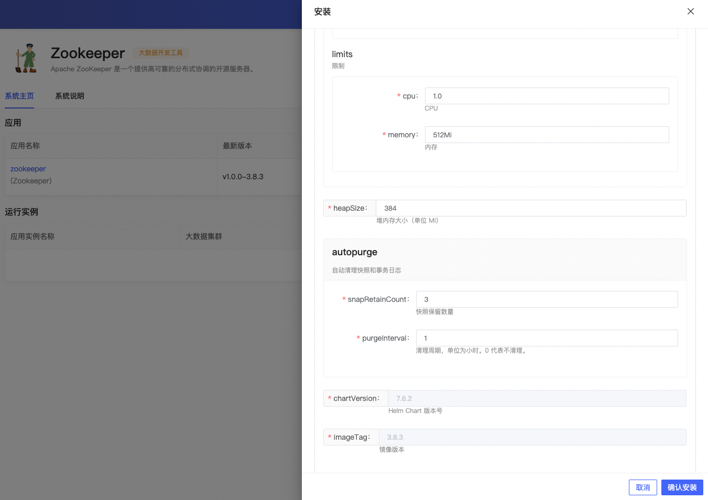
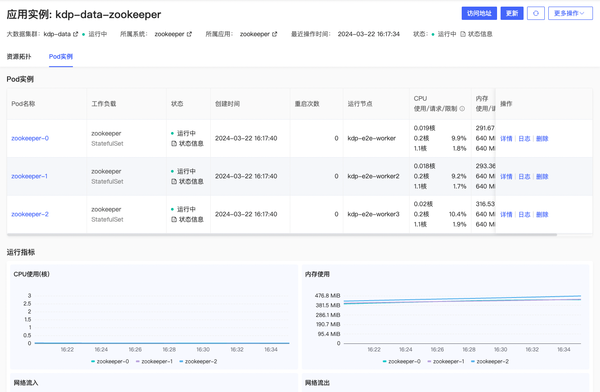
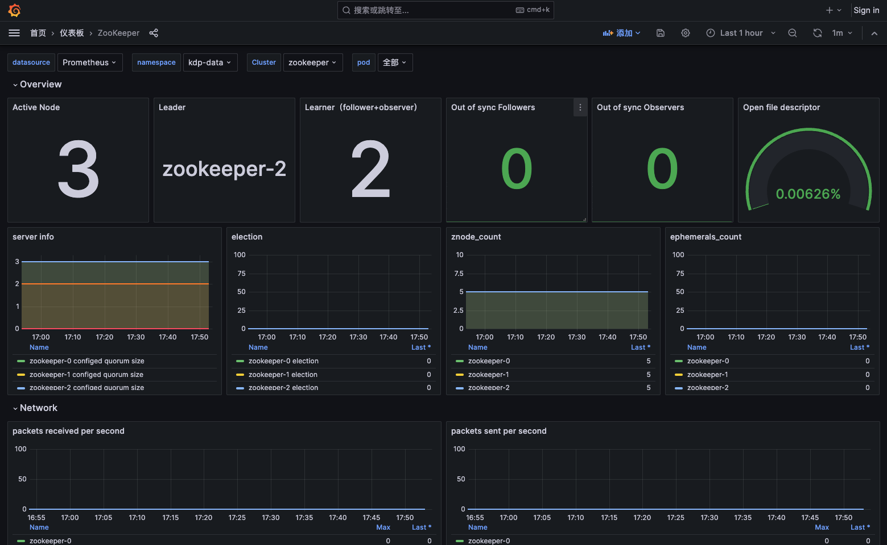

# Zookeeper 概述

ZooKeeper 是一个分布式、高可用性的协调服务。ZooKeeper 提供分布式配置服务、同步服务和命名注册等功能。

## 配置信息

安装应用时，可使用默认配置。

支持配置：

- replicaCount: 副本数
- resources: 资源规格
- heapSize: 堆内存大小（单位 Mi）
- autopurge
  - snapRetainCount: 快照保留数量
  - purgeInterval: 清理周期，单位为小时。0 代表不清理。
- chartVersion: Helm Chart 版本号
- imageTag: 镜像版本

安装成功后，可以进入应用实例详情，进行更新、卸载等运维管理操作。

Prometheus + Grafana 进行关键指标收集，提供多维度监控看板。

