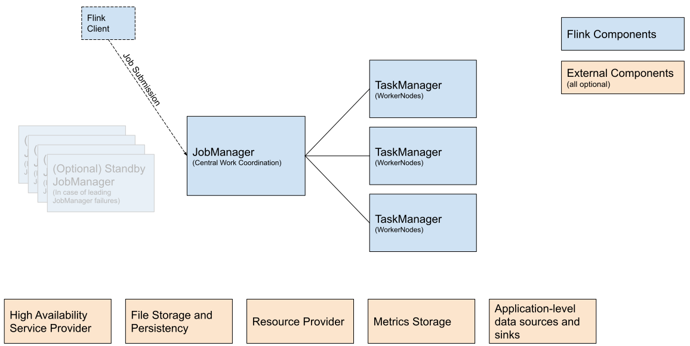
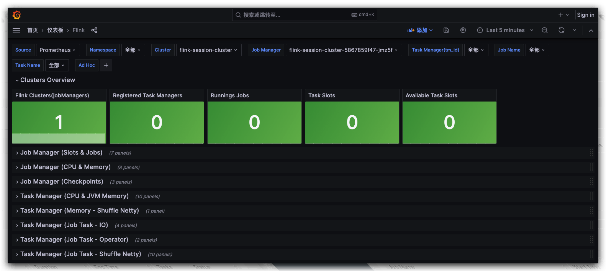

# Flink Overview

Apache Flink is a distributed high-performance stream processing framework, suitable for real-time and batch data processing. It is designed to support low-latency, high-throughput large-scale data processing. Flink provides APIs for Java, Scala, and Python, as well as a SQL interface for declarative stream processing.

## Architecture

The architectural design of Flink emphasizes high throughput, low latency, and strong fault tolerance, making it an ideal choice for processing real-time data streams. Through this distributed architecture, Flink can effectively scale to handle large-scale data streams while maintaining high availability and stability of jobs. For more information about Flink, please refer to the official [Flink documentation](https://nightlies.apache.org/flink/flink-docs-release-1.17/docs/deployment/overview).

## Deployment Modes

There are three common deployment modes of Flink as follows: Session, Application, and Per-Job.

**Session Mode**
Session mode is the most common Flink deployment mode. Under Session mode, a long-running Flink cluster is first started. Then, users can submit multiple jobs to this cluster. All jobs share cluster resources, which means resource management does not need to be conducted separately for each job.

Session mode is suitable for the following scenarios:

- Frequent submission of batch jobs
- Desire to maximize cluster resource utilization
- Similar resource requirements for various jobs, facilitating unified management

When using Session mode, the cluster remains running after the job ends, waiting for new job submissions.

**Application Mode**
Application mode was introduced after Flink 1.11. This mode allows each application to have its own dedicated Flink cluster, with the cluster's lifecycle bound to the application. When the application ends, the cluster also stops.

The typical steps for Application mode are as follows:

1. The user packages all their code and dependencies into an executable Jar file.
2. The user submits the application to the Flink cluster.
3. Flink creates a dedicated JobManager and TaskManagers for the application.
4. After the application is completed, the Flink cluster is destroyed.

Application mode is suitable for these scenarios:

- High requirements for security or resource isolation
- Automated pipelines where each run is independent
- Deployment on cloud environments or Kubernetes, where each job manages its own resources and lifecycle

**Per-Job Mode**
Per-Job mode starts an independent Flink cluster for each submitted job, and the cluster automatically shuts down after the job is completed. This is similar to Application mode, but Per-Job mode is more suitable for early versions of Flink and environments that do not support Application mode. The latest version of Flink no longer supports this mode.

Per-Job mode is suitable for:

- Jobs with strict cluster isolation requirements
- Ensuring that jobs do not compete for resources due to the load of other jobs
- Each job may have different configurations and resource requirements

The disadvantage of Per-Job mode is that each job may have a longer startup time because the submission of each job involves the startup process of the cluster.

Summary: The choice of which mode to use depends on the characteristics of the job, the need for resource isolation, the convenience of cluster management, and considerations for elasticity and scalability. Session mode is suitable for resource sharing, while Application and Per-Job modes provide better isolation and precise resource control.

KDP page installs Flink for session mode. Application mode deployment will be opened later

## Component Dependencies

Dependencies for installing a Flink session cluster:

-  flink-kubernetes-operator application, an automated deployment, management, and scaling tool for Apache Flink applications based on Kubernetes.
- Flink jobManager, high availability depends on Zookeeper or Kubernetes. checkpoints high availability metadata storage supports dependencies on HDFS or S3 (MinIO).
- Flink on Hive requires dependencies on HDFS and Hive; after enabling, Flink can read and write Hive tables.

Installing streampark (depends on MySQL) 

## Application Installation

Supports users to enable high availability and Flink on Hive and select corresponding dependency configurations;

### Flink Session Cluster Configuration

After installation, the application instance details can be viewed for application access address to perform operations such as updates and uninstallation.

Navigate to the Flink WebUI page.

On the application instance details page 'More Operations,' navigate to the Grafana Flink monitoring panel to view monitoring metric information.

### Streampark Configuration

After installation, the application instance details can be viewed for application access address to perform operations such as updates and uninstallation.

Navigate to the streampark real-time data development platform WebUI page. The default user is admin/streampark for login.

On the application instance details page, under "More Actions," you could jumping to the Grafana monitoring dashboard to view monitoring metric information.

