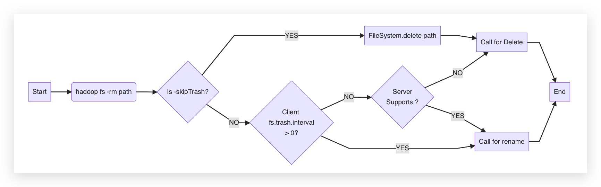

# HDFS Best Practices

## JVM Memory Tuning

Here we introduce how to adjust the NameNode JVM and DataNode JVM memory sizes to optimize the stability of HDFS.

### Adjusting NameNode JVM Memory Size

In HDFS, each file object requires metadata information to be recorded in the NameNode, occupying a certain amount of memory space. The default JVM configuration can meet some ordinary HDFS usage. Some workloads write more files to HDFS, or as time accumulates, the number of files saved in HDFS continuously increases. When the increased number of files exceeds the default memory space configuration, the default memory space cannot store the corresponding information, and you need to modify the memory size settings.

Modify the NameNode JVM memory size. You can adjust the `maxRAMPercentage` under the Namenode node in the KDP HDFS application configuration page. This parameter is equivalent to the JVM parameter `-XX:MaxRAMPercentage`, and it must be a floating-point number, such as `60.0`. After modification, the JVM memory will be 60% of the container memory, i.e., `resources.limits.memory * maxRAMPercentage`.

You can view the number of files Files and the number of blocks Blocks on the HDFS UI page. You can adjust the NameNode JVM memory size according to the following calculation method.

> Recommended value = (Number of files (in millions) + Number of blocks (in millions)) × 512 MB

For example, if you have 10 million files, all of which are small and medium-sized files and do not exceed 1 block, and the number of blocks is also 10 million, then the recommended memory size is 10240 MB, i.e., (10+10) × 512 MB. When most of your files do not exceed 1 block, the recommended values are as follows:


| Number of Files    | Recommended Value (MB) |
| ----------- | ---------- |
| 10,000,000  | 10240      |
| 20,000,000  | 20480      |
| 50,000,000  | 51200      |
| 100,000,000 | 102400     |

### Adjusting DataNode JVM Memory Size

In HDFS, each file block object requires metadata information to be recorded in the DataNode, occupying a certain amount of memory space. The default JVM configuration can meet some simple, low-stress job requirements. Some jobs write more files to HDFS, or as time accumulates, the number of files saved in HDFS continuously increases. When the number of files increases, the number of blocks on DataNode will also increase, and if the default memory space cannot store the corresponding information, you need to modify the memory size settings.

You can adjust the `maxRAMPercentage` under the Datanode node in the KDP HDFS application configuration page. This parameter is equivalent to the JVM parameter `-XX:MaxRAMPercentage`, and it must be a floating-point number, such as `60.0`. After modification, the JVM memory will be 60% of the container memory, i.e., `resources.limits.memory * maxRAMPercentage`.

You can adjust the DataNode JVM memory size according to the following calculation method.

> The average number of replicas saved by each DataNode instance in the cluster = File block number Blocks × 3 ÷ Number of DataNode nodes
> Recommended value = Number of replicas for a single DataNode (in millions) × 2048 MB

For example, for a large data model with 3 replicas and 6 Core nodes, if you have 10 million files and they are all small and medium-sized files, with a block number of 10 million, then the number of replicas for a single DataNode is 5 million (10 million × 3 ÷ 6), and the recommended memory size is 10240 MB (5 × 2048 MB).

When most of your files do not exceed 1 block, the recommended values are as follows.

| Average number of replicas for a single DataNode instance | Recommended Value (MB) |
| ------------------------------------ | ---------- |
| 10,000,000                           | 2048       |
| 20,000,000                           | 4096       |
| 50,000,000                           | 10240      |

## Real-time Computing Scenario Optimization

### Adjusting DataNode Xceiver Connection Number

Typically, real-time computing frameworks will open a large number of HDFS file write streams (Streams) to facilitate continuous writing of new data to HDFS. The number of files that HDFS allows to open simultaneously is limited and restricted by the DataNode parameter `dfs.datanode.max.transfer.threads`.

You can modify `dfs.datanode.max.transfer.threads` in the hdfsSite node on the KDP HDFS application configuration page. This parameter represents the thread pool size for DataNode to handle read or write streams. When you find the following error in the DataNode service log directory or client run log, you can appropriately increase this parameter value:

In the DataNode service log, find the following error

```log
java.io.IOException: Xceiver count 4097 exceeds the limit of concurrent xcievers: 4096
        at org.apache.hadoop.hdfs.server.datanode.DataXceiverServer.run(DataXceiverServer.java:150)
```

In the client run log, find the following error

```log
DataXceiver error processing WRITE_BLOCK operation  src: /10.*.*.*:35692 dst: /10.*.*.*:50010
java.io.IOException: Premature EOF from inputStream
```

### Configuring Reserved Disk Space

HDFS will reserve 128 MB of disk space remaining for each opened file write stream to ensure that the file can be written normally. If the actual size of the file is very small, for example, only 8 MB, then when the file calls the close method to close the input stream, it will only occupy 8 MB of disk space.

Typically, real-time computing frameworks will open a large number of HDFS file write streams. If many files are opened at the same time, HDFS will reserve a large amount of disk space in advance. If there is not enough remaining disk space, it will cause file creation to fail.

If the number of files opened at the same time is N, the cluster must reserve at least N * 128 MB * Number of replicas of disk space.

## HDFS Usage Optimization

### Controlling the Number of Small Files

HDFS NameNode loads all file metadata in memory. With a fixed cluster disk capacity, if there are too many small files, it will cause a memory capacity bottleneck for NameNode.

Try to control the number of small files. For existing small files, it is recommended to merge them into larger files.


### Configuring HDFS Single Directory File Count

When the cluster is running, different components (such as Spark) or clients may continuously write files to the same HDFS directory. However, the HDFS system has an upper limit on the number of files supported in a single directory, so you need to plan ahead to prevent the number of files in a single directory from exceeding the threshold, causing tasks to fail.

You can add a new parameter ·dfs.namenode.fs-limits.max-directory-items· in the hdfsSite node on the KDP HDFS application configuration page to set the number of files that can be stored in a single directory, and finally save the configuration.

You need to plan your data storage well, and it is recommended to classify by time, business type, etc., and not have too many direct files under a single directory, suggesting about 100,000 files under a single directory.


### Configuring Tolerated Disk Failures

If you configure multiple data storage volumes for DataNode, by default, if one volume fails, DataNode will no longer provide services.

You can add a new parameter ·dfs.datanode.failed.volumes.tolerated· in the hdfsSite node on the KDP HDFS application configuration page. You can set this parameter, and DataNode can continue to provide services if the number of failed volumes is less than the parameter value.


| Parameter             | Description           | Default Value |
| ------ | ----------- | ------ |
| dfs.datanode.failed.volumes.tolerated | The number of volumes allowed to fail before DataNode stops providing services. By default, at least one valid volume is required. | 0 |

### Using Balancer for capacity balancing

In an HDFS cluster, there may be situations where the disk utilization among DataNode nodes is unbalanced, such as when adding new DataNodes to the cluster. If HDFS experiences data imbalance, it may lead to excessive pressure on individual DataNodes.

Using Balancer for Capacity Balancing

> **Note**：HDFS clusters may have unbalanced disk utilization among DataNode nodes, such as when new DataNodes are added to the cluster. If HDFS has data imbalance, it may cause excessive pressure on individual DataNodes.

You can use the Balancer operation for capacity balancing.

**Optional**：Execute the following command to modify the maximum bandwidth of Balancer.

```shell
hdfs dfsadmin -setBalancerBandwidth <bandwidth in bytes per second>
```

> **Note**：The  in the example is the maximum bandwidth set. For example, if you need to set the bandwidth control to 20 MB/s, the corresponding value is 20971520, then the complete code example is hdfs dfsadmin -setBalancerBandwidth 20971520. If the cluster load is high, you can change it to 209715200 (200 MB/s); if the cluster is idle, you can change it to 1073741824 (1 GB/s).

Execute the following command to start Balancer.

```shell
/opt/hadoop/sbin/start-balancer.sh -threshold 10
```

Execute the following command to view the running status of Balancer.
```shell
tail -f /opt/hadoop/logs/hadoop-hdfs-balancer-xxx.log
```

When the prompt message includes the word "Successfully", it means the execution is successful.

## Managing Hadoop Trash

Hadoop Trash is an important feature of the Hadoop file system that can recover mistakenly deleted files and directories. Here we introduce how to use Hadoop Trash.

The trash is an encapsulation of the Hadoop Shell or some applications (such as Hive) for the Hadoop FileSystem API on the client side. When the client or server configuration turns on the trash feature, the Hadoop Shell will call the FileSystem's rename operation to move the files or directories to be deleted to the `/user/<username>/.Trash/Current` directory, otherwise, it will call the FileSystem's delete operation.

Taking the hadoop rm command as an example, the Hadoop Trash process flowchart is shown below.




### Enable Trash

As shown in the flowchart, simply check the `fs.trash.interval` parameter in the coreSite node of the KDP HDFS application configuration. If the parameter is greater than 0, the trash will be enabled, and when executing `-rm`, it will be placed in the trash directory.

### Disable Trash

Once the trash is disabled, it is not possible to recover after executing rm. It is generally not recommended to disable it, but if you need to disable it, you can change `fs.trash.interval` to 0 (HDFS needs to restart the NameNode component).

### Access Trash

The default trash directory is `/user/<username>/.Trash/Current`. To access the corresponding HDFS trash directory, you can add the corresponding prefix, for example, `hdfs://default/user/<username>/.Trash/Current`.

### Clean Up Trash Directory

The default is 1440 minutes, i.e., it will automatically clean up after 1 day. You can modify the check point for deleted files by changing the parameter `fs.trash.interval`.
