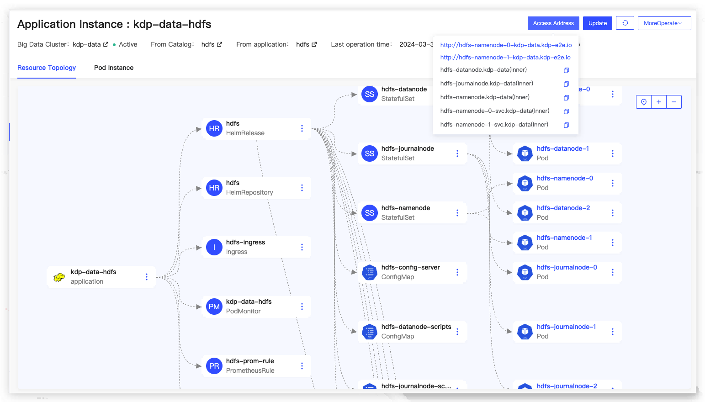

# HDFS Overview

HDFS (Hadoop Distributed File System) is a Hadoop distributed file system that features high fault tolerance, supports high-throughput data access, and aims to minimize costs while handling massive amounts of data (TB or PB scale and above). HDFS is suitable for distributed read and write operations on large-scale data, especially in scenarios where reads are more frequent than writes.

KDP HDFS Component Enhancements:

- Extended the open-source Kubernetes HDFS project.
- Integrated Kerberos and Ranger.
- Supported Persistent Volumes and virtual machine networks.

## Architecture

HDFS follows the classic Master-Slave architecture, where each HDFS cluster consists of one NameNode and multiple DataNodes.

The NameNode manages all file metadata and is responsible for interacting with clients. DataNodes manage files stored on their respective nodes. Each file uploaded to HDFS is divided into one or more data blocks, which are distributed across different DataNodes according to the HDFS cluster's data replication strategy, with the location information managed centrally by the NameNode.

## Component Dependencies

Installing HDFS requires dependency on Zookeeper.
Installing httpfs-gateway requires dependency on HDFS.

## Application Installation

Applications can be installed with default configurations.

### HDFS Application Configuration

- Component Dependencies
  - zookeeperQuorum: Zookeeper address.
  - zookeeperParentZnode: The Zookeeper node where the Namenode high availability status is located.
- Namenode
  - resources: Resource specifications.
  - maxRAMPercentage: The maximum percentage of heap memory.
  - persistence: Persistent volume configuration.
  - HAEnabled: Namenode high availability (default is true).
- Journalnode
  - quorumSize: Number of Journalnodes.
  - resources: Resource specifications.
  - persistence: Persistent volume configuration.
- Datanode
  - replicas: Number of Datanode replicas.
  - resources: Resource specifications.
  - maxRAMPercentage: The maximum percentage of heap memory.
  - persistence: Persistent volume configuration.
- coreSite: Custom content for core-site.xml.
- hdfsSite: Custom content for hdfs-site.xml.
- chartVersion: Helm Chart version number.
- imageTag: Hadoop image version.

After installation, the application instance details can be viewed, including the application access address, for operations such as updates and uninstallations.

Navigateto the NameNode WebUI page.

On the application instance details page under 'More Operations,' navigate to the Grafana HDFS monitoring panel to view monitoring metric information.

### httpfs-gateway Application Configuration

- Component Dependencies
  - hdfsContext: HDFS configuration that httpfs depends on.
- replicas: Number of replicas.
- resources: Resource specifications.
- image: Application image.
- kerberos: Kerberos switch (follows the Kerberos switch of the big data cluster).
