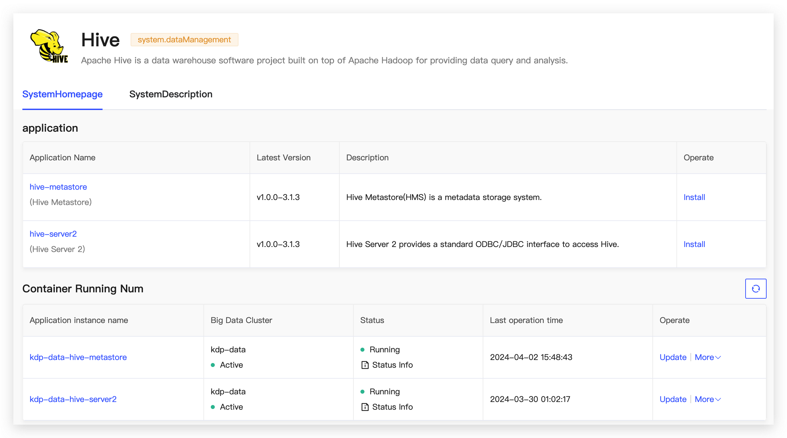
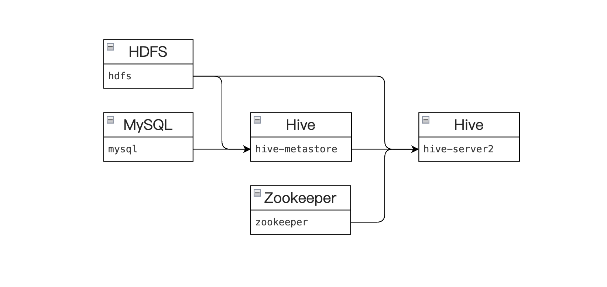
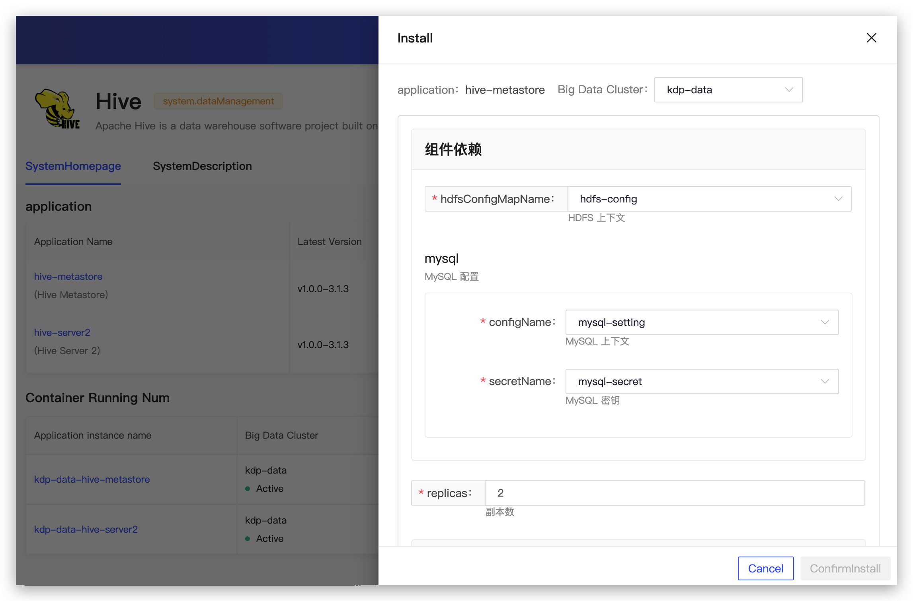
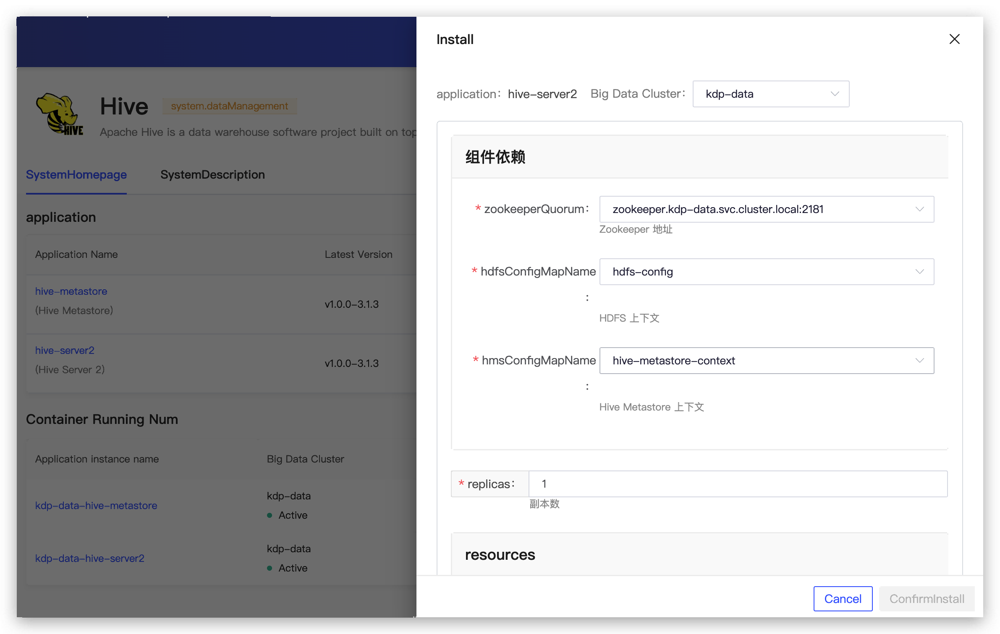

# Hive Overview

Hive is a data warehouse framework based on Hadoop, primarily used for data extraction, transformation, and loading (ETL) as well as metadata management in big data business scenarios.

## Application Description

Hive Structure:

| Name | Description |
|---|---|
| HiveServer2 | HiveQL query server, which can be configured with Thrift or HTTP protocols to receive SQL requests submitted by JDBC clients, supporting multi-client concurrency and authentication.|
| Hive MetaStore | Metadata management module, relied upon by other engines for storing metadata information such as Database and Table. Both Spark and Presto depend on this module for their metadata management.|

## Component Dependencies

- Installing hive-metastore depends on HDFS and MySQL services.
- Installing hive-server2 depends on ZooKeeper, HDFS, and hive-metastore services.

> **Note：** The HDFS service that hive-metastore and hive-server2 depend on must be the same one.

## Application Installation

Applications can be installed with default configurations.

### Hive Metastore Configuration

- Component Dependencies
  - hdfsConfigMapName: HDFS context
  - mysql: MySQL configuration
- replicas: Number of replicas
- resources: Resource specifications
- hiveConf: Custom content for hive-site.xml
- image: Image version

The application instance details can display resource topology and Pod instance information, allowing for operations such as updates and uninstallations. It also supports navigation to the hive-metastore monitoring panel to view monitoring metric information.

### Hive Server2 Configuration

- Component Dependencies
  - zookeeperQuorum: Zookeeper address
  - hdfsConfigMapName: HDFS context
  - hmsConfigMapName: Hive Metastore context
- replicas: Number of replicas
- resources: Resource specifications
- dataLocality: Spark pods are preferably scheduled on data nodes
- hiveConf: Custom content for hive-site.xml
- spark
  - image: Spark image version
  - volcanoEnabled: Use Volcano to schedule Spark pods
  - sparkDefaults: Custom content for spark-defaults.conf
- image: image version

The application instance details can display resource topology and Pod instance information, allowing for operations such as updates and uninstallations. It also supports navigation to the hive-server2 monitoring panel to view monitoring metric information.

