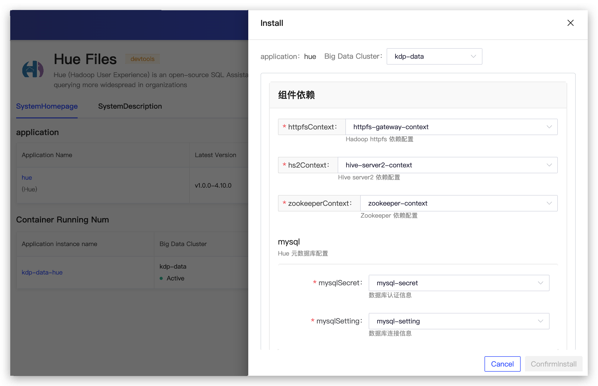
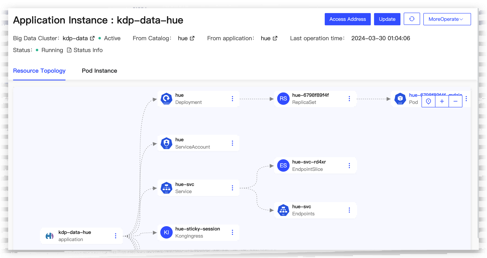
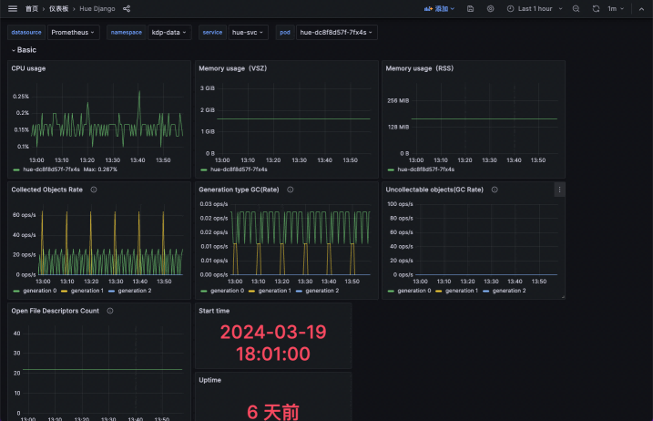

# Hue Overview

Hue (Hadoop User Experience) is an open-source web interface designed for data analysts using the Hadoop ecosystem. It is primarily used for data warehouse components such as Hive, file storage with HDFS, and data processing supported by Spark. Hue provides an easy-to-use interface that allows users to execute queries, browse datasets, and visualize analysis results through Beeswax (Hive's interface).

KDF Hue Component Enhancements

- Unified login/logout
- Logging/Monitoring/Alerting
- Optimized "Hive on Spark" experience

## Architecture

- Hue UI is the user interface through which users can interact with the Hue Server, for example, by submitting queries or managing files. The user interface communicates with the backend Hue Server in the form of HTTP requests.
- Hue Server receives requests from the user interface and communicates with different backend systems based on these requests.
- The Hue Server receives requests from the user interface and communicates with different backend systems based on these requests.
  - It sends SQL queries to Hive, which then executes these queries and returns the results.
  - It performs file operations on HDFS, including uploading, downloading, and managing files.
  - Submitting jobs to Spark on Hive, allowing users to run big data processing tasks on the Spark engine within the Hive context.
- The Hue Server also interacts with Hue DB (MySQL) for storing metadata, such as user information and job history. This provides the necessary persistent storage functionality for the Hue platform, supporting user authentication and operation tracking.

## Component Dependencies

Hue is a web-based application that can be accessed through a browser. The components currently depended on by KDP Hue are:

- HiveServer2 for accessing Hive
- Httpfs for accessing HDFS
- Zookeeper for HA access to HiveServer2
- MySQL for storing Hue's metadata

## Application Installation

The application can be installed using default configurations.

After installation, the application instance details page allows you to view the application access address and perform operational management operations such as updates and uninstallations.

Log in to the Hue login page using the `root` account without a password.

After logging in, you can view Hive table data.

Check HDFS files.

On the application instance details page, Click "More Operations", you can jump to the Grafana Hue monitoring panel to view monitoring metric information.

