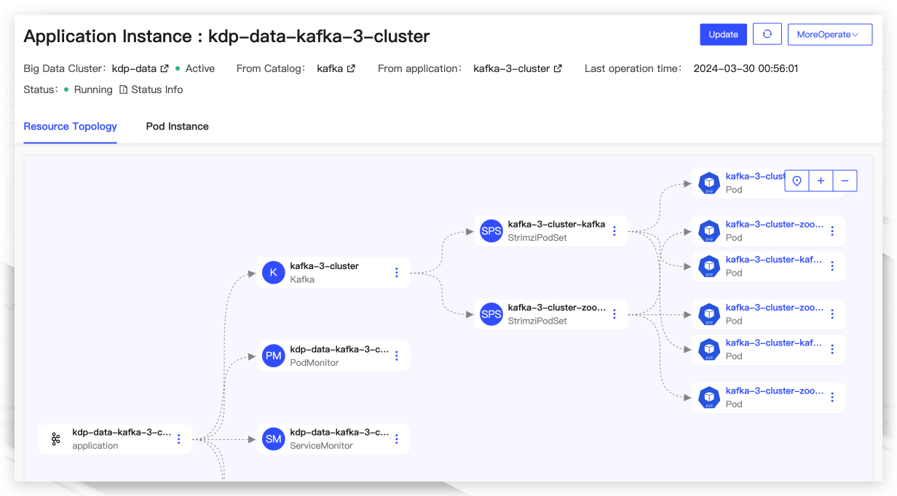
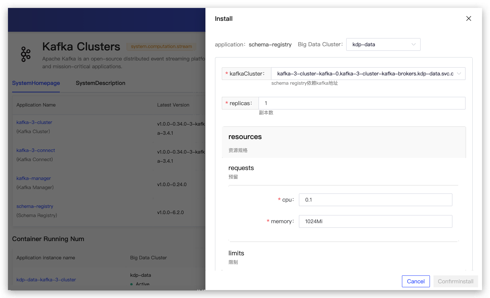
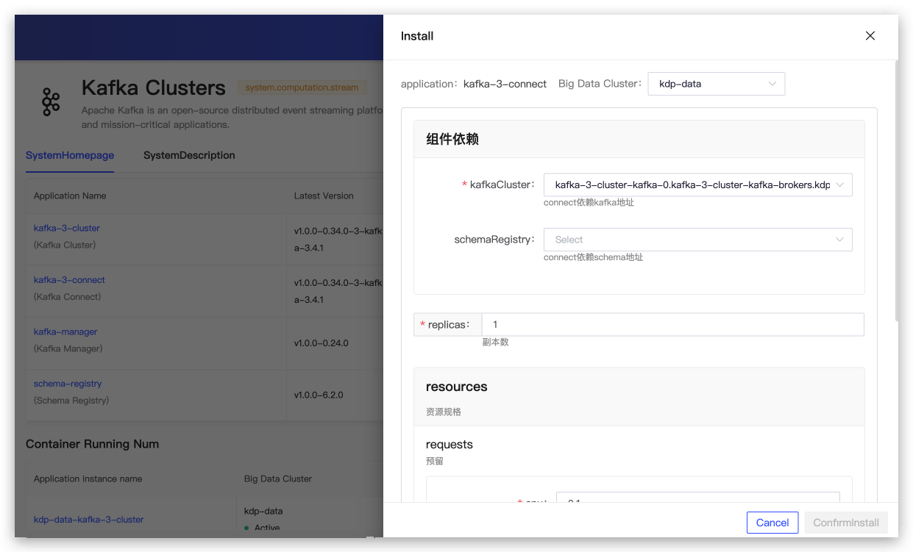
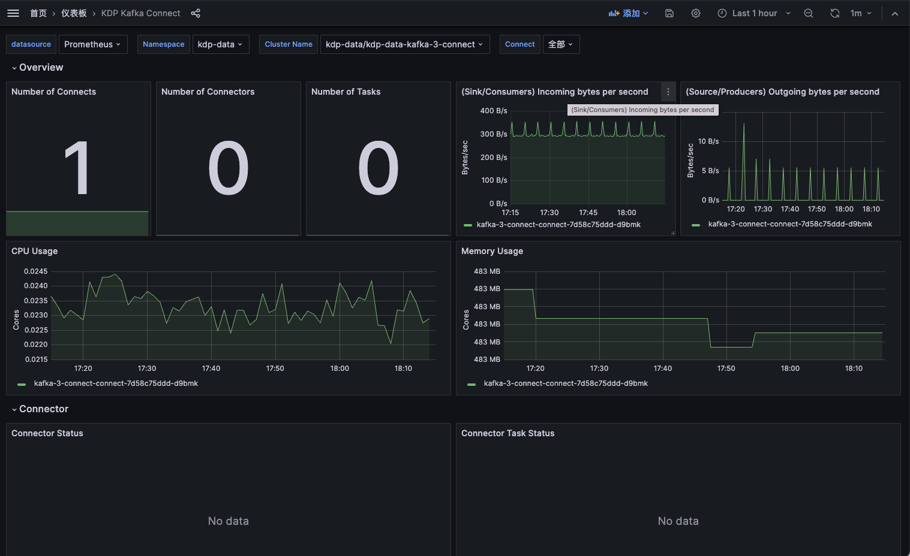
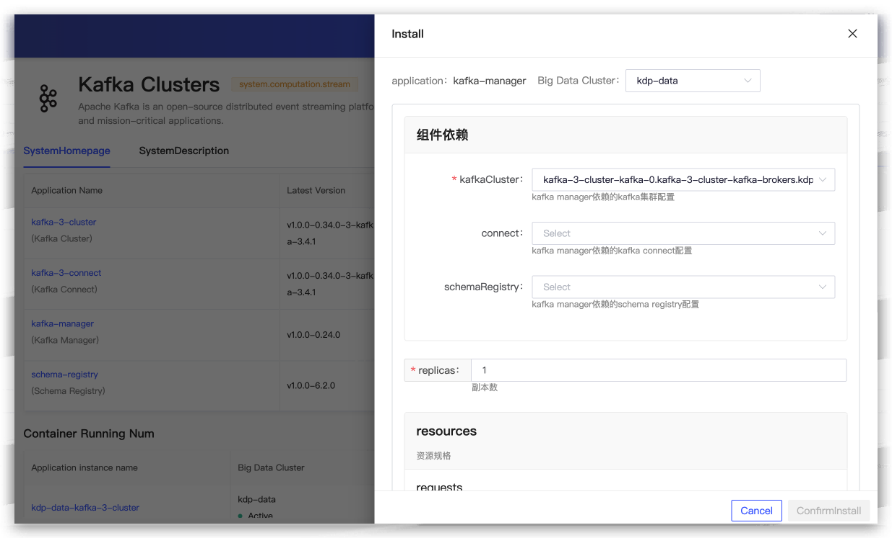

# Kafka Overview

Apache Kafka is a distributed event streaming platform. Based on Kafka, it is possible to build high-throughput, highly scalable message middleware services. It is suitable for scenarios such as log collection, stream processing, and traffic peak shaving and filling. Kafka's characteristics of high reliability, high-concurrency access, and scalability make it an indispensable part of the big data ecosystem.

KDP Kafka Component Enhancements:

* Expanded support for Kafka's integration with Ranger and Kerberos in the Kubernetes cloud-native architecture;
* Implemented Kafka's scaling capabilities under the permission system of Ranger and Kerberos;
* Completed management of dependency configuration between Kafka components.

## Architecture

A Kafka cluster includes Producers, Kafka Brokers, Groups, and ZooKeeper.

Producer

Send messages to Kafka Brokers in a push mode. The messages sent can be website page visits, server logs, or system resource information related to CPU and memory.

Kafka Broker

Servers used for storing messages. Kafka Brokers support horizontal scaling. The more Kafka Broker nodes there are, the higher the throughput of the Kafka cluster.

Group

Subscribe to and consume messages from Kafka Brokers in a pull mode.

Zookeeper

Manages cluster configuration, elects leader partitions, and performs load balancing when Groups change.

## Application Description

Kafka includes four applications:

* **kafka cluster**: Kafka is a distributed, high-throughput, and scalable event streaming platform application. It requires the installation of the Kafka operator first.
* **kafka connect**: Kafka Connect aims to simplify data integration and stream processing, used for integrating external systems and data sources with Kafka. It requires the installation of the Kafka operator and Kafka cluster first.
* **schema registry**: Schema Registry is a service for managing and storing Avro, JSON, and Protobuf type schemas. It requires the installation of the Kafka operator and Kafka cluster first.
* **kafka manager**: Kafka Manager is a web application for managing and monitoring Kafka, Kafka Connect, and Schema Registry. It requires the installation of the Kafka cluster first.

## Component Dependencies

Before installing the Kafka application directory, the kafka-3-operator application in the Operator directory of the application directory needs to be installed. It is an automated deployment, management, and scaling tool for Apache Flink applications based on K8s.

The application dependency in the Kafka application directory is shown in the diagram below, with dashed lines indicating non-essential dependencies.

## Application Installation

Applications can be installed with default configurations.

### Kafka Cluster Application Configuration

* replicas: The number of Kafka instances
* resources: Resource specifications
* storage: Persistent volume configuration
* listeners: Kafka listener configuration
* metrics: Kafka monitoring configuration
* config: Kafka configuration
* zookeeper: Kafka's dependent Zookeeper configuration (dedicated to Kafka)
  * replicas: The number of Zookeeper instances
  * resources: ZK resource specifications
  * storage: ZK persistent volume configuration
* image: Kafka image version

After successful installation, the application instance details can view the resource topology, Pod instance information, and perform operational management operations such as updates and uninstallations. The "More Operations" section supports jumping to the Kafka Cluster monitoring panel.

View Kafka dashboard monitoring metric information.

### Schema Registry Application Configuration

* kafkaCluster: Schema Registry depends on the Kafka address
* replicas: The number of Schema Registry instances
* resources: Resource specifications
* image: Schema Registry image version

After successful installation, the application instance details can view the resource topology, Pod instance information, and perform operational management operations such as updates and uninstallations. The "More Operations" section supports jumping to the Kafka Schema Registry monitoring panel.

View monitoring metric information.

### Kafka Connect Application Configuration

* Component Dependencies
  * kafkaCluster: Connect depends on the Kafka address
  * schemaRegistry: Connect depends on the Schema Registry address (Optional)
* replicas: The number of Connect instances
* resources: Resource specifications
* image: Connect image version

After successful installation, the application instance details can view the resource topology, Pod instance information, and perform operational management operations such as updates and uninstallations. The "More Operations" section supports jumping to the Kafka Connect monitoring panel. View monitoring metric information.

### Kafka Manager Application Configuration

* Component Dependencies
  * mysql: Kafka Manager depends on MySQL configuration
  * kafkaCluster: The Kafka managed by Kafka Manager
  * connect: The Connect managed by Kafka Manager (Optional)
  * schemaRegistry: The Schema Registry managed by Kafka Manager (Optional)
* replicas: The number of Kafka Manager instances
* resources: Resource specifications
* image: Kafka Manager image version

After successful installation, the application instance details can view the resource topology, Pod instance information, and perform operational management operations. View the application access address and support jumping to the Kafka Manager WebUI interface.

