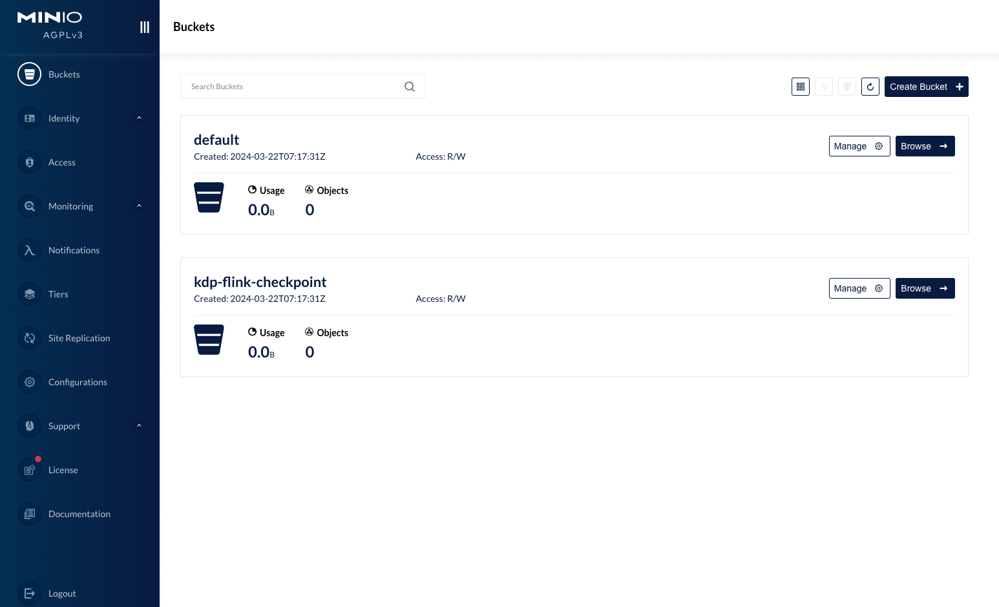

# MinIO Overview

MinIO is a high-performance, distributed object storage system designed for storing and retrieving large amounts of data. It supports the S3 API and other common cloud storage service interfaces. MinIO is characterized by its high availability, high scalability, security, low cost, and high performance.

MinIO is suitable for storing any amount of unstructured data, such as images, videos, logs, backups, and container/virtual machine images. It can be used to build high-performance infrastructure for cloud-native applications, DevOps, and big data analytics.

## Architecture

## Deployment Modes

MinIO consists of two parts: the server and the client. The server is used for data storage, while the client is used for uploading, downloading, and managing data. The MinIO server supports both Standalone (single-node) and Distributed (multi-node) modes.

**Standalone Mode**

The Standalone mode is a single-node configuration, primarily used for development, testing, or small-scale deployments as it does not offer high availability and failover capabilities. In Standalone mode, all data is stored on a single disk, which limits storage capacity and throughput. Additionally, if the node fails, the data may become completely inaccessible.

**Distributed Mode**

For production environments, the Distributed mode is recommended. This mode supports multiple nodes and disks, providing high availability and data redundancy. Even if any node goes down, the MinIO cluster can continue to operate normally.

When configuring the distributed mode, all nodes should have network communication permissions with each other, and time synchronization should be properly configured. Moreover, all MinIO nodes need to use the same Access Key and Secret Key to ensure mutual authentication between nodes.

## Installing the Application

Users can choose their desired installation mode, with the rest using default configurations.

In Distributed mode

- Storage Configuration: Users can configure the storage capacity size, which refers to the storage allocated to each node. Vertical scaling is possible, so it's best to plan the storage capacity in advance.

- Node Configuration: Users can configure the number of nodes (the number of minio servers). The number of nodes determines the reliability and performance of the storage, and the number of nodes can be horizontally scaled by modifying the number of `zones`.
- Administrator Account: Users can configure an administrator account and password for logging into the MinIO WebUI. After logging in, users can add users and buckets, among other things.

After installation, the application instance details will display the application access address, allowing for operations such as updates and uninstallations. The "More Operations" section supports navigation to the Grafana MinIO monitoring panel to view monitoring metrics.

Access the MinIO server via the WebUI or client tools to perform operations such as uploading, downloading, and managing data.

