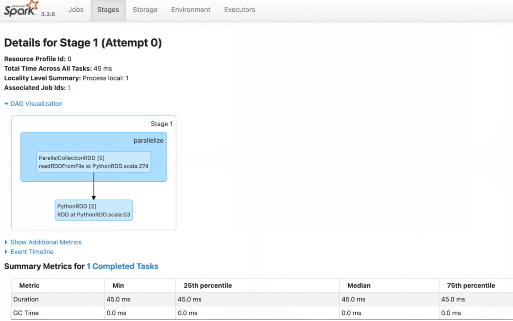

# Spark Component Usage

## Connection Methods

### Using the spark-submit Command-Line Tool

spark-submit is the standard method for submitting Spark jobs and can be used to deploy applications in various environments, including Kubernetes.

### Submitting Spark Applications with Spark on k8s Operator

After installing the spark-on-k8s-operator application, users can manage the lifecycle of Spark applications in a way that aligns more closely with Kubernetes concepts by using the Spark Operator. 

Save the following content to a file named sparkApp.yaml:


```yaml
apiVersion: sparkoperator.k8s.io/v1beta2
kind: SparkApplication
metadata:
  name: spark-pi
  namespace: default
spec:
  type: Scala
  mode: cluster
  image: od-registry.linktimecloud.com/ltc-spark:3.3.0-1.11
  mainClass: org.apache.spark.examples.SparkPi
  mainApplicationFile: local:///opt/spark/examples/jars/spark-examples_2.12-3.3.0.jar
```

Then execute `kubectl apply -f sparkApp.yaml`

For more information, refer to Spark on k8s operator [user guide](https://github.com/GoogleCloudPlatform/spark-on-k8s-operator/blob/master/docs/user-guide.md)。

### Spark Execution History

Access the Spark History Server WebUI page to view the execution status of Spark tasks. For example, after executing a simple data processing task, check the execution details:

