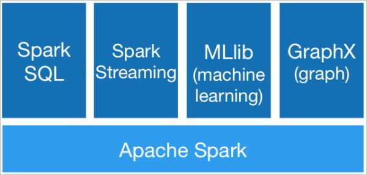
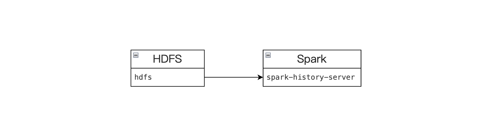
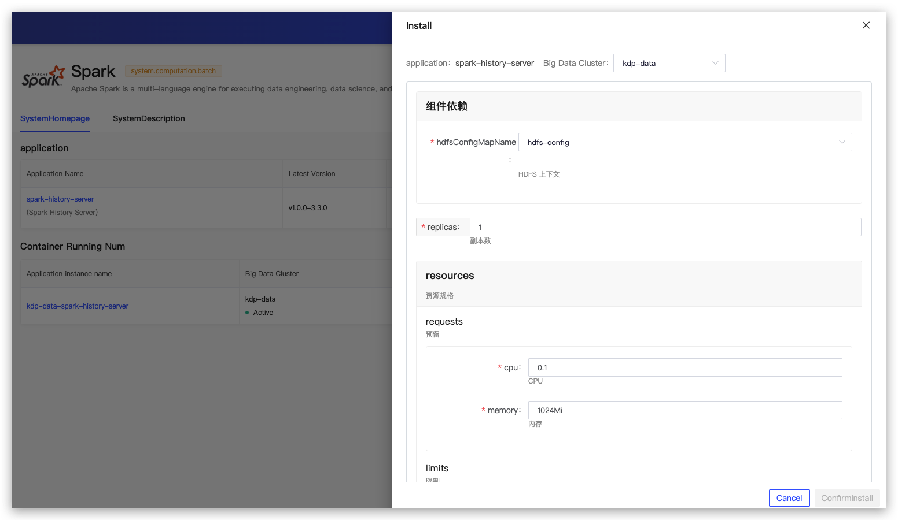
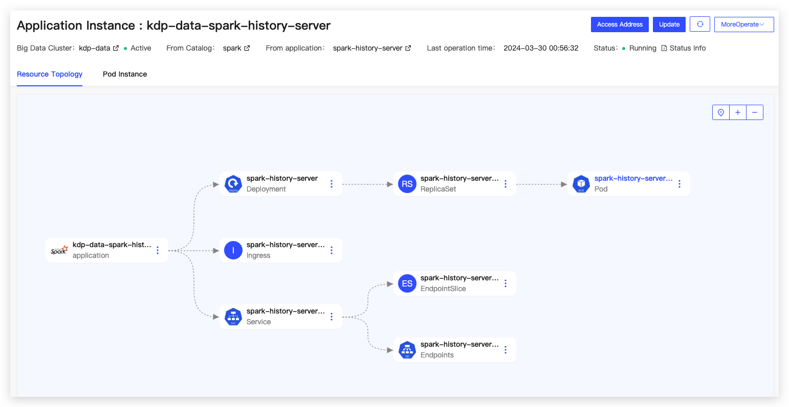

# Spark Overview

Spark is a versatile big data analysis engine characterized by high performance, ease of use, and universality.

## Architecture

The Spark architecture, as shown in the diagram below, is built upon Spark Core and has four main libraries: Spark SQL, Spark Streaming, MLlib, and GraphX. These libraries are designed for various scenarios such as offline ETL (Extract-Transform-Load), online data analysis, stream computing, machine learning, and graph computing, respectively.

## Component Dependencies

The spark-history-server component depends on HDFS. The History Server periodically scans the directory to discover new or updated log files and parses them.

## Application Installation

Default configurations can be used during the application installation.

### Spark History Server Configuration

- Component Dependencies
  - hdfsConfigMapName: HDFS context
- replicas: Number of replicas
- resources: Resource specifications
- logDirectory: Spark log path
- cleaner
  - enabled: Enable automatic cleanup
  - interval: Cleanup interval
  - maxAge: Maximum retention time
- image: Image version

After installation, the application instance details page will display the application access address, allowing for operations such as updates and uninstallations for operational management.

