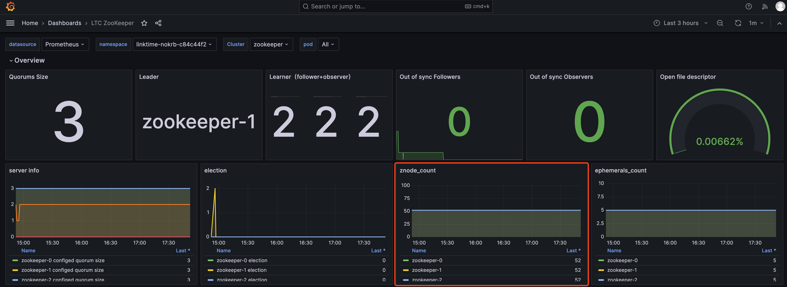

# Zookeeper FAQs

## ZooKeeper service instability and abnormal restarts

There can be many causes for service instability, the most common of which is an excessive number of znodes or overly large snapshots. Since ZooKeeper maintains all znodes in memory and requires data synchronization between nodes, a large number or capacity of znodes can impact service stability. ZooKeeper is designed as a distributed coordination service, and it should not be used as a file system. Typically, the number of znodes should be kept below 100,000, and the snapshot size should be under 800 MB.

You can check the znode count monitoring in the KDP's Zookeeper monitoring panel.



Refer to [Basic Useage](./02-usage-basic.md#连接方式)  - Enter the zookeeper container and execute the following command to view the size of the snapshots in the ZooKeeper data directory.

```shell
ls -lrt /bitnami/zookeeper/data/version-2/snapshot*
```

If there is an excessive number of znodes or overly large snapshots, it is necessary to investigate the distribution of znodes to avoid excessive use of ZooKeeper by related upper-layer applications.
