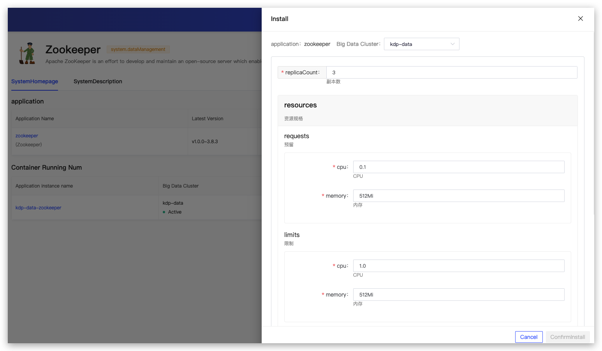
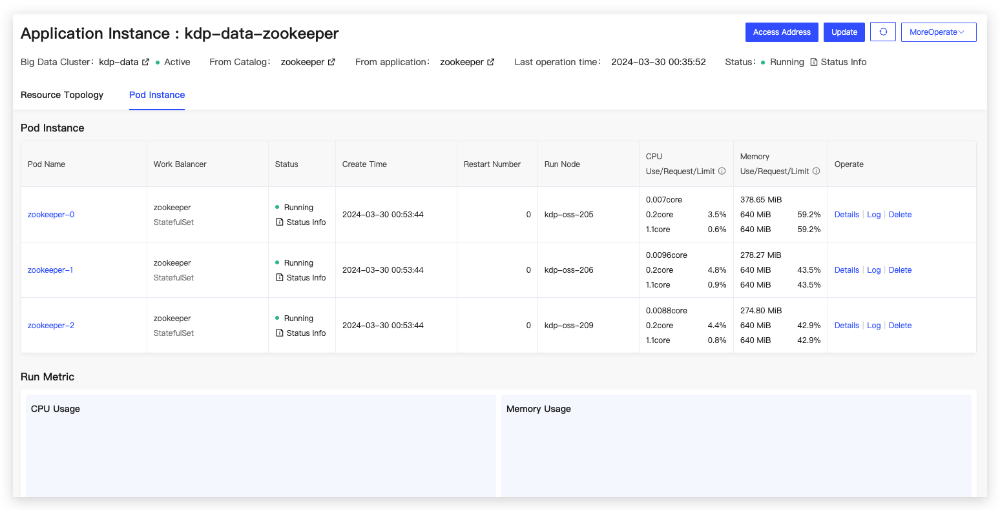
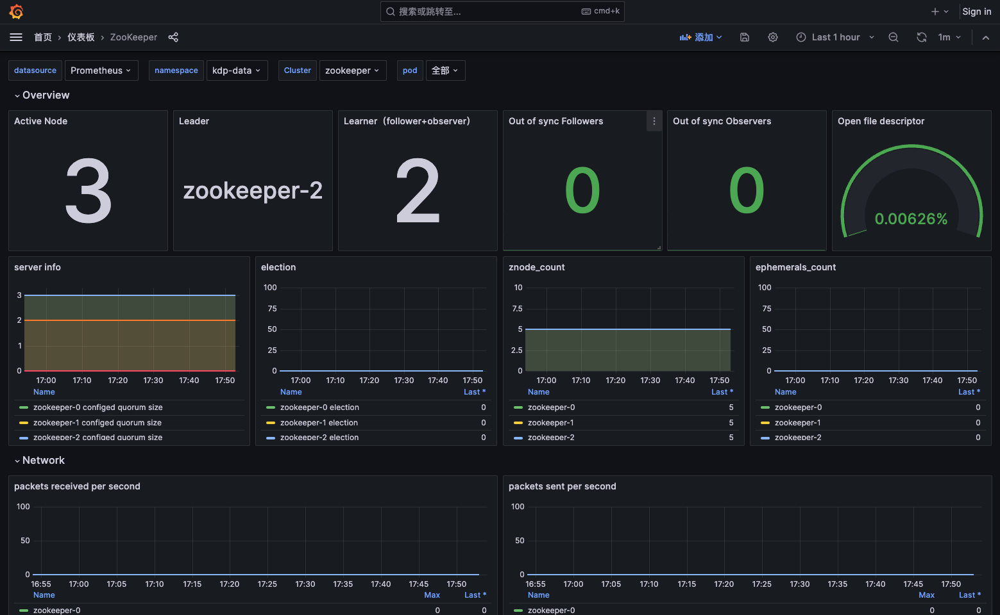

# Zookeeper Overview

ZooKeeper is a distributed, highly available coordination service. It provides distributed configuration services, synchronization services, and naming registry functions.

## Configuration Information

When installing the application, default configurations can be used.

Configurations:

- replicaCount: The number of replicas.
- resources: Resource specifications.
- heapSize: Heap memory size (unit: MiB).
- autopurge
  - snapRetainCount: The number of snapshots to retain.
  - purgeInterval: The cleanup interval in hours. A value of 0 means do not purge.
- chartVersion: The version number of the Helm Chart.
- imageTag: The version of the image.

After successful installation, you can enter the application instance details to perform operations such as updates and uninstallations for operational management.

Prometheus + Grafana are used for collecting key metrics and providing multidimensional monitoring dashboards.

