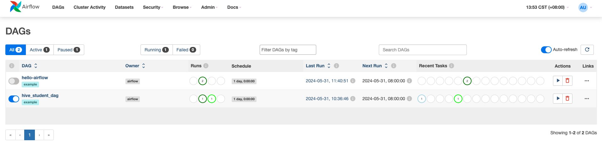
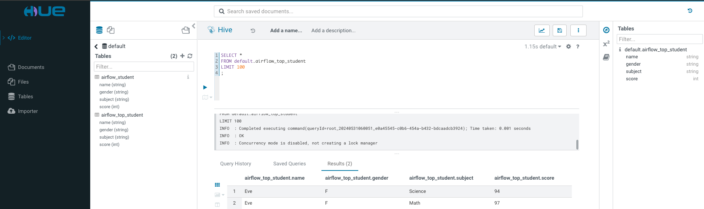

# Batch Job Scheduling for Hive SQL with Apache Airflow

# 1. Introduction
Apache Airflow is an open-source platform for orchestrating and automating batch jobs, allowing for the easy creation, scheduling, monitoring, and management of workflows. Airflow supports Hive SQL, enabling the effortless execution of Hive SQL tasks.

Apache Airflow utilizes Directed Acyclic Graphs (DAGs) to represent workflows, which consist of task nodes and dependencies. Task nodes can be Python operations, Shell operations, SQL operations, and more. Airflow supports various schedulers, including the Local scheduler, Celery scheduler, Kubernetes scheduler, and others.

This article introduces how to write Hive SQL tasks using `pyhive` and execute them with the Apache Airflow Kubernetes scheduler.

# 2. Writing a Hive SQL DAG

The specific code implementation can be accessed on [Github](https://github.com/linktimecloud/example-datasets/blob/airflow/dags/hive-sql-example.py) or [Gitee](https://gitee.com/linktime-cloud/example-datasets/blob/airflow/dags/hive-sql-example.py).

This code is a DAG (Directed Acyclic Graph) written using the Apache Airflow framework, designed for automating data processing tasks. It primarily performs two tasks: creating a Hive table and inserting data, followed by identifying the top-scoring students in each subject.

# 3. Running the DAG
## 3.1 Component Dependencies
The following components need to be installed in KDP:
- mysql
- airflow
- zookeeper
- hdfs
- hive (hive metastore, hive server)
- hue, httpfs-gateway (optional)

## 3.2 Scheduling Jobs
After installing Airflow with default parameters in KDP, log in to the Airflow Web interface using the username `admin` and password `admin`.

Start the DAG named `hive-sql-example`.

Upon successful execution, the results can be viewed through the Hue Web interface. Alternatively, you can refer to the `hive-server2` Quick Start guide to connect to Hive Server2 using beeline and view the results.

运行成功后，可以通过Hue Web界面查看结果。也可以参考 `hive-server2` Qucick Start 使用beeline 连接 Hive Server2 查看结果。

