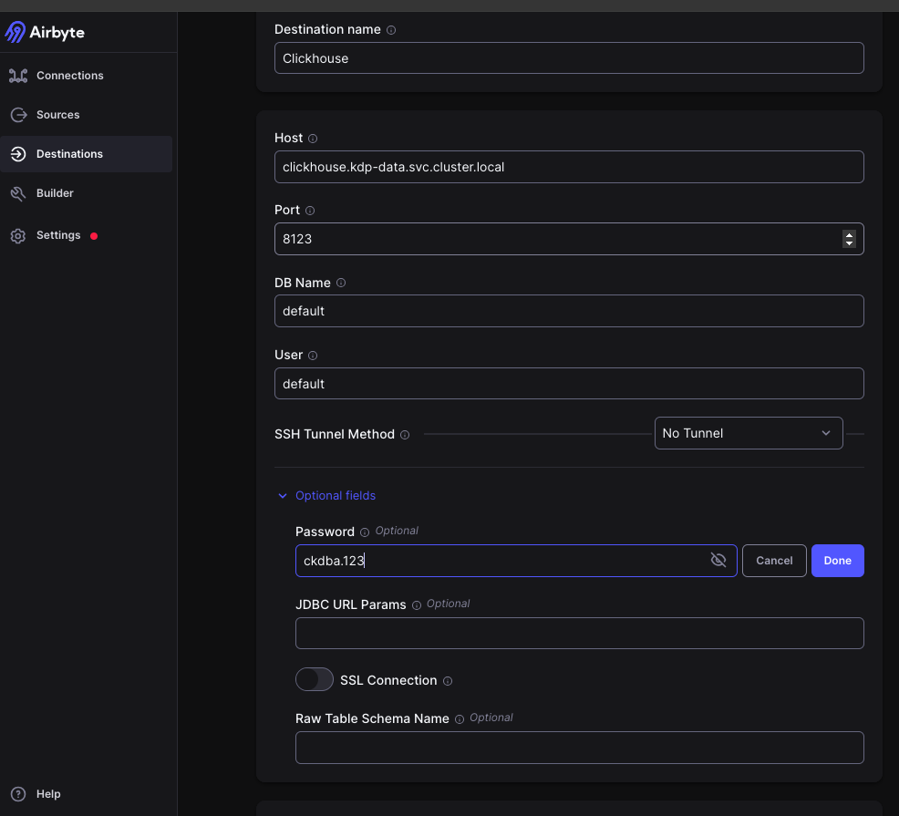
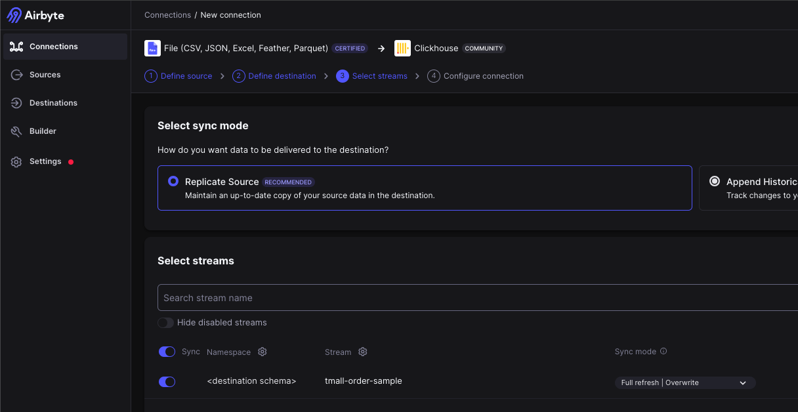
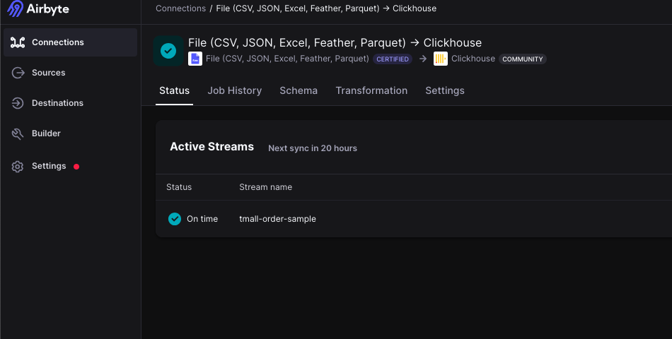
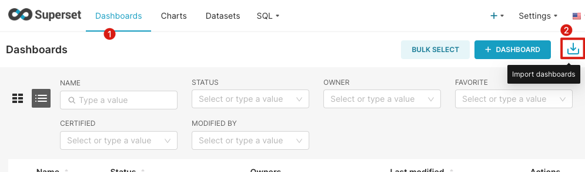
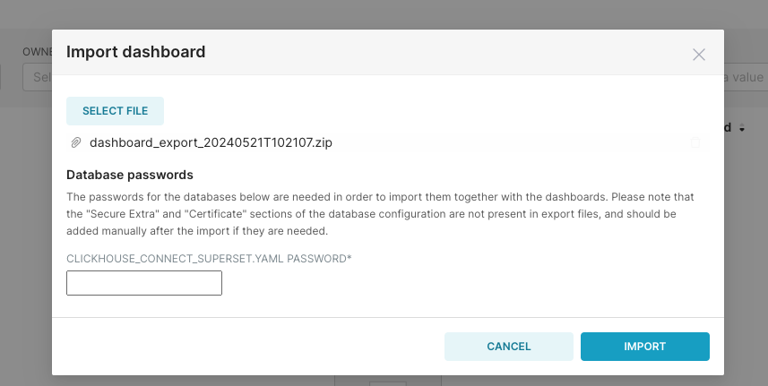
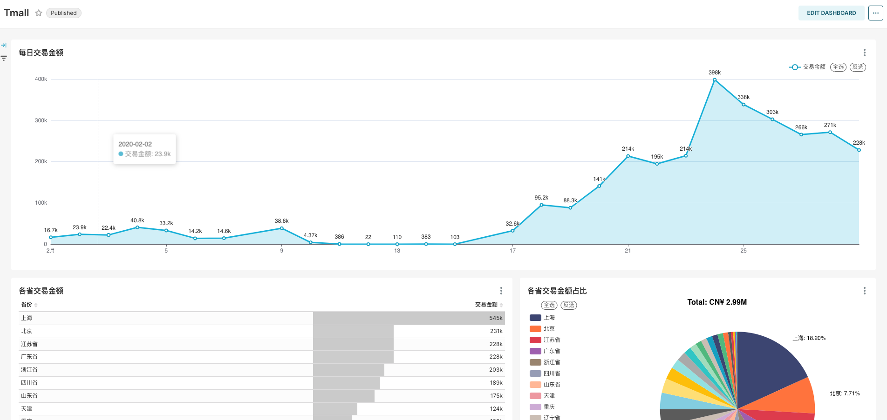

# Exploring data using airbyte, clickhouse, and superset
English | [简体中文](../../zh/user-tutorials/exploring-data-using-airbyte-clickhouse-superset.md)

# 1. Introduction
This guide will show you how to use the KDP platform to complete data integration/processing/BI display, involving applications such as `airbyte`, `clickhouse`, and `superset`. It is recommended to familiarize yourself with each component's quick start before following the steps in this guide.

# 2. Data Integration
Import data from a csv file into clickhouse
1. Add a file type source in airbyte.
   
   - Dataset Name: `tmall-order-sample` (please modify)
   - URL: `https://gitee.com/linktime-cloud/example-datasets/raw/main/airbyte/tmall-order-sample.csv`
      
1. Add a clickhouse type destination in airbyte. 
   
   - Host: `clickhouse.kdp-data.svc.cluster.local`
   - Port: `8123`
   - DB Name: `default`
   - User: `default`
   - Password: `ckdba.123`

1. Add a connection in airbyte, select file as the source and clickhouse as the destination, use the default configuration, and then save.
   
   
1. Check the airbyte job status. If successful, the data has been successfully imported into clickhouse.
   
   
After completing the above operations, the ELT (Extract Load Transform) process is completed, and the Transform is performed using clickhouse.

# 3. Data Processing

```bash
# Enter clickhouse container
kubectl exec -it clickhouse-shard0-0 -n kdp-data -c clickhouse -- bash
# Connect to clickhouse
clickhouse-client --user default  --password ckdba.123
# View the databases
show databases;
use airbyte_internal;
show tables;
# Confirm that the data has been successfully written
select count(*) from airbyte_internal.default_raw__stream_tmall_order_sample;
```

Continue to execute the following three SQL statements in sequence to complete data processing.

```sql
DROP TABLE IF EXISTS airbyte_internal.ods_tmall_order;

-- Define the structure of the new table ods_tmall_order 
CREATE TABLE airbyte_internal.ods_tmall_order
(
    total_amount          Int32,
    order_number          Int32,
    shipping_address      String,
    payment_time          DateTime64(3, 'GMT'),
    order_creation_time   DateTime64(3, 'GMT'),
    refund_amount         Int32,
    actual_payment_amount Int32
)
    ENGINE = MergeTree
ORDER BY order_number;
-- Assuming order_number is a unique identifier for each order

-- Insert data into the new table from the JSON in _airbyte_data
INSERT INTO airbyte_internal.ods_tmall_order
SELECT JSONExtractInt(_airbyte_data, '总金额')                                                      AS total_amount,
       JSONExtractInt(_airbyte_data, '订单编号')                                                    AS order_number,
       JSONExtractString(_airbyte_data, '收货地址 ')                                                AS shipping_address,
       parseDateTimeBestEffortOrNull(nullIf(JSONExtractString(_airbyte_data, '订单付款时间 '), '')) AS payment_time,
       parseDateTimeBestEffortOrNull(nullIf(JSONExtractString(_airbyte_data, '订单创建时间'), ''))  AS order_creation_time,

       JSONExtractInt(_airbyte_data, '退款金额')                                                    AS refund_amount,
       JSONExtractInt(_airbyte_data, '买家实际支付金额')                                            AS actual_payment_amount
FROM default_raw__stream_tmall_order_sample;

```

Data processing verification
```sql
select * from airbyte_internal.ods_tmall_order limit 10;
```
# 4.  Data Display
In Superset, we add a ClickHouse data source and create a dashboard. For instructions on how to add a data source and create a dashboard, refer to the Superset quick start guide. Below, we complete the data source and dashboard import using the panel import feature.
1. [Download the dashboard](https://gitee.com/linktime-cloud/example-datasets/blob/main/superset/dashboard_export_20240521T102107.zip)
2. Import the dashboard
   - Select the downloaded file to import

   - Enter the default password of the ClickHouse user `default` as ckdba.123`

   - The imported dashboard will look like this:

   
