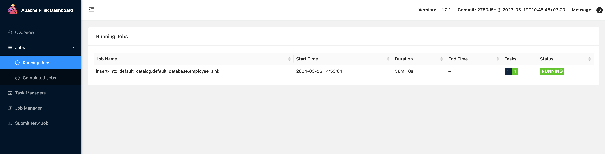
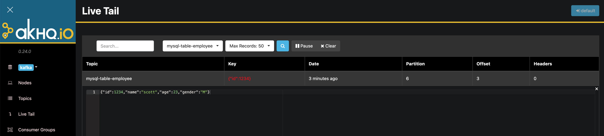

# MySQL Data Synchronization to Kafka

In complex computing scenarios, a table in MySQL may be used by multiple jobs (for example, a table that stores user information). When multiple tasks use the same MySQL table for processing, the MySQL database initiates multiple connections, putting significant pressure on the MySQL server and the network.

To alleviate the pressure on the upstream MySQL database, it is possible to consider using Flink CDC to synchronize the MySQL table to Kafka, where the MySQL table is written to the corresponding topic in the form of Upsert Kafka. Then, instead of using the MySQL table directly, use the table in the Kafka JSON Catalog, thereby reducing the pressure on the MySQL database caused by multiple tasks.

This article introduces how to implement data synchronization in Flink SQL without writing a single line of code.

# Component Dependencies

Requires the installation of the following components on KDP:

- flink-kubernetes-operator
- flink-session-cluster
- kafka-3-operator
- kafka-3-cluster
- kafka-manager（optional）

Please install the above components in order.

For the usage of Flink SQL, please refer to [Flink SQL](./import-from-mysql-to-hive.md#flink-sql-使用方法)

After the installation of kafka-3-cluster is complete, please click on 'Big Data Cluster Management' - 'Cluster Information' - 'Application Usage Configuration' - 'kafka-3-cluster-kafka-context' on the KDP page in sequence, and check the value of `bootstrap_plain` (usually `kafka-3-cluster-kafka-0.kafka-3-cluster-kafka-brokers.kdp-data.svc.cluster.local:9092,kafka-3-cluster-kafka-1.kafka-3-cluster-kafka-brokers.kdp-data.svc.cluster.local:9092,kafka-3-cluster-kafka-2.kafka-3-cluster-kafka-brokers.kdp-data.svc.cluster.local:9092`). This value is the address of the kafka bootstrap servers and will be used below.

# Data Source Preparation

> Note: Flink CDC needs to read the MySQL binlog, please ensure that the `binlog_row_image` is set to `FULL` in the MySQL configuration. The source table must have a primary key.

If there is an appropriate data source already, skip this step.

Log in to MySQL and execute the following SQL script to create a database and table:

```sql
CREATE DATABASE my_database;

CREATE TABLE IF NOT EXISTS my_database.employee (
  id int NOT NULL PRIMARY KEY,
  name varchar(255),
  age int,
  gender varchar(255)
);
```

# Create Synchronization Job

Enter Flink SQL and execute the following script. Note to replace the MySQL address, port, and credentials with real information. Replace the Kafka bootstrap servers with the address obtained in the previous step.

```sql
CREATE TABLE employee_source (
  `id` INT NOT NULL,
  name STRING,
  age INT,
  gender STRING,
  PRIMARY KEY (`id`) NOT ENFORCED
) WITH (
  'connector' = 'mysql-cdc',
  'hostname' = '<mysql_host>',
  'port' = '<mysql_port>',
  'username' = '<mysql_user>',
  'password' = '<mysql_password>',
  'database-name' = 'my_database',
  'table-name' = 'employee',
  'server-time-zone' = 'Asia/Shanghai',
  'jdbc.properties.useSSL' = 'false'
);

CREATE TABLE employee_sink(
  `id` INT NOT NULL,
  name STRING,
  age INT,
  gender STRING,
  PRIMARY KEY (`id`) NOT ENFORCED
) WITH (
  'connector' = 'upsert-kafka',
  'topic' = 'mysql-table-employee',
  'properties.bootstrap.servers' = '<bootstrap_servers>',
  'key.format' = 'json',
  'value.format' = 'json'
);

INSERT INTO employee_sink SELECT * FROM employee_source;
```

At this point, a real-time synchronization job has been created, which can be seen running in the Flink Dashboard.



If Kafka Manager is installed, you can open the Live Tail page to observe the data entering the topic.

If not installed, you can enter the `kafka-3-cluster-kafka-0` container and execute the following command to observe the data entering the topic.

```shell
./bin/kafka-console-consumer.sh --bootstrap-server localhost:9092 --topic mysql-table-employee
```

Log in to MySQL and execute the following SQL to insert data:

```sql
INSERT INTO my_database.employee VALUES (1234, 'scott', 23, 'M');
```

Observe the data that has entered the topic.




