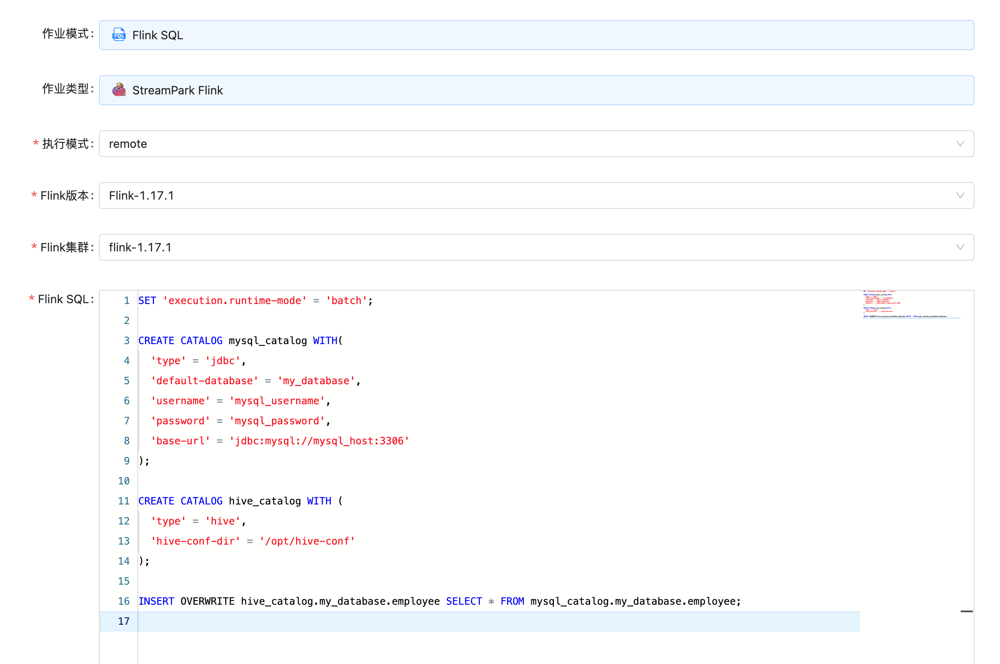

# Importing Data from Relational Databases to Hive

After setting up an enterprise's big data platform, it is usually necessary to import data from databases scattered across various departments to eliminate data silos. Traditional host-based big data platforms often use ETL tools like Sqoop to import data. On cloud-native big data platforms, there are better methods available.

This article introduces how to use Flink SQL to import MySQL data into Hive. Flink's Table & SQL API can handle SQL queries written in the SQL language, but these queries need to be embedded in table programs written in Java or Scala. In addition, these programs need to be packaged with build tools before being submitted to the cluster. We can use Flink SQL Client or StreamPark to write, debug, and submit table programs to the Flink cluster without writing a single line of Java or Scala code. This step can be easily achieved on KDP.

# Component Dependencies

Requires the installation of the following components on KDP:

- hdfs
- hive-metastore
- hive-server2
- flink-kubernetes-operator
- flink-session-cluster
- streampark（optional. Note that Flink on Hive needs to be enabled.）
- hue（optional）

Please install the above components in order.

## StreamPark Configuration (Optional)

If streampark is installed, Flink cluster configuration must be done first.

1. Find Flink, go to the Streampark application, click the application instance name, click the "Access Address" button to enter the Streampark management page, and log in with the fixed username (`admin`) and password (`streampark`).
   In the `Settings Center`, add `Flink version` configuration: Currently, only Flink version 1.17.1 is supported, and the default path in streampark is `/streampark/flink/flink-1.17.1`.

   

2. In the `Settings Center`, add Flink cluster configuration: Currently, only Flink version 1.17.1 is supported. The default access address for KDP Flink is: `http://flink-session-cluster-rest:8081`

   

## Hue Configuration (Optional)


After Hue is installed, it will automatically connect to hive server2 without the need for additional configuration. Log in to the Hue login page with the account `root` (DO NOT use other users, otherwise, permission issues may arise), no password required.

# CLI Tools

If you do not wish to install streampark and hue, you can use Flink SQL and Beeline as alternatives, respectively.

## Flink SQL Usage

Execute the following commands to enter Flink SQL:

```shell
# Obtain the flink-session-cluster pod name.
kubectl get pods -n kdp-data -l app=flink-session-cluster -l component=jobmanager -o name
# Enter the flink-session-cluster container.
# Replace 'flink-session-cluster-xxxxx' with the actual pod name.
kbuectl exec -it flink-session-cluster-xxxxx -n kdp-data -- bash
# Start Flink SQL
./bin/sql-client.sh
```

## Beeline Usage

Execute the following commands to enter Beeline:

```shell
# Enter the hive-server2 container
kubectl exec -it hive-server2-0 -n kdp-data -- bash
# Start Beeline.
beeline -u 'jdbc:hive2://hive-server2-0.hive-server2:10000/;auth=noSasl' -n root
```

# Data Preparation

## Source Table

If there is already data in MySQL, you can skip this step. If not, you can refer to the following steps to create test data.

Log in to MySQL and execute the following SQL script to create a database and table, and insert test data:

```sql
CREATE DATABASE my_database;

CREATE TABLE IF NOT EXISTS my_database.employee (
  id int NOT NULL PRIMARY KEY,
  name varchar(255),
  age int,
  gender varchar(255)
);

INSERT INTO my_database.employee
VALUES
  (1, 'scott', 23, 'M'),
  (2, 'scott', 23, 'M'),
  (3, 'scott', 23, 'M'),
  (4, 'scott', 23, 'M'),
  (5, 'scott', 23, 'M');
```

## Target Table

In Beeline or Hue, execute the following script to create a target table corresponding to the source table:

```sql
CREATE DATABASE my_database;

CREATE TABLE IF NOT EXISTS my_database.employee (
 id int,
 name string,
 age int,
 gender string )
 COMMENT 'Employee Table'
 ROW FORMAT DELIMITED
 FIELDS TERMINATED BY ',';
```

# Data Import

In StreamPark or Flink SQL, execute the following Flink SQL. Note that you need to replace the MySQL address, port, and credentials with real information.

```sql
SET 'execution.runtime-mode' = 'batch';

CREATE CATALOG mysql_catalog WITH(
  'type' = 'jdbc',
  'default-database' = 'my_database',
  'username' = '<mysql_username>',
  'password' = '<mysql_password>',
  'base-url' = 'jdbc:mysql://<mysql_host>:<mysql_port>'
);

CREATE CATALOG hive_catalog WITH (
  'type' = 'hive',
  'hive-conf-dir' = '/opt/hive-conf'
);

INSERT OVERWRITE hive_catalog.my_database.employee SELECT * FROM mysql_catalog.my_database.employee;
```

> MySQL Catalog, refer to [JDBC Catalog Doc](https://nightlies.apache.org/flink/flink-docs-release-1.17/zh/docs/connectors/table/jdbc/#jdbc-catalog-的使用)

> Hive Catalog, refer to[Hive Catalog Doc](https://nightlies.apache.org/flink/flink-docs-release-1.17/zh/docs/connectors/table/hive/overview/#连接到hive)

You can refer to the following image to create a job in StreamPark.



# Browsing Data in Hive

After the data import is complete, you can browse the data in Beeline or Hue:

```sql
select * from my_database.employee;
```

Then you can analyze and process the data in Hive.
