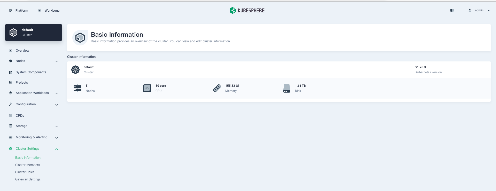
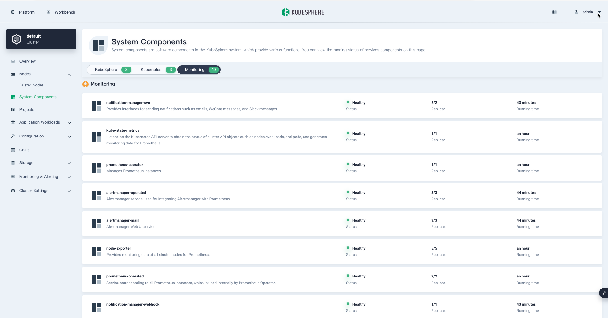
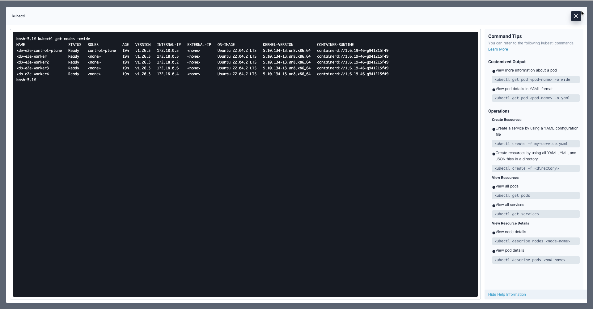
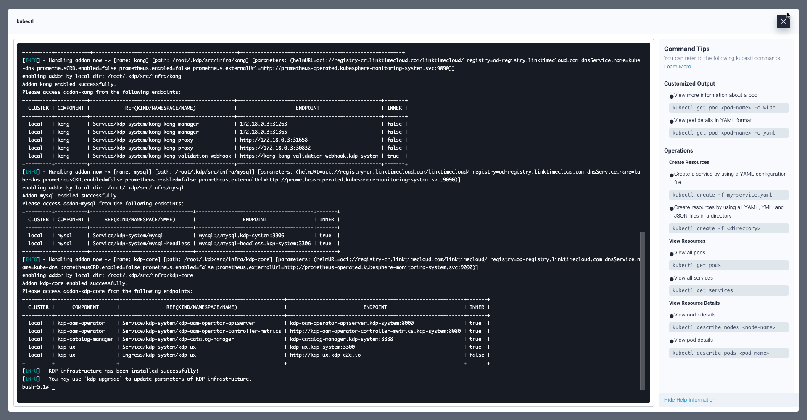
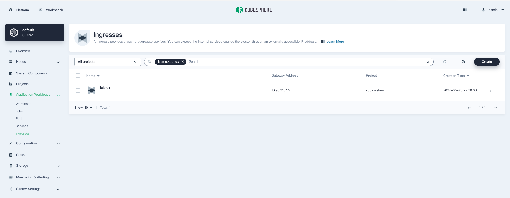
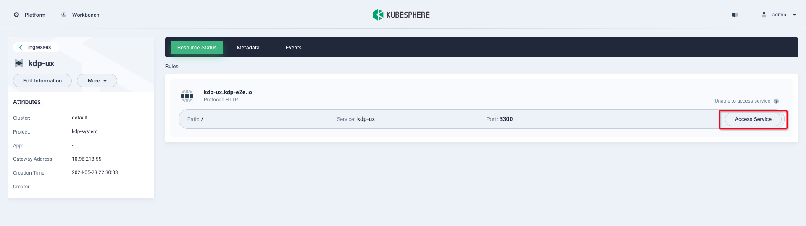
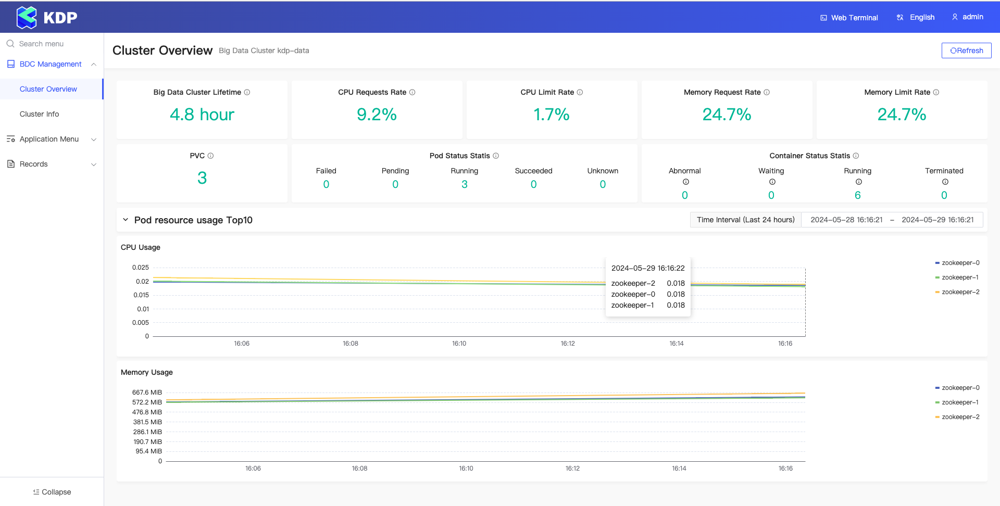

# Install KDP on KubeSphere Container Platform
## KubeSphere Container Platform
### Kubekey

[Kubekey](https://github.com/kubesphere/kubekey) is an open source Kubernetes installer and lifecycle manager. It supports installation of Kubernetes clusters, KubeSphere, and other related components.

### KubeSphere

[KubeSphere](https://kubesphere.io/) is a distributed operating system for cloud-native application management, using Kubernetes as its kernel. It provides a plug-and-play architecture, allowing third-party applications to be seamlessly integrated into its ecosystem.

## Prerequisites

- [x] KubeSphere is installed on Kubernetes(refer to [Minimal KubeSphere on Kubernetes](https://kubesphere.io/docs/v3.4/quick-start/minimal-kubesphere-on-k8s/) for a quick-start):


- [x] After KubeSphere is installed, login to KubeSphere web console and make sure the monitoring components are enabled:


## Install KDP on KubeSphere

> Assume you have already installed KubeSphere on a v1.26.x Kubernetes cluster with monitoring componentes enabled.

### Install KDP CLI

* Use either local terminal tool or KubeShpere web terminal:
  * By local shell: Open your local shell terminal tool with Bash or Zsh.
  * By [Web Kubectl](https://kubesphere.io/docs/v3.4/toolbox/web-kubectl/): 


* In the web/local terminal, run following commands to install KDP CLI(Note: for web terminal, since it's statefulless, you may need to install KDP CLI every time you connect to a new session): 
```bash
# Download KDP CLI(set env 'VERSION' to the version you want to download)
export VERSION=v1.1.0
wget https://github.com/linktimecloud/kubernetes-data-platform/releases/download/${VERSION}/kdp-${VERSION}-linux-amd64.tar.gz
tar xzf kdp-${VERSION}-linux-amd64.tar.gz
mkdir -p ~/.local/bin
install -v linux-amd64/kdp ~/.local/bin
export PATH=$PATH:$HOME/.local/bin

kdp version
```

### Install KDP infrastructure

Run below command to install KDP infrastructure:
```bash
# Note: pay attention to those parameters:
# - `openebs.enabled=false`: To disable installing OpenEBS hostpath provisioner in KDP
# - `storageConfig.storageClassMapping.localDisk=local`: To use the built-in StorageClass on KubeShpere, you may also change `local` to other existing SC
# - `prometheusCRD.enabled=false`: To disable installing Prometheus CRD in KDP
# - `prometheus.enabled=false`: To disable installing Prometheus operator and cluster in KDP
# - `prometheus.externalUrl=http://prometheus-operated.kubesphere-monitoring-system.svc:9090`: To use the built-in Prometheus service URL on KubeShpere
kdp install \
--force-reinstall \
--set openebs.enabled=false \
--set storageConfig.storageClassMapping.localDisk=local \
--set prometheusCRD.enabled=false \
--set prometheus.enabled=false \
--set prometheus.externalUrl=http://prometheus-operated.kubesphere-monitoring-system.svc:9090
```

## Visit KDP UX

* Wait untill the installation is completed:


* Go to menu 'Application Workloads' -> 'Ingresses' on KubeSphere web console and find the ingress object 'kdp-ux' and click to enter its detailed page:


* On the detailed page of ingress 'kdp-ux', click the 'Access Service' button of path '/' and KDP UX will be opened in a new tab:


* You may now use KDP web console to set up your data platform. For more tutorials with data components, please refer to [**tutorial catalogs**](./tutorials.md):

