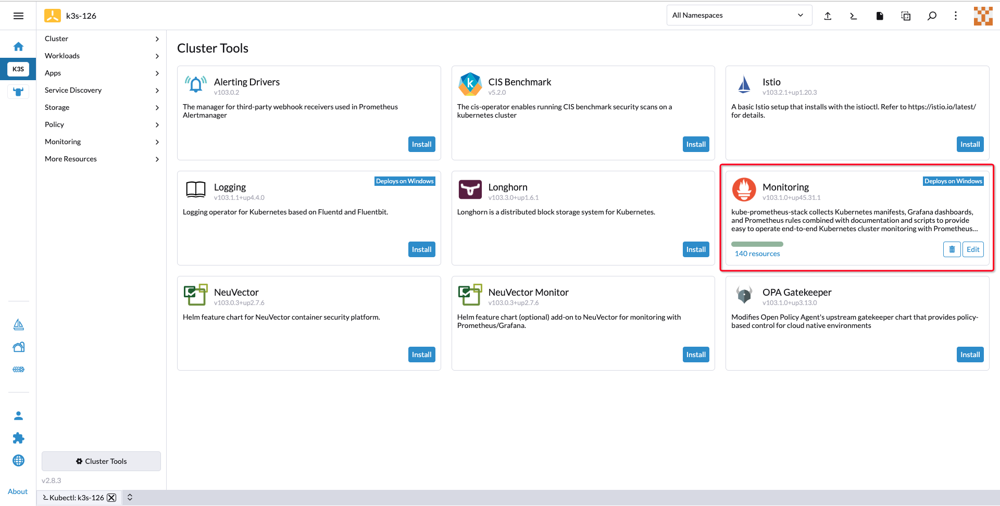

# Install KDP on Rancher
## Rancher
### What is Rancher

[Rancher](https://ranchermanager.docs.rancher.com/) is a Kubernetes management tool to deploy and run clusters anywhere and on any provider.

Rancher can provision Kubernetes from a hosted provider, provision compute nodes and then install Kubernetes onto them, or import existing Kubernetes clusters running anywhere.

Rancher is a complete container management platform for Kubernetes, giving you the tools to successfully run Kubernetes anywhere.


### Rancher Architecture

Speaking of the architecture of Rancher, there are Rancher management server and Rancher-managed downstream clusters:


### Integrated Kubernetes Distributions

Rancher integrates these [Kubernetes distributions](https://ranchermanager.docs.rancher.com/integrations-in-rancher/kubernetes-distributions): 

- [K3s](https://docs.k3s.io/): Lightweight Kubernetes. Easy to install, half the memory, all in a binary of less than 100 MB.

- [RKE2](https://docs.rke2.io/): RKE2, also known as RKE Government, is Rancher's next-generation Kubernetes distribution.

When creating a custom downstream cluster on Rancher, you may see those two distributions as options:


## Prerequisites

- [x] The Rancher management server is installed on a [Kubernetes cluster](https://ranchermanager.docs.rancher.com/getting-started/installation-and-upgrade/install-upgrade-on-a-kubernetes-cluster) or by [other methods](https://ranchermanager.docs.rancher.com/getting-started/installation-and-upgrade/other-installation-methods).

- [x] A Downstream cluster are [set up on the Rancher management server](https://ranchermanager.docs.rancher.com/how-to-guides/new-user-guides/launch-kubernetes-with-rancher), such as a K3s cluster, a RKE2 cluster or K8s clusters from [other providers](https://ranchermanager.docs.rancher.com/how-to-guides/new-user-guides/kubernetes-clusters-in-rancher-setup).

## Install KDP on Rancher-managed clusters

> Assume you have already installed a downstream K3s or RKE2 cluster(K8s v1.26.x) on Rancher and the monitroing stack has been installed on the downstream cluster:



### Install KDP CLI

* Use either local terminal tool or Rancher web terminal:
  * By local shell: Open your local shell terminal tool with Bash or Zsh.
  * By 'Kubectl Shell': Open the 'Kubectl Shell(Ctrl+`)' on Rancher web console as below, and you will connect to a web terminal:


* In the web/local terminal, run following commands to install KDP CLI(Note: for web terminal, since it's statefulless, you may need to install KDP CLI every time you connect to a new session): 
```bash
# Download KDP CLI(set env 'VERSION' to the version you want to download)
export VERSION=v1.1.0
wget https://github.com/linktimecloud/kubernetes-data-platform/releases/download/${VERSION}/kdp-${VERSION}-linux-amd64.tar.gz
tar xzf kdp-${VERSION}-linux-amd64.tar.gz
mkdir -p ~/.local/bin
install -v linux-amd64/kdp ~/.local/bin
export PATH=$PATH:$HOME/.local/bin

kdp version
```

### Install KDP infrastructure
#### For K3s clusters

Run below command to install KDP on K3s clusters with monitoring stack enabled: 
```bash
# Note: pay attention to those parameters:
# - `dnsService.name=kube-dns`: To specify the default DNS service name of K3s clusters.
# - `kong.enabled=false` && `ingress.class=traefik`: To disable installing KDP built-in Kong ingress controller, and use K3s built-in Traefik instead.
# - `prometheus*`: To disable installing KDP built-in monitoring stack, and use K3s built-in monitoring stack instead.

kdp install \
--force-reinstall \
--set dnsService.name=kube-dns \
--set kong.enabled=false \
--set ingress.class=traefik \
--set prometheusCRD.enabled=false \
--set prometheus.enabled=false \
--set prometheus.externalUrl=http://rancher-monitoring-prometheus.cattle-monitoring-system.svc:9090
```

#### For RKE2 clusters

Run below command to install KDP on RKE2 clusters with monitoring stack enabled: 
```bash
# Note: pay attention to those parameters:
# - `dnsService.name=rke2-coredns-rke2-coredns`: To specify the default DNS service name of RKE2 clusters.
# - `kong.enabled=false` && `ingress.class=nginx`: To disable installing KDP built-in Kong ingress controller, and use RKE2 built-in Nginx instead.
# - `prometheus*`: To disable installing KDP built-in monitoring stack, and use RKE2 built-in monitoring stack instead.

kdp install \
--force-reinstall \
--set dnsService.name=rke2-coredns-rke2-coredns \
--set kong.enabled=false \
--set ingress.class=nginx \
--set prometheusCRD.enabled=false \
--set prometheus.enabled=false \
--set prometheus.externalUrl=http://rancher-monitoring-prometheus.cattle-monitoring-system.svc:9090
```

### Visit KDP UX

* Wait untill the installation is completed:


* Go to menu 'Service Discovery' - 'Ingresses' on Rancher web console, and find the ingress object 'kdp-ux', then click the hyper link in the column 'Target', and KDP UX will be opened in a new tab:


* You may now use KDP web console to set up your data platform. For more tutorials with data components, please refer to [**tutorial catalogs**](./tutorials.md)::

