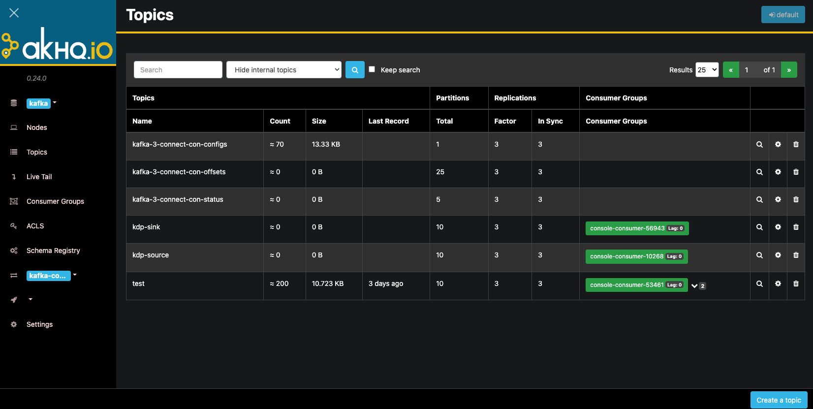
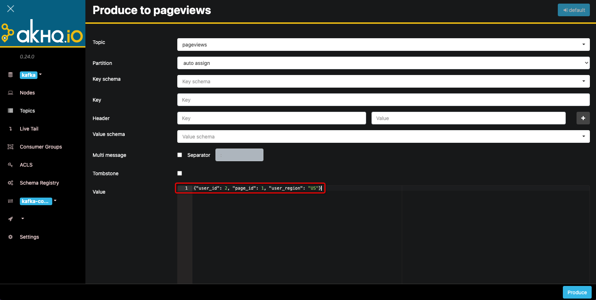
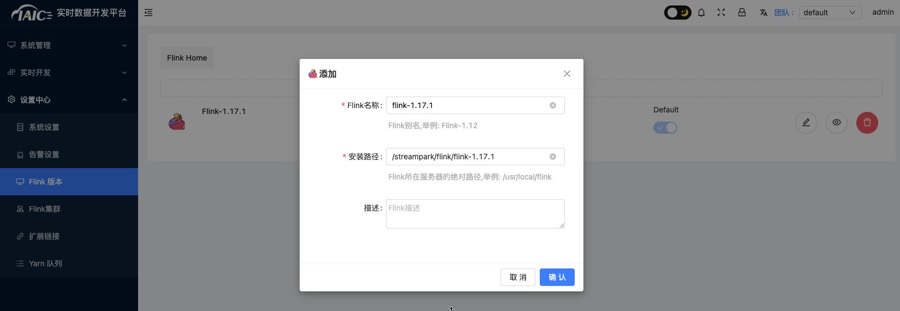
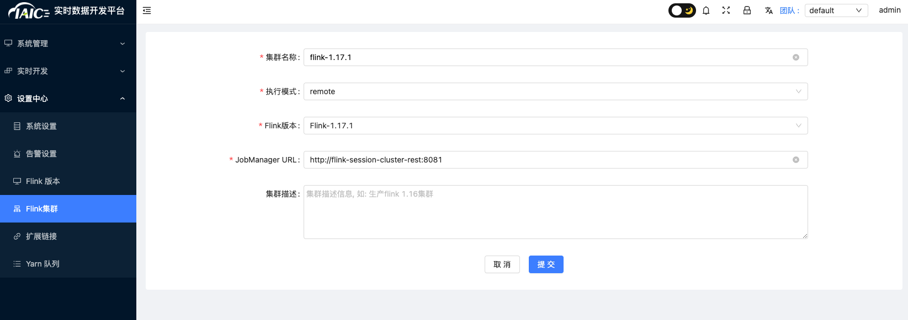
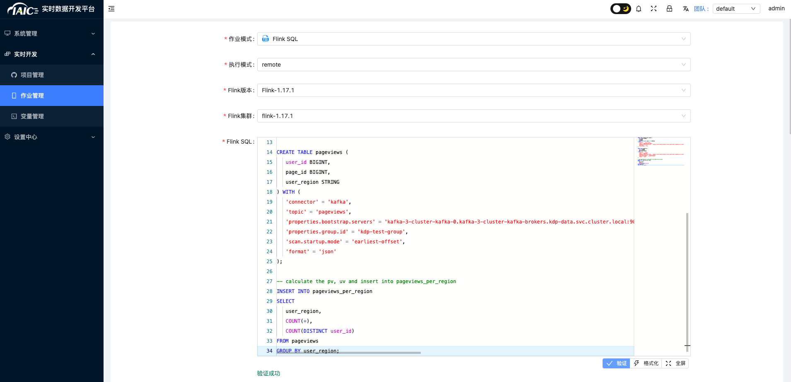
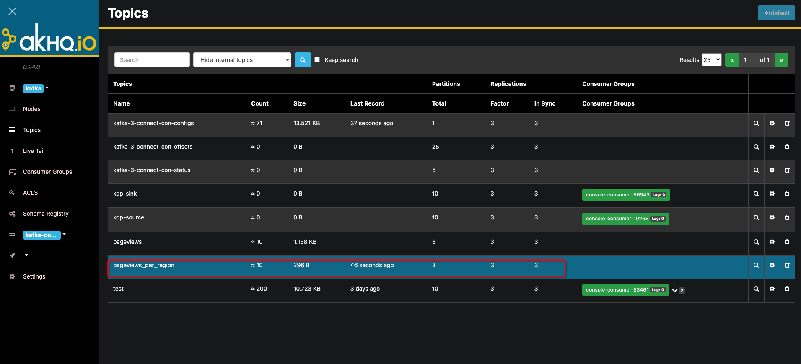

# Kafka Integration with Internal and External Components

The cloud-native Kafka provided by KDP is a distributed message queue system characterized by high throughput, high availability, and high fault tolerance, making it suitable for large-scale data processing scenarios.

To support users in quickly setting up Kafka clusters, KDP offers a Kafka cluster application that allows users to install Kafka clusters with one click through the KDP-ux interface, supporting the production and consumption of messages.

To facilitate the transfer of data from on-premises to the cloud, KDP provides Kafka with the ability to access K8s clusters externally. By exposing Kafka services through the K8s nodeport method, users can connect their on-premises services to the KDP Kafka cluster via Kafka clients.


## Kafka Integration with External Components

KDP has encapsulated Kafka, allowing cloud-based user services to access the Kafka cluster in a manner consistent with on-premises access. When accessing from on-premises, users simply need to resolve the Kafka cluster domain name to the KDP Kafka cluster's K8s node IP, enabling connection to the KDP Kafka cluster through the Kafka client.

### Kafka Deployment

Install the Kafka cluster application through KDP-ux and select nodeport for `listeners.type`.

### Network Connectivity

After installing the Kafka cluster application, ensure that the network between the KDP Kafka cluster K8s node and the user service's network is connected, allowing the user service to connect to the KDP Kafka cluster via the Kafka client.

Please configure the DNS server or local hosts file to resolve the Kafka cluster domain name to the KDP Kafka cluster K8s node IP.

### Configuring Kafka Domain Name Resolution

The KDP Kafka cluster application will automatically create a Kafka cluster domain name, which users need to resolve to the KDP Kafka cluster K8s node IP. The Kafka cluster domain name format is: `<kafka-broker>.<namespace>.svc.<cluster-domain>`, for example: `kafka-3-cluster-kafka-plain-0.kdp-data.svc.cluster.local`.

Note: KDP Kafka address and port information can be viewed through the KDP-ux cluster information - application usage configuration page. By default, the Kafka three-node broker will occupy NodePort ports 31091-31094.

### Kafka Client Connection

To connect user services to the KDP Kafka cluster, configure the Kafka client connection information, including the Kafka cluster domain name and Kafka cluster port.

If users already have on-premises applications that use Kafka, only need to replace the Kafka address and port to switch to KDP Kafka.

Below is an example of KDP Kafka producer and consumer code:

1. Java Dependency Configuration
   Add the following dependency to pom.xml.

```xml
   <dependency>
       <groupId>org.apache.kafka</groupId>
       <artifactId>kafka-clients</artifactId>
       <version>3.4.1</version>
   </dependency>
```

2. Create Kafka Configuration File kafka-cfg.properties

```properties
   bootstrap.servers=<broker add+ip>
   topic=<set topic name>
   group.id=<set group id>
```

3. Utility Class Preparation

```java
   import java.util.Properties;
   
   public class KafkaCfg {
       private static Properties properties;
       public static final String BOOTSTRAP_SERVERS = "bootstrap.servers";
       public static final String TOPIC = "topic";
       public static final String GROUP_ID = "group.id";
     
     
       public synchronized static Properties getKafkaProperties() {
           if (null != properties) {
               return properties;
           }
           Properties kafkaProperties = new Properties();
           try {
               kafkaProperties.load(KafkaCfg.class.getClassLoader().getResourceAsStream("kafka-cfg.properties"));
           } catch (Exception e) {
               e.printStackTrace();
           }
           properties = kafkaProperties;
           return kafkaProperties;
       }
   }
```

4. Producing Messages

```java
   import org.apache.kafka.clients.producer.KafkaProducer;
   import org.apache.kafka.clients.producer.ProducerConfig;
   import org.apache.kafka.clients.producer.ProducerRecord;
   
   import java.util.Properties;
   
   public class KdpKafkaProducer {
   
       public static void main(String args[]) {
           //load kafka-cfg.properties
           Properties kafkaCfgProperties =  KafkaCfg.getKafkaProperties();
   
           Properties props = new Properties();
           // Set the bootstrap servers. Please obtain the corresponding bootstrap servers from the console for the respective Topic.
           props.put(ProducerConfig.BOOTSTRAP_SERVERS_CONFIG, kafkaCfgProperties.getProperty(KafkaCfg.BOOTSTRAP_SERVERS));
   
           // Kafka message acknowledgment mechanism, 1 means return after leader acknowledgment, -1 means return after all replicas acknowledgment
           props.put("acks", "1");
           // Serialization method for Kafka messages.
           props.put(ProducerConfig.KEY_SERIALIZER_CLASS_CONFIG, "org.apache.kafka.common.serialization.StringSerializer");
           props.put(ProducerConfig.VALUE_SERIALIZER_CLASS_CONFIG, "org.apache.kafka.common.serialization.StringSerializer");
           // Maximum waiting time for requests.
           props.put(ProducerConfig.MAX_BLOCK_MS_CONFIG, 30 * 1000);
           // Set the client's internal retry count.
           props.put(ProducerConfig.RETRIES_CONFIG, 5);
           // Set the client's internal retry interval.
           props.put(ProducerConfig.RECONNECT_BACKOFF_MS_CONFIG, 3000);
           // Construct the Producer object, which is thread-safe.
           KafkaProducer<String, String> producer = new KafkaProducer<>(props);
   
           // Topic to which the message belongs
           String topic = kafkaCfgProperties.getProperty(KafkaCfg.TOPIC);
           // Message key
           String key = "message key";
           // Message content, here is just a test string, in actual production scenarios, messages are often converted to JSON or Avro format strings.
           String value = "this is the message's value";
   
           for (int i = 0; i< 100 ; i++) {
               ProducerRecord<String, String> record = new ProducerRecord<>(topic,
                       key + i,
                      value + i);
               producer.send(record);
           }
           producer.flush();
       }
   }
```

5. Consuming Messages

```java
   import org.apache.kafka.clients.consumer.ConsumerConfig;
   import org.apache.kafka.clients.consumer.ConsumerRecord;
   import org.apache.kafka.clients.consumer.ConsumerRecords;
   import org.apache.kafka.clients.consumer.KafkaConsumer;
   import org.apache.kafka.clients.producer.ProducerConfig;
   
   import java.util.ArrayList;
   import java.util.List;
   import java.util.Properties;
   
   public class KdpKafkaConsumer {
   
       public static void main(String args[]) {
           //load kafka-cfg.properties
           Properties kafkaProperties =  KafkaCfg.getKafkaProperties();
   
           Properties props = new Properties();
           // Set the bootstrap servers. Please obtain the corresponding bootstrap servers from the console for the respective Topic.
           props.put(ProducerConfig.BOOTSTRAP_SERVERS_CONFIG, kafkaProperties.getProperty(KafkaCfg.BOOTSTRAP_SERVERS));
           // Maximum allowed interval between two Polls.
           // If the consumer does not return a heartbeat within this value, the server considers the consumer to be in a non-live state, removes it from the Consumer Group, and triggers Rebalance. Default is 30s.
           props.put(ConsumerConfig.SESSION_TIMEOUT_MS_CONFIG, 30000);
           // Maximum number of records per Poll.
           // Be cautious about setting this value too high. If too many records are polled but not consumed before the next poll, it will trigger a rebalance and cause latency.
           props.put(ConsumerConfig.MAX_POLL_RECORDS_CONFIG, 30);
           // Message deserialization method.
           props.put(ConsumerConfig.KEY_DESERIALIZER_CLASS_CONFIG, "org.apache.kafka.common.serialization.StringDeserializer");
           props.put(ConsumerConfig.VALUE_DESERIALIZER_CLASS_CONFIG, "org.apache.kafka.common.serialization.StringDeserializer");
           // Consumer Group to which the current consumer instance belongs. Please fill in after applying on the console.
           // Consumer instances belonging to the same group will share the consumption load.
           props.put(ConsumerConfig.GROUP_ID_CONFIG, kafkaProperties.getProperty(KafkaCfg.GROUP_ID));
   
           // Create a consumer instance.
           KafkaConsumer<String, String> consumer = new KafkaConsumer<>(props);
           // Set the topics subscribed by the consumer group. Multiple topics can be subscribed.
           // It is recommended to set the subscribed topics the same if GROUP_ID_CONFIG is the same.
           List<String> subscribedTopics =  new ArrayList<String>();
           // Add multiple topics to subscribe if necessary.
           // Each topic needs to be created on the console first.
           String topicStr = kafkaProperties.getProperty(KafkaCfg.TOPIC);
           String[] topics = topicStr.split(",");
           for (String topic: topics) {
               subscribedTopics.add(topic.trim());
           }
           consumer.subscribe(subscribedTopics);
   
           // Consume messages in a loop.
           while (true){
               try {
                   // Must consume these records before the next Poll, and the total time consumed must not exceed SESSION_TIMEOUT_MS_CONFIG.SESSION_TIMEOUT_MS_CONFIG。
                   ConsumerRecords<String, String> records = consumer.poll(1000);
   
                   // It is recommended to open a separate thread pool to consume messages and then return results asynchronously.
                   for (ConsumerRecord<String, String> record : records) {
                       System.out.println(String.format("Consume partition:%d offset:%d", record.partition(), record.offset()));
                       System.out.println(String.format("record key:%s, value:%s", record.key(), record.value()));
                   }
               } catch (Exception e) {
                   e.printStackTrace();
               }
           }
       }
   }
```

## Kafka Integration with Internal Components

KDP provides an example of reading Kafka data and writing it back to Kafka using Flink for user reference.


### Component Deployment

Install Kafka cluster, kafka-manager, Flink cluster, and streampark applications on KDP-ux.

### Topic Creation and Data Preparation

Find the application directory under Kafka and click on the kafka-manager application. Enter the application details page and click the "Access Address" button to enter the kafka-manager management page. Create topics named `pageviews` and `pageviews_per_region`.

Kafka Manager Topic Management and Creation




Click the magnifying glass on the right side of the `pageviews` topic to enter the topic details page. Click the "`Produce to topic`" button to send the following data to the topic one by one.



```json
{"user_id": 1, "page_id": 1, "user_region": "China"}
{"user_id": 2, "page_id": 1, "user_region": "US"}
{"user_id": 3, "page_id": 1, "user_region": "China"}
{"user_id": 4, "page_id": 1, "user_region": "US"}
{"user_id": 5, "page_id": 2, "user_region": "China"}
{"user_id": 6, "page_id": 2, "user_region": "US"}
{"user_id": 7, "page_id": 3, "user_region": "China"}
{"user_id": 8, "page_id": 4, "user_region": "US"}
{"user_id": 9, "page_id": 3, "user_region": "UK"}
{"user_id": 10, "page_id": 4, "user_region": "UK"}
```

### Flink Reading and Writing Kafka

#### Streampark Configuration

If the configuration is complete, skip this step.

1. Find the Streampark application under the Flink application directory, enter the application details page, and click the "Access Address" button to enter the Streampark management page. Log in with the fixed username (`admin`) and password (`streampark`).
   In the design center, add `Flink version` configuration: Currently, only Flink version 1.17.1 is supported. The default path for streampark is `/streampark/flink/flink-1.17.1`.
   

2. In the `design center`, add `Flink cluster` configuration: Currently, only Flink version 1.17.1 is supported. The default access address for KDP Flink is: http://flink-session-cluster-rest:8081.
   

#### Flink Job Writing

1. Select `real-time job` -> `Job management` and click "`Add`",
2. Select "`remote`" as the execution mode, and choose the `Flink version` and `Flink cluster` configured in 3.3.1.
   
3. Fill in the following Flink SQL:

```sql
CREATE TABLE pageviews_per_region (
   user_region STRING,
   pv BIGINT,
   uv BIGINT,
   PRIMARY KEY (user_region) NOT ENFORCED
) WITH (
   'connector' = 'upsert-kafka',
   'topic' = 'pageviews_per_region',
   'properties.bootstrap.servers' = 'kafka-3-cluster-kafka-0.kafka-3-cluster-kafka-brokers.kdp-data.svc.cluster.local:9092,kafka-3-cluster-kafka-1.kafka-3-cluster-kafka-brokers.kdp-data.svc.cluster.local:9092,kafka-3-cluster-kafka-2.kafka-3-cluster-kafka-brokers.kdp-data.svc.cluster.local:9092',
   'key.format' = 'csv',
   'value.format' = 'csv'
);

CREATE TABLE pageviews (
   user_id BIGINT,
   page_id BIGINT,
   user_region STRING
) WITH (
   'connector' = 'kafka',
   'topic' = 'pageviews',
   'properties.bootstrap.servers' = 'kafka-3-cluster-kafka-0.kafka-3-cluster-kafka-brokers.kdp-data.svc.cluster.local:9092,kafka-3-cluster-kafka-1.kafka-3-cluster-kafka-brokers.kdp-data.svc.cluster.local:9092,kafka-3-cluster-kafka-2.kafka-3-cluster-kafka-brokers.kdp-data.svc.cluster.local:9092',
   'properties.group.id' = 'kdp-test-group',
   'scan.startup.mode' = 'earliest-offset',
   'format' = 'json'
);

-- calculate the pv, uv and insert into pageviews_per_region
INSERT INTO pageviews_per_region
SELECT
   user_region,
   COUNT(*),
   COUNT(DISTINCT user_id)
FROM pageviews
GROUP BY user_region;
```

4. Enter the job name "`kafka-to-kafka`" and click "`OK`".
5. In the `job management` page, find the newly added "`kafka-to-kafka`" job and click "`Submit` & `Start`" in the operations to wait for the task to start successfully.

### Result Verification

Return to the kafka manager page and check the data in the `pageviews_per_region` topic to see if the data has been written to the `pageviews_per_region` topic.

You can click the magnifying glass on the right side of the `pageviews_per_region`



