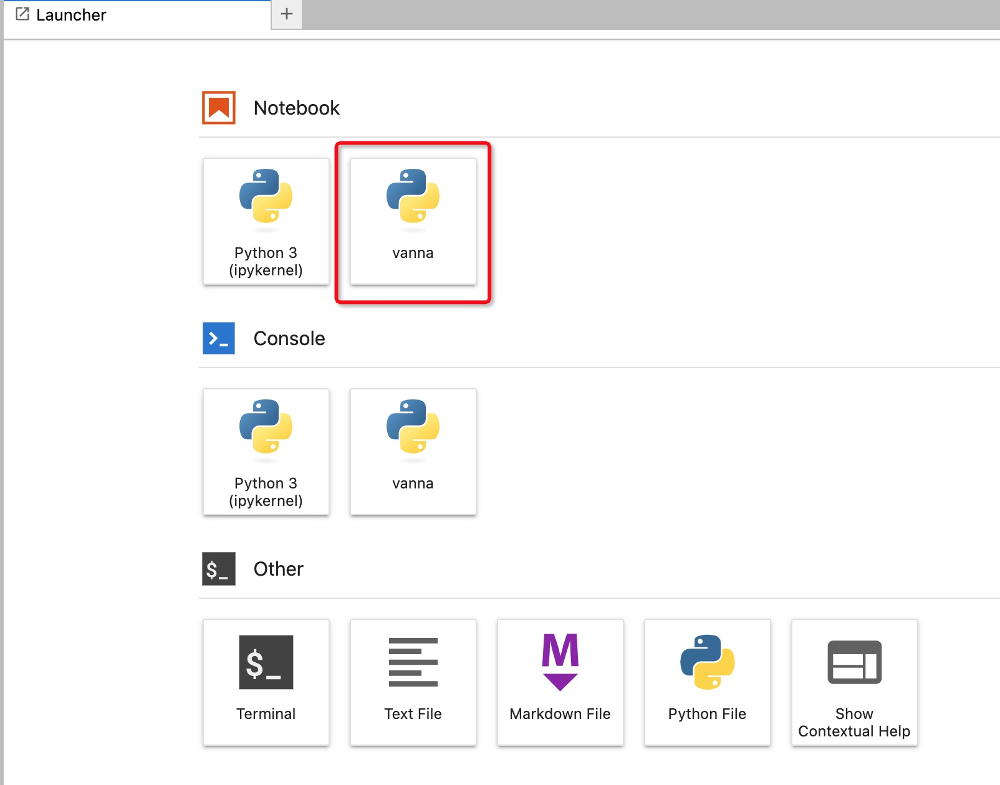

# Large Language Model (LLM) Retrieval-Augmented Generation (RAG) Development Guide

## Large Language Models (LLM) and Retrieval-Augmented Generation (RAG)

Large Language Models (LLM), also known as large-scale language models, are AI models designed to understand and generate human language.

LLM typically refers to language models with hundreds of billions (or more) of parameters, trained on vast amounts of text data, gaining a deep understanding of language. Currently, well-known LLMs abroad include GPT-3.5, GPT-4, PaLM, Claude, and LLaMA, while domestically, there are models like Wenxin Yiyan, Xunfei Spark, Tongyi Qianwen, ChatGLM, and Baichuan.

To explore performance limits, many researchers have started training increasingly larger language models, such as GPT-3 with 175 billion parameters and PaLM with 540 billion parameters. Although these large language models use similar architectures and pre-training tasks as smaller models (like BERT with 330 million parameters and GPT-2 with 1.5 billion parameters), they exhibit strikingly different capabilities, especially in solving complex tasks, showing remarkable potential, known as "emergent abilities." Taking GPT-3 and GPT-2 as examples, GPT-3 can solve few-shot tasks by learning context, while GPT-2 performs poorly in this regard. Therefore, the research community has named these large models "Large Language Models (LLM)." A notable application of LLM is ChatGPT, a bold attempt to use the GPT series LLM for human-like conversational applications, demonstrating very smooth and natural performance.

Large Language Models (LLM) have stronger capabilities compared to traditional language models, yet they may still fail to provide accurate answers in some cases. To address the challenges faced by large language models in text generation and to improve model performance and output quality, researchers have proposed a new model architecture: Retrieval-Augmented Generation (RAG). This architecture cleverly integrates relevant information retrieved from a vast knowledge base and uses it to guide large language models in generating more accurate answers, significantly enhancing the accuracy and depth of responses. RAG has been successful in multiple fields, including question-answering systems, dialogue systems, document summarization, and document generation.

## Building RAG Applications in KDP

In KDP, it is convenient to utilize local or online large models, combined with user-specific data, to build RAG applications. Below, we illustrate how to build a RAG application using the Text to SQL scenario as an example.

SQL language is widely used in the field of data analysis. Although SQL is relatively close to natural language, it still has some usage barriers for business professionals:

- Must learn SQL syntax
- Must understand table structures, clearly knowing which business data is in which tables

With large models, can we leverage their capabilities, combined with private table structure information, to assist us in data analysis? For example, directly asking, "Who sold the most iPhones last month?"

The answer is affirmative.

To simplify development details, we directly use [Vanna](https://github.com/vanna-ai/vanna) to implement Text to SQL. For more flexible construction, consider using other tools like [LangChain](https://github.com/langchain-ai/langchain).

### Component Dependencies

Please install the following components in KDP:

- ollama
- milvus
- jupyterlab

Ollama is used to run large models locally, Milvus is used to store vectorized data, and JupyterLab is the development environment.

### Running Large Models Locally

We will use [phi3](https://ollama.com/library/phi3) as an example to run a large model. Enter the ollama container and execute

```shell
ollama run phi3:3.8b
```

Once successfully started, you can access the phi3 large model via `http://ollama:11434`.

### Preparing the Development Environment

Execute the following commands in the Terminal of jupyterlab:

```bash
# Enter the current user directory, which should be mounted to a PV to prevent environment loss after pod restart
cd ~
# Create a Python virtual environment named vanna
python -m venv vanna
# Activate this virtual environment
source vanna/bin/activate
# Install necessary pip packages
pip install -i https://mirrors.aliyun.com/pypi/simple/ 'vanna[milvus,ollama]' pyhive thrift ipykernel ipywidgets
# Add the current virtual environment to the Jupyterlab kernel list
python -m ipykernel install --user --name=vanna
```

After execution, you should see a kernel named `vanna` in the Jupyterlab Launcher after a short while.



### Building Text to SQL with Vanna

#### Extending BaseEmbeddingFunction

Since Vanna does not have a built-in embedding function for milvus by default, we need to extend `BaseEmbeddingFunction`. Create a Notebook with the `vanna` kernel and enter the following code:

```python
from vanna.ollama import Ollama
from vanna.milvus import Milvus_VectorStore
from milvus_model.base import BaseEmbeddingFunction
from pymilvus import MilvusClient
from ollama import Client
from typing import List, Optional
import numpy as np
 
class OllamaEmbeddingFunction(BaseEmbeddingFunction):
    def __init__(
        self,
        model_name: str,
        host: Optional[str] = None
    ):
        self.model_name = model_name
        self.client = Client(host=host)
     
    def encode_queries(self, queries: List[str]) -> List[np.array]:
        return self._encode(queries)
     
    def __call__(self, texts: List[str]) -> List[np.array]:
        return self._encode(texts)
     
    def encode_documents(self, documents: List[str]) -> List[np.array]:
        return self._encode(documents)
     
    def _encode(self, texts: List[str]):
        return [np.array(self.client.embeddings(model=self.model_name, prompt=text)['embedding']) for text in texts]
 
class MyVanna(Milvus_VectorStore, Ollama):
    def __init__(self, config=None):
        fn = OllamaEmbeddingFunction(model_name=config['embedding_model'], host=config['ollama_host'])
        milvus = MilvusClient(uri=config['milvus_host'])
        config['embedding_function'] = fn
        config['milvus_client'] = milvus
        Milvus_VectorStore.__init__(self, config=config)
        Ollama.__init__(self, config=config)
 
vn = MyVanna(config={'ollama_host': 'http://ollama:11434', 'model': 'phi3:3.8b', 'embedding_model': 'phi3:3.8b', 'milvus_host': 'http://milvus:19530'})
```

#### Scenario with a Single Table

Assume there is already a table in Hive with the following create table statement:

```sql
CREATE TABLE IF NOT EXISTS test_table (id bigint, data string);
```

In the Notebook, we continue by writing the following code:

```python
vn.connect_to_hive(host='hive-server2-0.hive-server2.kdp-data.svc.cluster.local',
      dbname='default',
      port=10000,
      auth='NOSASL',
      user='root')

vn.train(ddl='CREATE TABLE IF NOT EXISTS test_table (id bigint, data string)')
 
# Ask question
# You will see an output similar to this SQL:
# SELECT id
# FROM minio_test_2
# ORDER BY data DESC
# LIMIT 3
# And a chart display
vn.ask("What are the top 3 ids of test_table?")
```

#### Scenario with Multiple Tables

Vanna provides an example SQLite database [Chinook.sqlite](https://vanna.ai/Chinook.sqlite). After downloading it, upload it to the same directory as the notebook in jupyterlab. Write the following code:

```python
vn.connect_to_sqlite('Chinook.sqlite')

# Traverse all DDL statements to train the table structure
df_ddl = vn.run_sql("SELECT type, sql FROM sqlite_master WHERE sql is not null")
for ddl in df_ddl['sql'].to_list():
  vn.train(ddl=ddl)

# Ask question
vn.ask(question="What are the top 10 billing countries by total billing?", allow_llm_to_see_data=True)
```

If you choose to use another database, you can adjust the code to train specific create table statements.

For more examples, please refer to the [official documentation](https://vanna.ai/docs/).
