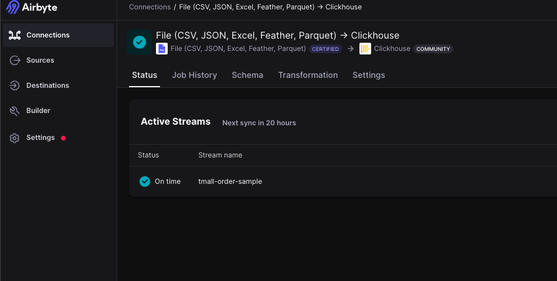
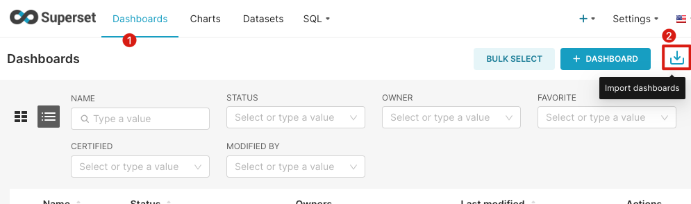
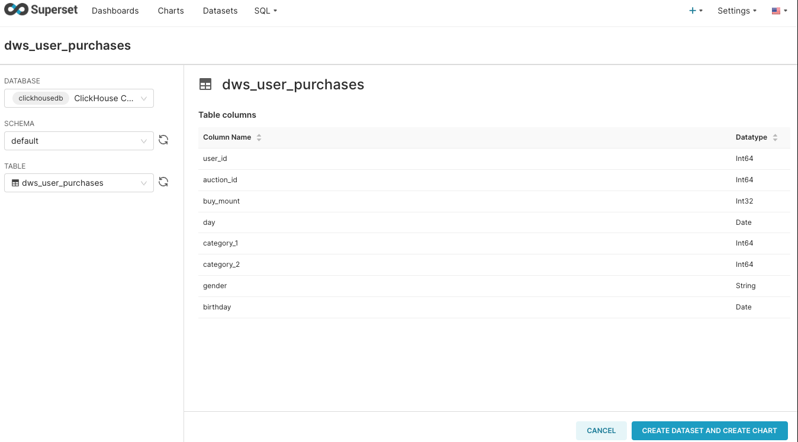

# Visualization Analysis of Taobao Maternal and Infant Shopping Data
English | [简体中文](../../zh/user-tutorials/visualization-analysis-of-taobao's-maternal-and-infant-shopping-data.md)


# 1. Background
Mother and baby products are a popular shopping category on Taobao. With the implementation of the national two-child and three-child policies, the sales of mother and baby products will further increase. At the same time, the parenting concepts of the younger generation of parents have also undergone significant changes, driving the diversified development of China's mother and baby e-commerce market. As a result, major mother and baby brands have launched more intense competition, and more and more brands have seen potential business opportunities in the industry, joining the mother and baby e-commerce field, making industry competition increasingly fierce. Based on this, this project will conduct a visual analysis of the "Taobao Mother and Baby Shopping" dataset to better mine data insights.

## 1.1 Data Description
The data for this analysis comes from the [Taobao Mother and Baby Shopping Behavior Dataset](https://tianchi.aliyun.com/dataset/45), with field adjustments made on the original data, including the following two tables:

- User Basic Information Table: tianchi_mum_baby

| Field    | Description       | Note                                                               |
| -------- | ----------------- | ------------------------------------------------------------------ |
| user_id  | User ID           | Sample & Field Anonymization                                       |
| birthday | Baby's Birth Date | Filled by user_id, may not be accurate, format: YYYYMMDD           |
| gender   | Baby's Gender     | (0 Boy, 1 Girl, 2 Unknown), filled by user_id, may not be accurate |

- Product Transaction Information Table: tianchi_mum_baby_trade_history

| Field      | Description                   | Note |
| ---------- | ----------------------------- | ---- |
| user_id    | User ID                       |      |
| auction_id | Transaction ID                |      |
| category_1 | Product Primary Category ID   |      |
| category_2 | Product Secondary Category ID |      |
| buy_amount | Purchase Quantity             |      |
| auction_id | Order ID                      |      |

## 1.2 Objectives
Using the open-source components `Airbyte`, `ClickHouse`, and `Superset` of the KDP platform to complete the following simple business analysis tasks, fully mining the value of the data through data analysis and visual display, making data better serve the business.
- Traffic Analysis: How are the sales of products on an annual/quarterly/monthly/daily basis? What patterns exist?
- Category Analysis: What patterns exist in product sales classified by category?
- Gender Analysis: Are the purchasing behaviors of infants of different genders similar? Does it conform to our common sense?
- .....

## 1.3 Environment Description
Install the following components on the KDP page and complete the component QuickStart:
- Airbyte: Data Collection
- ClickHouse: Data ETL Processing
- Superset: Data Visualization
- Airflow: Job Scheduling
- MySQL: Superset/Airflow Meta Database

In real projects, we usually need to schedule jobs. Here we use Airflow to achieve job scheduling.

# 2. Data Integration
We use the Airbyte component of the platform to synchronize data from the original data source (CSV file) to ClickHouse.
1. Add a file type source in Airbyte to read `tianchi_mum_baby`
   
   - Source Name: `tianchi_mum_baby`
   - Dataset Name: `tianchi_mum_baby` (Do not modify)
   - URL: `https://gitee.com/linktime-cloud/example-datasets/raw/main/airbyte/tianchi_mum_baby.csv`

2. Add a file type source in Airbyte to read `tianchi_mum_baby_trade_history`.
    - Source Name: `tianchi_mum_baby_trade_history`
    - Dataset Name: `tianchi_mum_baby_trade_history` (Do not modify)
    - URL: `https://gitee.com/linktime-cloud/example-datasets/raw/main/airbyte/tianchi_mum_baby_trade_history.csv`
   
3. Add a ClickHouse type destination in Airbyte.

    - Host: `clickhouse`
    - Port: `8123`
    - DB Name: `default`
    - User: `default`
    - Password: `ckdba.123`

4. Add a connection in Airbyte. Select `tianchi_mum_baby` as the source and ClickHouse as the destination, use the default configuration for the next step, set Schedule type to `Manual`, and then save.


5. Add a connection in Airbyte. Select `tianchi_mum_baby_trade_history` as the source and ClickHouse as the destination, use the default configuration for the next step, set Schedule type to `Manual`, and then save.
   
6. Check the job status in Airbyte. If successful, it means the data has been successfully imported into ClickHouse.

   
After completing the above operations, the data has been successfully imported into ClickHouse. Next, we will use ClickHouse for data ETL processing.

# 3 Data Development
After importing the data from the CSV file into ClickHouse, perform ETL processing on the data for visual analysis in Superset.
The relevant code in Airflow is as follows, refer to [Github](https://github.com/linktimecloud/example-datasets/blob/airflow/dags/taobao-mom-baby.py) or [Gitee](https://gitee.com/linktime-cloud/example-datasets/blob/airflow/dags/taobao-mom-baby.py) for specific code.

```python
@task
 def clickhouse_upsert_userinfo():
     ...

 @task
 def clickhouse_upsert_user_purchases():
     ...

 @task
 def clickhouse_upsert_dws_user_purchases():
     ...
```

Note: In data warehouse modeling, there are certain naming conventions and data layering, which are simply handled here.

# 4. Job Scheduling
In real projects, data changes over time, so job scheduling is needed to update the data. For basic use of Airflow, refer to the application's QuickStart.

In the data development chapter, an Airflow DAG is written, mainly involving the scheduling of two types of jobs:
- Airbyte Jobs
- ClickHouse Jobs

Airbyte itself can be configured for scheduling, but to manage jobs uniformly and handle dependencies between jobs, Airflow is used for scheduling here. The following mainly introduces how to schedule Airbyte jobs through Airflow.

1. Add an HTTP type connection in Airflow.
   
   
   - Connection Id: `airbyte` (This connection will be used in subsequent DAGs)
   - Connection Type: `HTTP`
   - Host: `airbyte-airbyte-server-svc`
   - Port: `8001`

2. Airbyte Job Task
The code is as follows:

```python

user_info_to_clickhouse = AirbyteTriggerSyncOperator(
    task_id='user_info_to_clickhouse',
    airbyte_conn_id='airbyte',
    connection_id='dd5ebac2-2827-460a-bc5b-d96b68eb5e8a', # Please use your Airbyte connection id
    asynchronous=False,
    timeout=3600,
    wait_seconds=3
)

user_purchases_to_clickhouse = AirbyteTriggerSyncOperator(
    task_id='user_purchases_to_clickhouse',
    airbyte_conn_id='airbyte',
    connection_id='1f37ca26-b381-4fb9-8b68-fa1e633cc505',  # Please use your Airbyte connection id
    asynchronous=False,
    timeout=3600,
    wait_seconds=3
)
```

- `airbyte_conn_id` is the ID of the HTTP type connection added
- `connection_id` is the ID of the connection in Airbyte, which can be obtained from the URL. For example, if the URL of a connection is `http://airbyte-kdp-data.kdp-e2e.io/workspaces/xyz/connections/abc`, the connection_id is `abc`

> Please fork the code and update the `gitSync` configuration of the `dags` in Airflow on KDP using your own git repository.


Refer to [Using the Airbyte Operator to orchestrate Airbyte OSS](https://docs.airbyte.com/operator-guides/using-the-airflow-airbyte-operator#2-create-a-dag-in-apache-airflow-to-trigger-your-airbyte-job) for scheduling Airbyte jobs.


3. Enable the DAG named `taobao-user-purchases-example` in Airflow, the job is scheduled daily, and the first time it is enabled, it will backfill the schedule for the previous day. It can also be triggered manually. Click the DAG name to view the job running status.
   
    > DAG List
    
  
    > DAG Running Status
    


# 5. Data Visualization
Superset supports ClickHouse data sources, and we can use Superset for visual analysis of the data. It is recommended that users complete the KDP Superset App QuickStart first.

Log in to Superset `http://superset-kdp-data.kdp-e2e.io` (note to add local Host resolution) with the account `admin` and password `admin`.

## 5.1 Creating Charts

### Method One: Import the prepared charts (recommended)
1. [Download Dashboard](https://gitee.com/linktime-cloud/example-datasets/blob/main/superset/dashboard_export_20240607T100739.zip)
2. Import Dashboard
Select the downloaded file to import

Enter the default password `ckdba.123` for ClickHouse user `default`


### Method Two: Create Manually

- **Add Data Connection**
Click `Settings` - `Databases Connections` - `+ Database` on the right side of the page to add a ClickHouse data source.

Fill in the following parameters:
- HOST: `clickhouse`
- PORT: `8123`
- DATABASE NAME: `default`
- USERNAME: `default`
- PASSWORD: `ckdba.123`

- **Add DATASET**
Click `DATASETS` on the top navigation of the page - `+ Dataset` on the top right to add a dataset.


Then refer to the Superset official documentation to create charts

#### Traffic Analysis
   
   - Platform sales increase quarterly, with the highest sales in the fourth quarter.
   - Sales are higher in mid-year/end-of-year months, possibly related to promotions; January and February have the lowest sales.
  
#### Gender Analysis

- The difference in the number of boys and girls is not significant.
- The purchase volume for boys is about twice that of girls.
- Boys' purchase volumes are higher than girls' in all categories except `50022520`; boys' purchase volume in category `50014815` far exceeds that of girls, being more than double.

#### Category Analysis

- The primary categories are mainly concentrated in three major categories.
- In the secondary categories, a special case is the secondary category `50018831` within the primary category `50014815`, which accounts for 64% of the sales in this primary category.

> Machine Learning
Additionally, we can use machine learning to predict user purchasing behavior and make recommendations. For users who did not purchase as expected, we can push coupons to attract them to buy. To Be Continued...