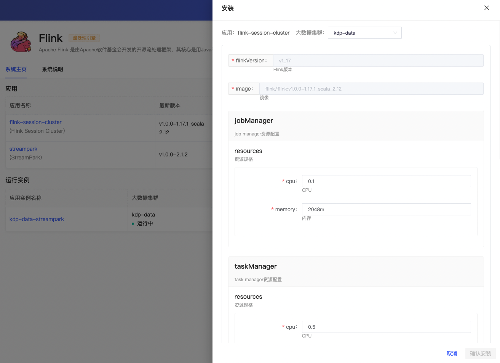

# Flink 概述

Apache Flink 是一个分布式高性能流处理框架，可用于实时和批量数据处理。它旨在支持低延迟、高吞吐量的大规模数据处理。Flink 提供了 Java、Scala 和 Python 的 API，以及用于声明式流处理的 SQL 接口。

## 架构

Flink的架构设计强调了高吞吐量、低延迟和强大的容错能力，使其成为处理实时数据流的理想选择。通过这种分布式架构，Flink能够有效地扩展以处理大规模数据流，同时保持作业的高可用性和稳定性。关于 Flink 的更多介绍，请参见 [Flink 官方说明](https://nightlies.apache.org/flink/flink-docs-release-1.17/docs/deployment/overview)。

## 部署模式

以下是 Flink 三种常见的部署模式：Session、Application 和 Per-Job。

**Session 模式**
Session模式是最常见的Flink部署模式。在Session模式下，首先启动一个长期运行的Flink集群。然后，用户可以在这个集群上提交多个作业。所有作业共享集群资源，这意味着资源管理不需要为每个作业单独进行。

Session模式适合以下场景：

- 批量作业的频繁提交
- 希望最大化集群资源利用率
- 各作业的资源需求相似，便于统一管理

使用Session模式时，作业结束后集群仍然保持运行状态，等待新的作业提交。

**Application 模式**
Application模式是Flink 1.11之后引入的。这种模式允许每个应用程序带有自己专用的Flink集群，集群的生命周期与应用程序绑定。当应用程序结束时，集群也随之停止。

典型的Application模式步骤如下：

1. 用户打包其所有代码和依赖到一个可执行Jar文件。
2. 用户提交应用程序到Flink集群。
3. Flink为该应用程序创建一个专用的JobManager和TaskManagers。
4. 应用程序完成后，Flink集群销毁。

Application模式适合这些场景：

- 安全或资源隔离的要求较高
- 自动化管道，其中每次运行都是独立的
- 云环境或Kubernetes上的部署，每个作业自己管理资源和生命周期

**Per-Job 模式**
Per-Job 模式为每个提交的作业启动一个独立的 Flink 集群，集群在作业执行完毕后自动关闭。这一点与Application模式类似，但是Per-Job模式更加适用于Flink早期版本和不支持Application模式的环境。新版Flink已不支持该模式。

Per-Job模式适用于：

- 对集群隔离有严格要求的作业
- 保证作业不会由于其他作业的负载而竞争资源
- 每个作业可能有不同的配置和资源需求

Per-Job模式的缺点是每个作业的启动时间可能较长，因为每次作业提交都涉及到集群的启动过程。

总结：选择哪种模式取决于作业的特性、资源隔离的需要、集群管理的便利性以及对弹性和可伸缩性的考虑。Session模式适合资源共享，Application和Per-Job模式提供更好的隔离性和精确的资源控制。

KDP 页面安装 Flink 为 session 模式。后续会开放 Application 模式部署。

## 组件依赖

安装 flink session cluster 依赖：

- 应用目录 Operator 下 flink-kubernetes-operator 应用，它是 Apache Flink 应用程序基于K8s的自动化部署、管理和扩缩容工具
- Flink jobManager 高可用依赖 Zookeeper 或是 Kubernetes。其中 checkpoints 高可用元数据存储支持依赖 HDFS 或者 S3（MinIO）
- 系统支持 Flink on Hive，需要依赖 HDFS 及 Hive，开启后 Flink 可以读写 Hive 表。

安装 streampark 依赖 MySQL。

## 应用安装

支持用户选择是否开启高可用及 Flink on Hive 并选择对应的依赖配置，其余可使用默认配置。

### flink session cluster 应用配置

安装完成，应用实例详情可查看应用访问地址，进行更新、卸载等运维管理操作。

支持跳转 Flink WebUI  页面。

应用实例详情页「更多操作」下，支持跳转 Grafana Flink 监控面板，查看监控指标信息。

### streampark 应用配置

安装完成，应用实例详情可查看应用访问地址，进行更新、卸载等运维管理操作。

支持跳转 streampark 实时数据开发平台 WebUI 页面。默认用户 admin/streampark 登录。

应用实例详情页「更多操作」下，支持跳转 Grafana 监控面板，查看监控指标信息。

