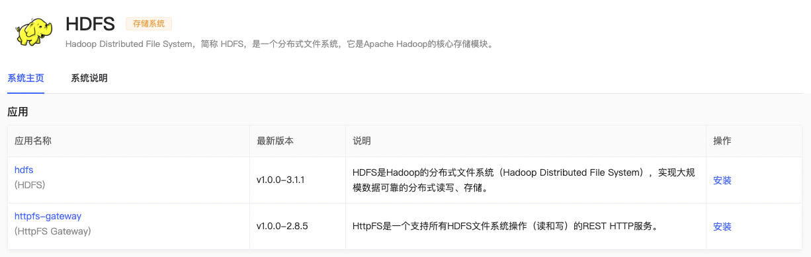
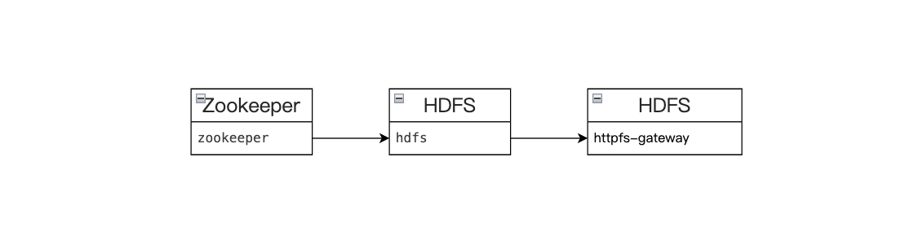
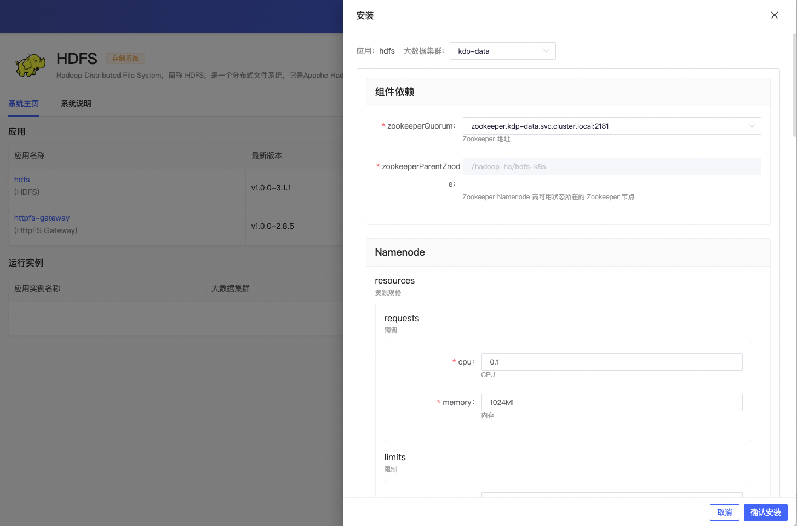
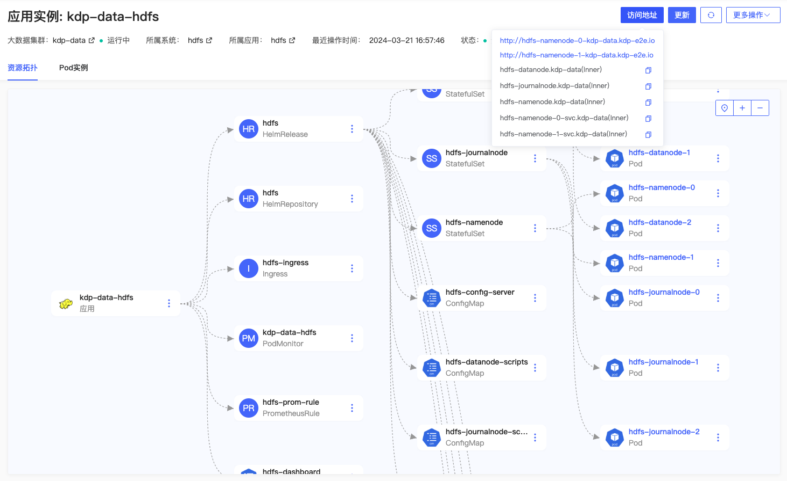
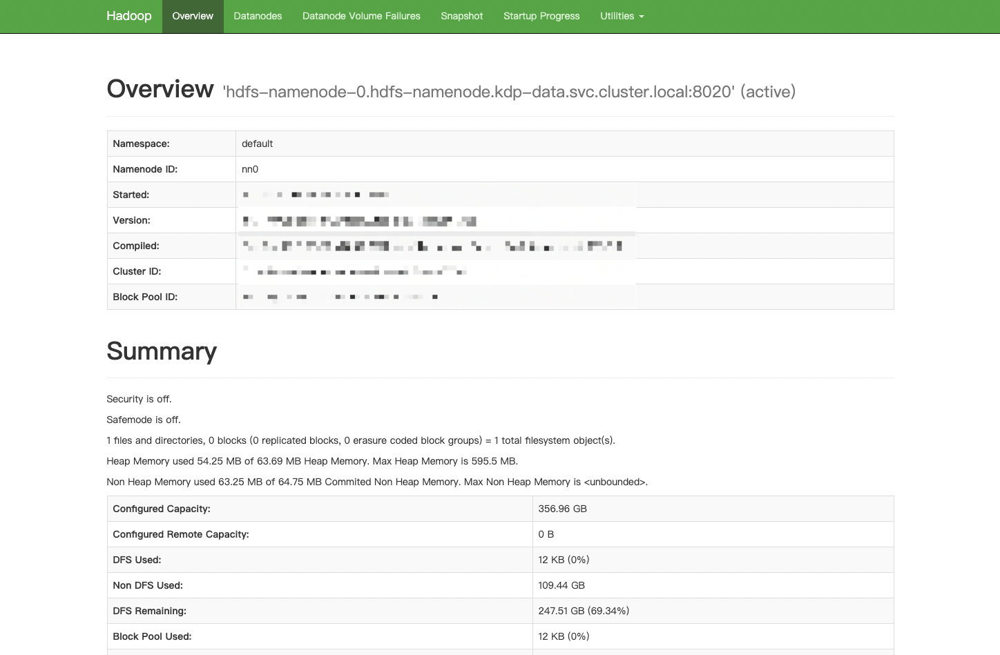
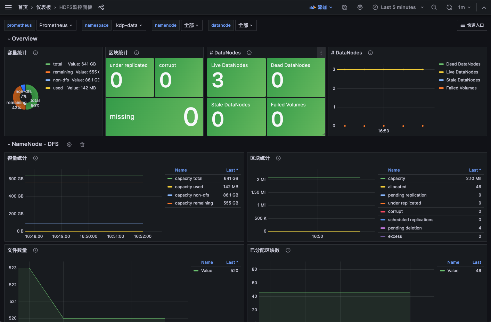
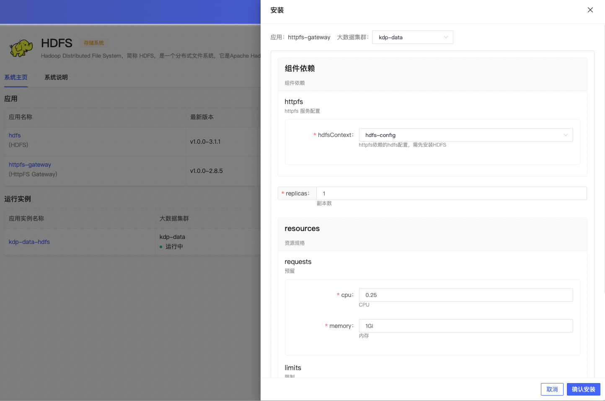

# HDFS 概述

HDFS（Hadoop Distributed File System）是一种 Hadoop 分布式文件系统，具备高度容错特性，支持高吞吐量数据访问，可以在处理海量数据（TB 或 PB 级别以上）的同时最大可能的降低成本。HDFS 适用于大规模数据的分布式读写，特别是读多写少的场景。

KDP HDFS 组件增强说明：

- 扩展了开源的 Kubernetes HDFS 项⽬
- 集成了对 Kerberos 和 Ranger 的支持
- ⽀持了 Persistent Volumes 以及虚机⽹络

## 架构

HDFS 是经典的 Master 和 Slave 架构，每一个 HDFS 集群包括一个 NameNode 和多个 DataNode。

NameNode 管理所有文件的元数据信息，并且负责与客户端交互。DataNode 负责管理存储在该节点上的文件。每一个上传到 HDFS 的文件都会被划分为一个或多个数据块，这些数据块根据 HDFS 集群的数据备份策略被分配到不同的 DataNode 上，位置信息交由 NameNode 统一管理。

## 组件依赖

安装 hdfs 依赖 zookeeper；
安装 httpfs-gateway 依赖 hdfs。

## 应用安装

可按默认配置进行应用安装。

### hdfs 应用配置

- 组件依赖
  - zookeeperQuorum：zookeeper 地址
  - zookeeperParentZnode：Namenode 高可用状态所在的 Zookeeper 节点
- Namenode
  - resources：资源规格
  - maxRAMPercentage: 最大的堆内存百分比
  - persistence：持久卷配置
  - HAEnabled：Namenode 高可用（默认为 true）
- Journalnode
  - quorumSize：Journalnode 数量
  - resources：资源规格
  - persistence：持久卷配置
- Datanode
  - replicas：Datanode 副本数
  - resources：资源规格
  - maxRAMPercentage: 最大的堆内存百分比
  - persistence：持久卷配置
- coreSite：自定义 core-site.xml 内容
- hdfsSite：自定义 hdfs-site.xml 内容
- chartVersion：Helm Chart 版本号
- imageTag：Hadoop 镜像版本

安装完成，应用实例详情可查看应用访问地址，进行更新、卸载等运维管理操作。

支持跳转 NameNode WebUI 页面。

应用实例详情页「更多操作」下，支持跳转 Grafana HDFS 监控面板，查看监控指标信息。

### httpfs-gateway 应用配置

- 组件依赖
  - hdfsContext：httpfs 依赖的 hdfs 配置
- replicas：副本数
- resources：资源规格
- image：应用镜像
- kerberos：Kerberos 开关（跟随大数据集群的 kerberos 开关）
