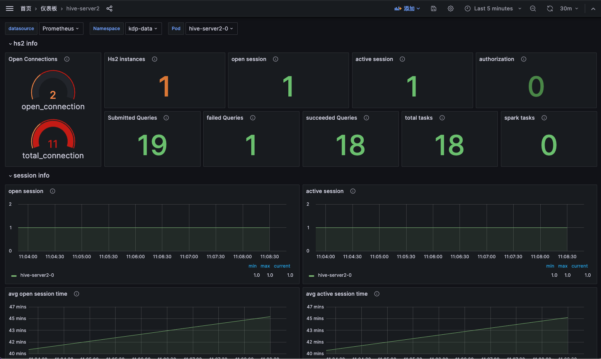

# Hive 概述

Hive 是一个基于 Hadoop 的数据仓库框架，在大数据业务场景中，主要用来进行数据提取、转化和加载（ETL）以及元数据管理。

## 应用说明

Hive 结构：

| 名称 | 说明 |
|---|---|
| HiveServer2 | HiveQL 查询服务器，可以配置为 Thrift 或者 HTTP 协议，接收来自 JDBC 客户端提交的 SQL 请求，支持多客户端并发以及身份验证。|
| Hive MetaStore | 元数据管理模块，此模块被其他引擎所依赖，用于存储 Database 和 Table 等元信息。例如，Spark 和 Presto 均依赖此模块作为其元数据管理。|

## 组件依赖

安装 hive-metastore 依赖 hdfs 及 mysql 服务。
安装 hive-server2 依赖 zookeeper、hdfs 及 hive-metastore 服务。

> **注意：** hive-metastore 与 hive-server2 依赖的 hdfs 服务必须为同一个。

## 应用安装

可按默认配置进行应用安装。

### Hive Metastore 应用配置

- 组件依赖
  - hdfsConfigMapName: HDFS 上下文
  - mysql: MySQL 配置
- replicas: 副本数
- resources: 资源规格
- hiveConf: 自定义 hive-site.xml 内容
- image: 镜像版本

应用实例详情可查看资源拓扑、Pod实例信息，进行更新、卸载等运维管理操作，支持跳转 hive-metastore 监控面板，查看监控指标信息。

### Hive Server2 应用配置

- 组件依赖
  - zookeeperQuorum: Zookeeper 地址
  - hdfsConfigMapName: HDFS 上下文
  - hmsConfigMapName: Hive Metastore 上下文
- replicas: 副本数
- resources: 资源规格
- dataLocality: Spark pod 尽量调度到数据节点
- hiveConf: 自定义 hive-site.xml 内容
- spark
  - image: Spark 镜像版本
  - volcanoEnabled: 用 Volcano 调度 Spark pod
  - sparkDefaults: 自定义 spark-defaults.conf 内容
- image: 镜像版本

应用实例详情可查看资源拓扑、Pod实例信息，进行更新、卸载等运维管理操作，支持跳转 hive-server2 监控面板，查看监控指标信息。

