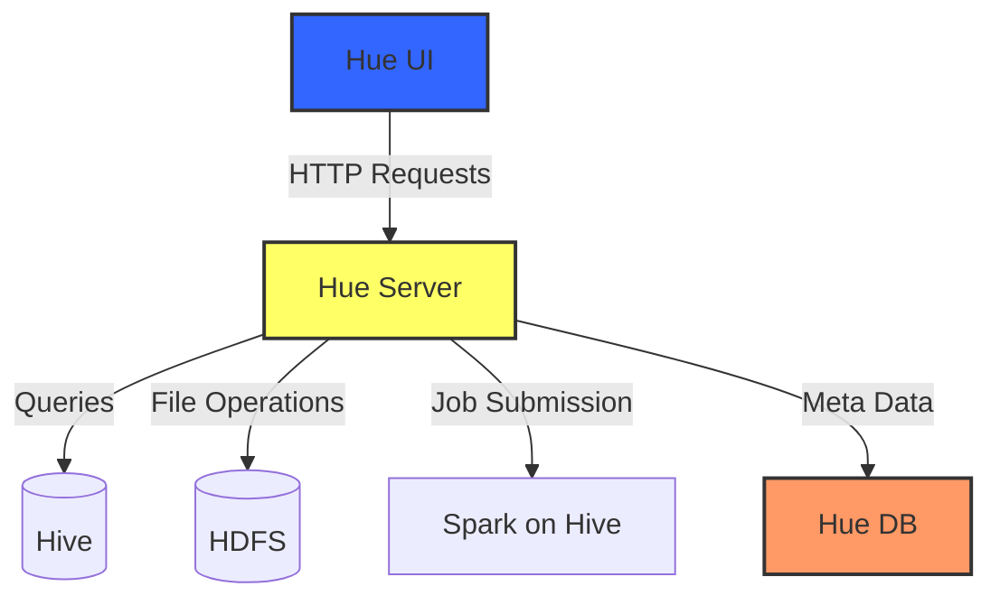
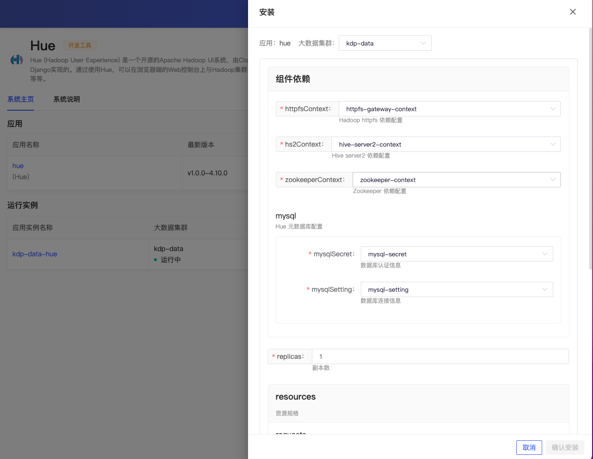
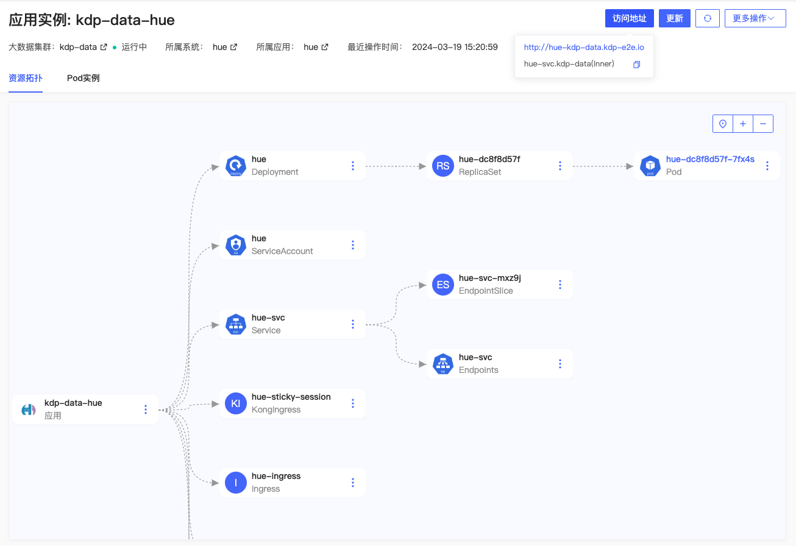
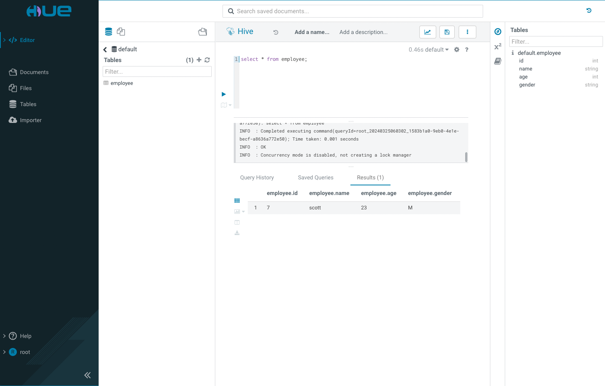
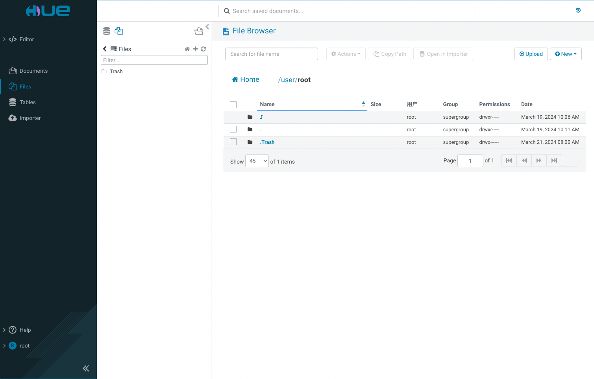
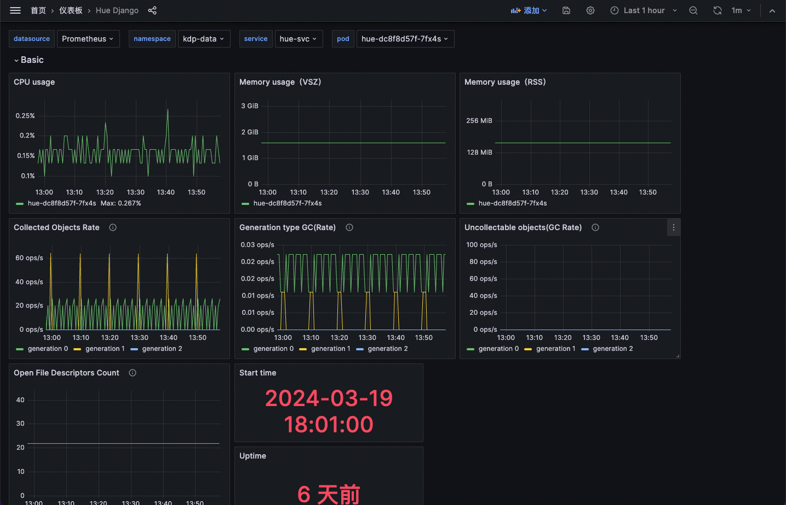

# Hue 概述

Hue （Hadoop User Experience）是一个为使用 Hadoop 生态系统的数据分析师设计的开源 Web 界面。它主要用于数据仓库组件 Hive、文件存储 HDFS 以及支持 Spark 的数据处理。Hue 提供了一个易于使用的界面，通过 Beeswax（Hive 的接口）可以让用户执行查询、浏览数据集、可视化分析结果等。

KDF Hue 组件增强说明

- 统一登录/登出
- 日志/监控/告警
- hive on spark 体验优化

## 架构

- Hue UI 是用户界面，用户可以通过它与 Hue Server 进行交互，比如提交查询或管理文件。用户接口以 HTTP 请求的形式与后端的 Hue Server 通信。
- Hue Server 接收来自用户界面的请求，并根据这些请求与不同的后端系统进行通信。
  - 向 Hive 发送 SQL 查询，Hive 然后执行这些查询并返回结果。
  - 对 HDFS 进行文件操作，包括文件的上传、下载和管理。
  - 负责向 Spark on Hive 提交作业，允许用户利用 Spark 引擎上运行在 Hive 上下文中的大数据处理任务。
- Hue Server 还与 Hue DB（MySQL）进行交互，用于存储 Meta Data，例如用户信息、作业历史记录等。这为 Hue 平台提供了必要的持久化存储功能，支持用户身份验证和操作跟踪。

## 组件依赖

Hue 是一个基于 Web 的 应用，可以通过浏览器访问。目前 KDP Hue 依赖的组件有：

- HiveServer2 用于访问 Hive
- Httpfs 用于访问 HDFS
- Zookeeper 用于 HiveServer2 的 HA 访问
- MySQL 用于存储 Hue 的元数据

## 应用安装

安装应用时可使用默认配置。

安装完成，应用实例详情页可查看应用访问地址，进行更新、卸载等运维管理操作。

在 Hue 登录页面使用 `root` 账号登录，无需密码。

登录后，可查看 Hive 表数据。

可查看 HDFS 文件。

应用实例详情页「更多操作」下，支持跳转 Grafana Hue 监控面板，查看监控指标信息。

