# Kafka 概述

Apache Kafka 是一个分布式事件流平台。基于Kafka，可以构建高吞吐量、高扩展性的消息中间件服务。适用于日志采集、流式数据处理、流量削峰填谷等场景。kafka具备高可靠、高并发访问、可扩展的特性是大数据生态系统中不可或缺的组成部分。

KDP Kafka 组件增强说明：

* 扩展了kubernetes云原生架构下kafka对ranger、kerberos集成支持；
* 实现了在ranger、kerberos权限体系下kafka扩容能力；
* 完成了kafka组件间依赖关系配置管理

## 架构

Kafka集群包括Producer、Kafka Broker、Group、ZooKeeper。

Producer

通过push模式向Kafka Broker发送消息。发送的消息可以是网站的页面访问、服务器日志，也可以是CPU和内存相关的系统资源信息。

Kafka Broker

用于存储消息的服务器。Kafka Broker支持水平扩展。Kafka Broker节点的数量越多，Kafka 版集群的吞吐率越高。

Group

通过pull模式从Kafka Broker订阅并消费消息。

Zookeeper

管理集群的配置、选举leader分区，并且在Group发生变化时，进行负载均衡。

## 应用说明

Kafka 包含了4个应用：

* **kafka cluster**: Kafka是一个分布式、高吞吐、可扩展的事件流平台应用。需要先安装kafka operator;
* **kafka connect**: Kafka Connect旨在简化数据集成和数据流处理，用于将外部系统和数据源与Kafka集成。需要先安装kafka operator和kafka cluster;
* **schema registry**: Schema Registry是一个用于管理与存储 Avro、JSON和Protobuf类型schema服务。需要先安装kafka operator和kafka cluster;
* **kafka manager**: Kafka Manager是一个用于管理和监控Kafka、Kafka Connect、Schema Registry的web应用。需要先安装kafka cluster。

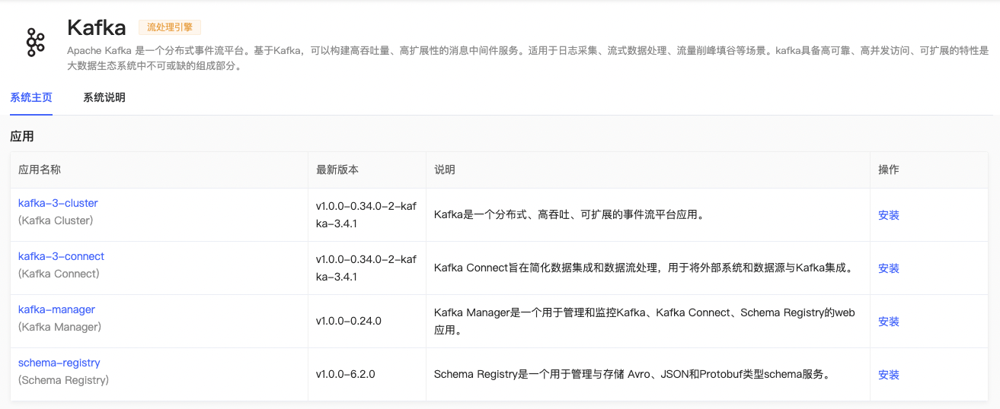

## 组件依赖

安装 Kafka 应用目录前，需要安装应用目录 Operator 下 kafka-3-operator 应用。它是 Apache Flink 应用程序基于K8s的自动化部署、管理和扩缩容工具。

Kafka 应用目录中应用依赖关系如下图，虚线为非必须依赖。

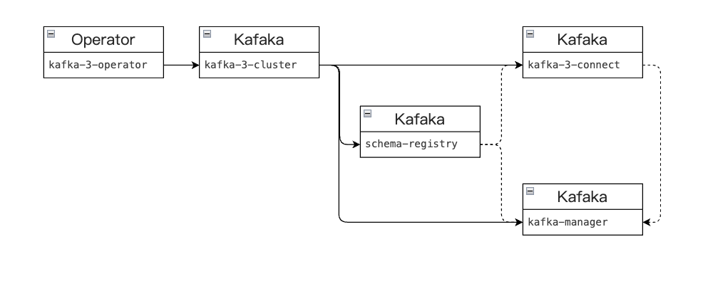

## 应用安装

可按默认配置进行应用安装。

### Kafka Cluster 应用配置

* replicas: kafka实例数
* resources: 资源规格
* storage: 持久卷配置
* listeners: kafka监听器配置
* metrics: kafka监控配置
* config: kafka配置
* zookeeper: kafka依赖的zookeeper配置（Kafka 独享）
  * replicas: zookeeper实例数
  * resources: zk资源规格
  * storage: zk持久卷配置
* image: kafka镜像版本

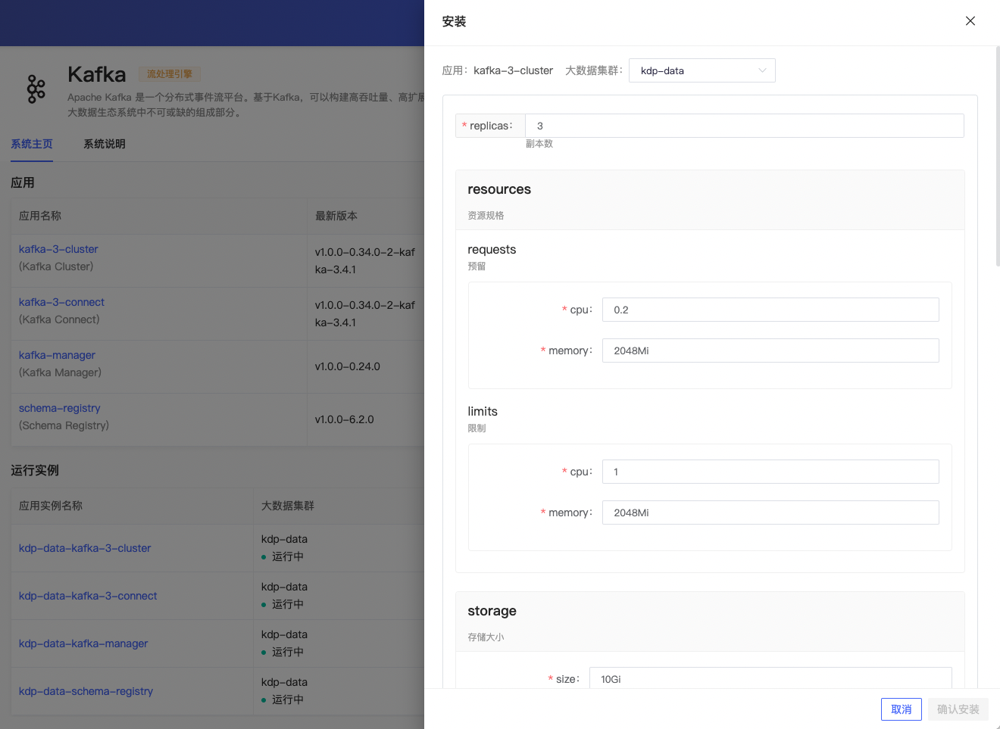

安装成功后，应用实例详情可查看资源拓扑、Pod实例信息，进行更新、卸载等运维管理操作，「更多操作」下支持跳转 Kafka Cluster 监控面板。

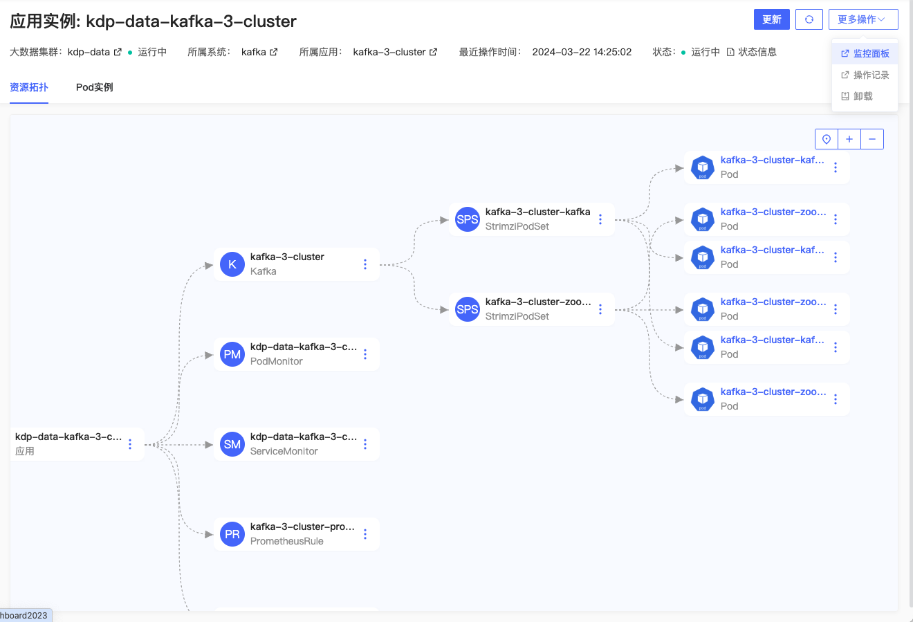

查看 Kafka 看板监控指标信息。

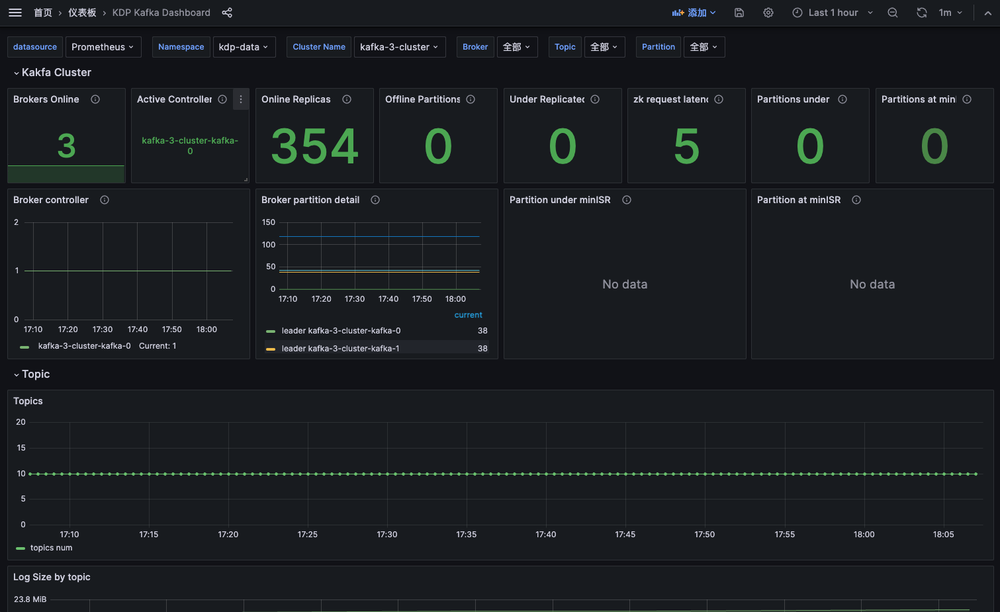

### Schema Registry 应用配置

* kafkaCluster: schema registry依赖kafka地址
* replicas: schema registry实例数
* resources: 资源规格
* image: schema registry镜像版本

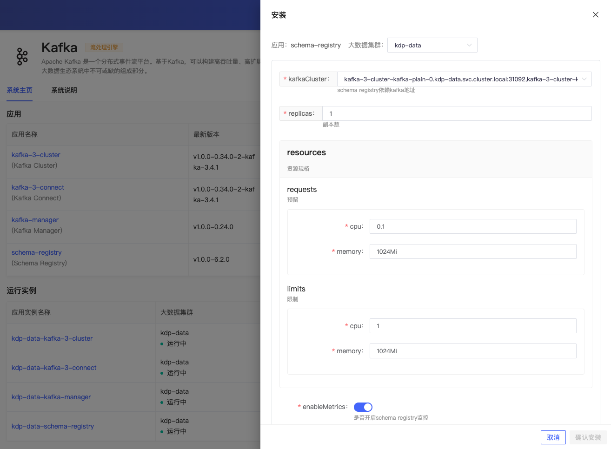

安装成功后，应用实例详情可查看资源拓扑、Pod实例信息，进行更新、卸载等运维管理操作，「更多操作」下支持跳转 Kafka Schema Registry 监控面板。

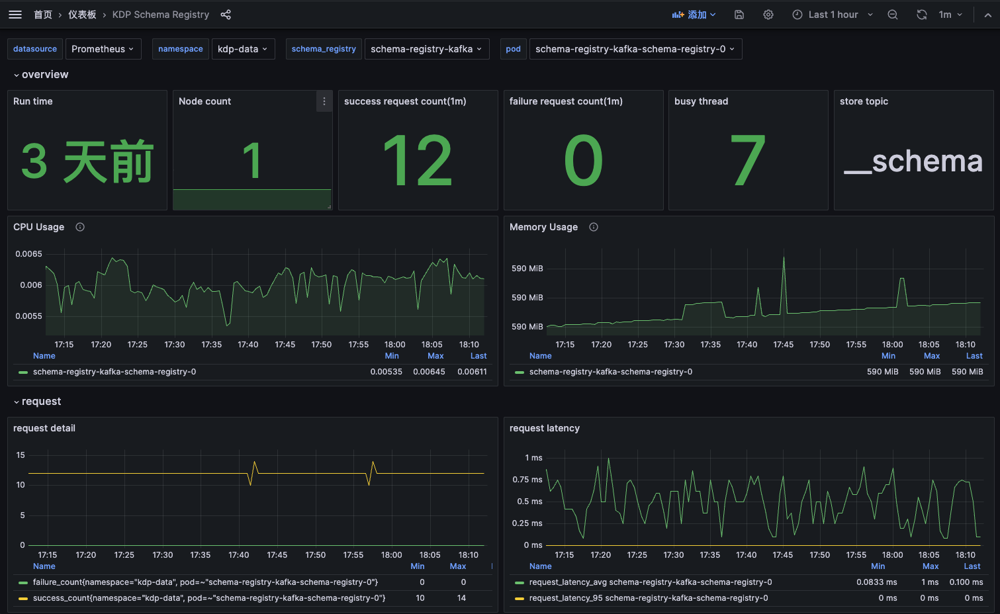

查看监控指标信息。

### Kafka Connect 应用配置

* 组件依赖
  * kafkaCluster: connect依赖kafka地址
  * schemaRegistry: connect依赖schemaRegistry地址。可选参数
* replicas: connect实例数
* resources: 资源规格
* image: connect镜像版本

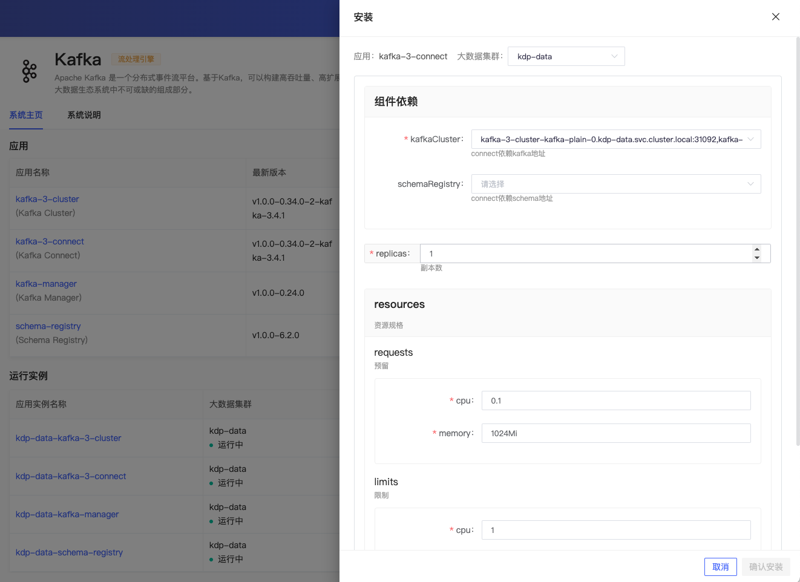

安装成功后，应用实例详情可查看资源拓扑、Pod实例信息，进行更新、卸载等运维管理操作，「更多操作」下支持跳转 Kafka Connect 监控面板。查看监控指标信息。

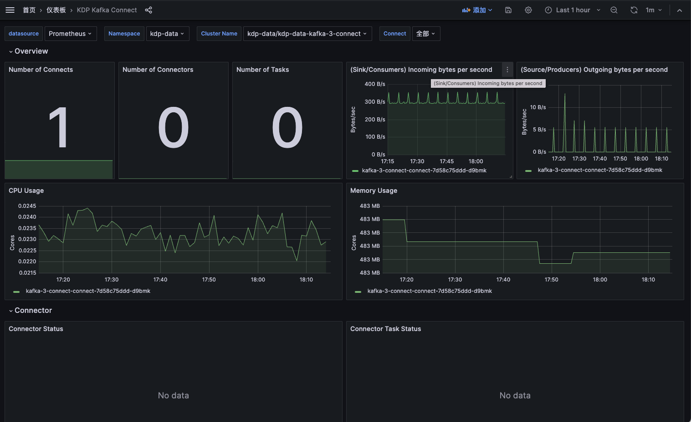

### Kafka Manager 应用配置

* 组件依赖
  * mysql: kafka manager依赖mysql配置
  * kafkaCluster: kafka manager管理的kafka
  * connect: kafka manager管理的connect。可选参数
  * schemaRegistry: kafka manager管理的schema registry。可选参数
* replicas: kafka manager实例数
* resources: 资源规格
* image: kafka manager镜像版本

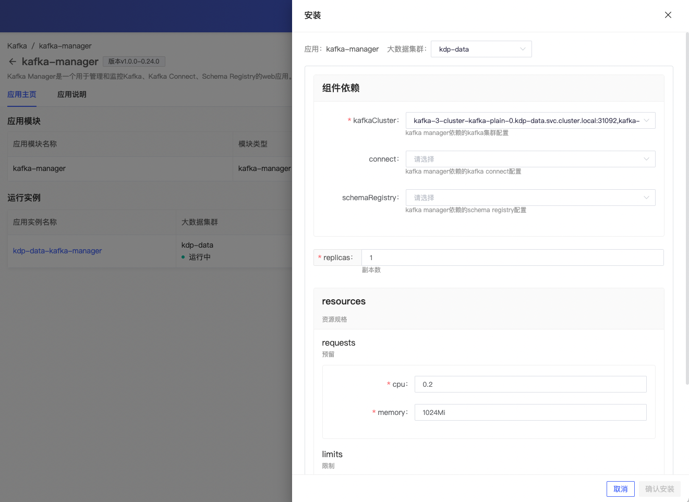

安装成功后，应用实例详情可查看资源拓扑、Pod实例信息，进行更新、卸载等运维管理操作。查看应用访问地址，支持跳转 Kafka Manager WebUI界面。

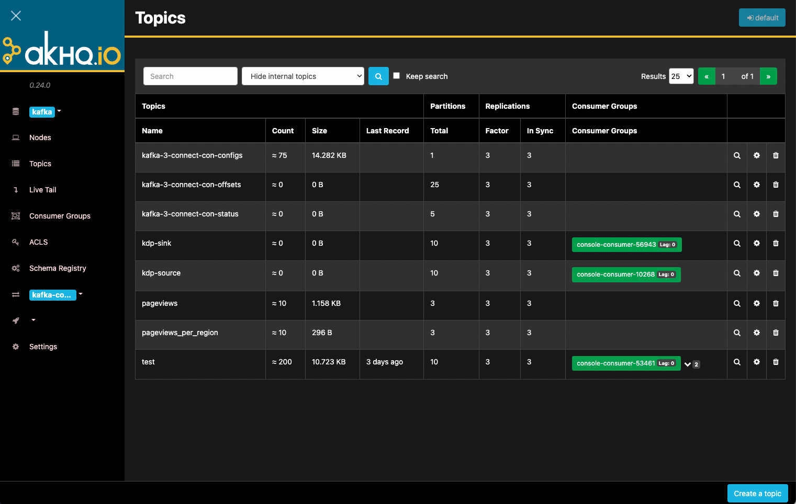