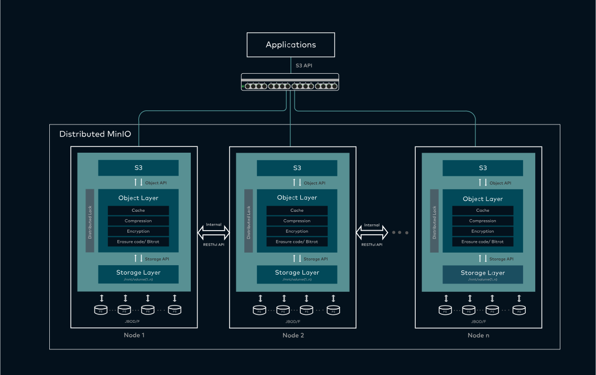
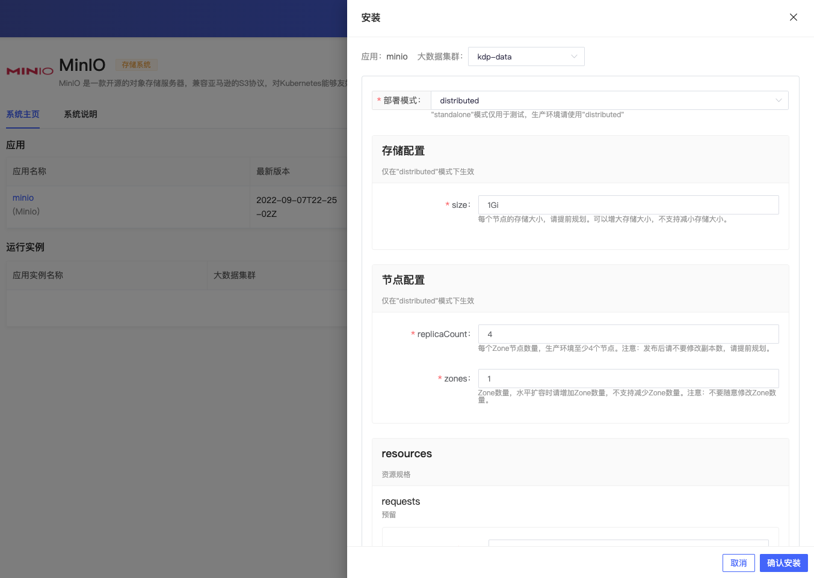
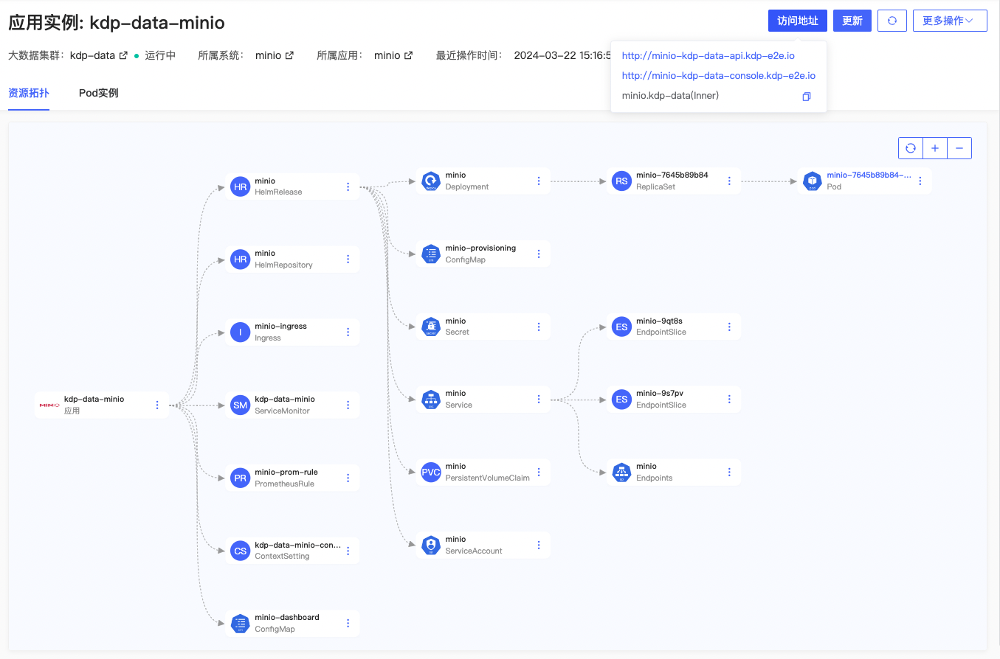
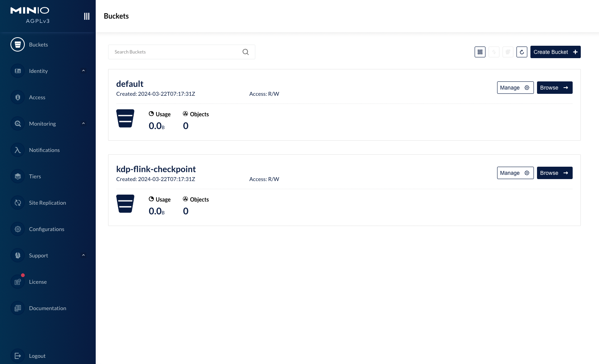

# MinIO 概述

MinIO 是一个高性能、分布式对象存储系统，可用于存储和检索大量数据，支持 S3 API 和其他常见的云存储服务接口。它具有高可用性、高可扩展性、安全性、低成本和高性能等特性。

Minio 适用于存储任意数量的非结构化数据，例如图像、视频、日志、备份和容器/虚拟机镜像。Minio 可用于构建高性能基础架构，例如云原生应用程序、DevOps 和大数据分析。

## 架构

## 部署模式

MinIO 分为服务端和客户端两部分，服务端用于存储数据，客户端用于上传、下载、管理数据。MinIO 服务端支持 Standalone（单机）模式和 Distributed（分布式）模式。

**Standalone 模式**

Standalone模式是单节点配置，此模式主要用于开发、测试或小规模部署，因为它不提供高可用性和故障转移功能。在Standalone模式下，所有数据都存储在单个盘上，这限制了存储容量和吞吐量，并且如果该节点发生故障，数据可能完全不可访问。

**Distributed 模式**

在生产环境中，推荐使用Distributed模式。此模式支持多个节点、多个硬盘，提供高可用性和数据冗余。如果任意节点宕机，MinIO集群依然可以正常运行。

在分布式模式配置时，所有的节点都应该有相互之间的网络通信权限，并且时间同步也需要被正确配置。此外，所有的MinIO节点需要使用相同的Access Key和Secret Key，以确保节点间可以相互认证。

## 安装应用

安装应用时，支持用户选择期望的安装模式，其余可使用默认配置。

Distributed模式下

- 存储配置：可以配置存储的容量大小，该大小是指每个节点分配的存储，可以垂直扩容，尽量提前规划好存储容量；
- 节点配置：可以配置节点数量(minio server数量),节点数量决定了存储的可靠性和性能，节点数量可以水平扩容, 修改`zones`数量即可
- 管理员账号：可以配置管理员账号和密码,用于登录 MinIO WebUI， 登录后可以添加用户和bucket等

安装完成，应用实例详情可查看应用访问地址，进行更新、卸载等运维管理操作。「更多操作」下支持跳转 Grafana MinIO 监控面板，查看查看监控指标信息。

通过 WebUI 或者客户端工具访问 MinIO 服务端，进行数据的上传、下载、管理等操作。

