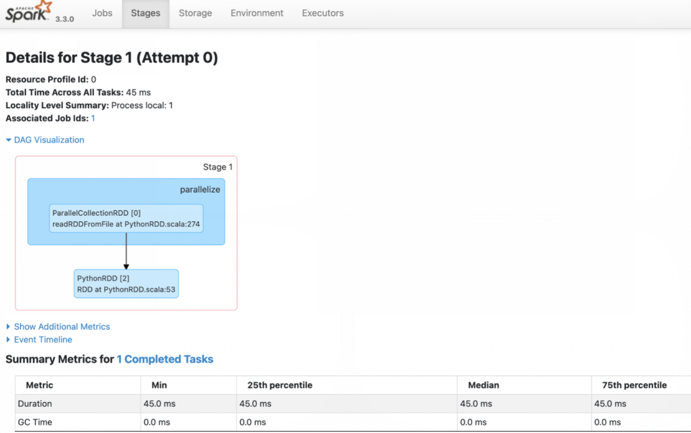

# Spark 组件使用

## 连接方式

### 使用 spark-submit 命令行工具

spark-submit 是提交Spark作业的标准方法，可以用来在各种环境中部署应用程序，包括Kubernetes。

### 通过 Spark on k8s operator 提交 spark 程序

安装 Operator spark-on-k8s-operator 应用后，通过Spark Operator，用户可以使用更加符合k8s理念的方式来管理spark应用的生命周期。

将以下内容保存到文件 sparkApp.yaml

```yaml
apiVersion: sparkoperator.k8s.io/v1beta2
kind: SparkApplication
metadata:
  name: spark-pi
  namespace: default
spec:
  type: Scala
  mode: cluster
  image: od-registry.linktimecloud.com/ltc-spark:3.3.0-1.11
  mainClass: org.apache.spark.examples.SparkPi
  mainApplicationFile: local:///opt/spark/examples/jars/spark-examples_2.12-3.3.0.jar
```

然后执行 `kubectl apply -f sparkApp.yaml`

更多信息详见 Spark on k8s operator [用户指南](https://github.com/GoogleCloudPlatform/spark-on-k8s-operator/blob/master/docs/user-guide.md)。

### 查看 Spark 执行历史

进入 Spark History Server WebUI页面，查看 Spark 任务执行情况。例如执行一个简单的数据处理任务后，查看执行情况：

