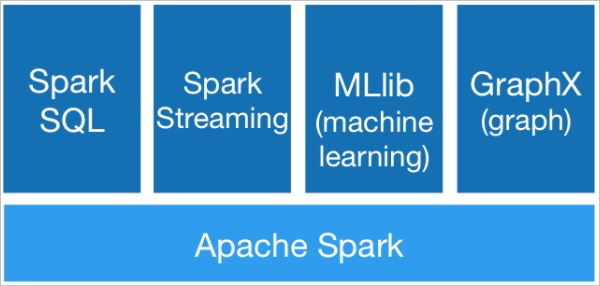
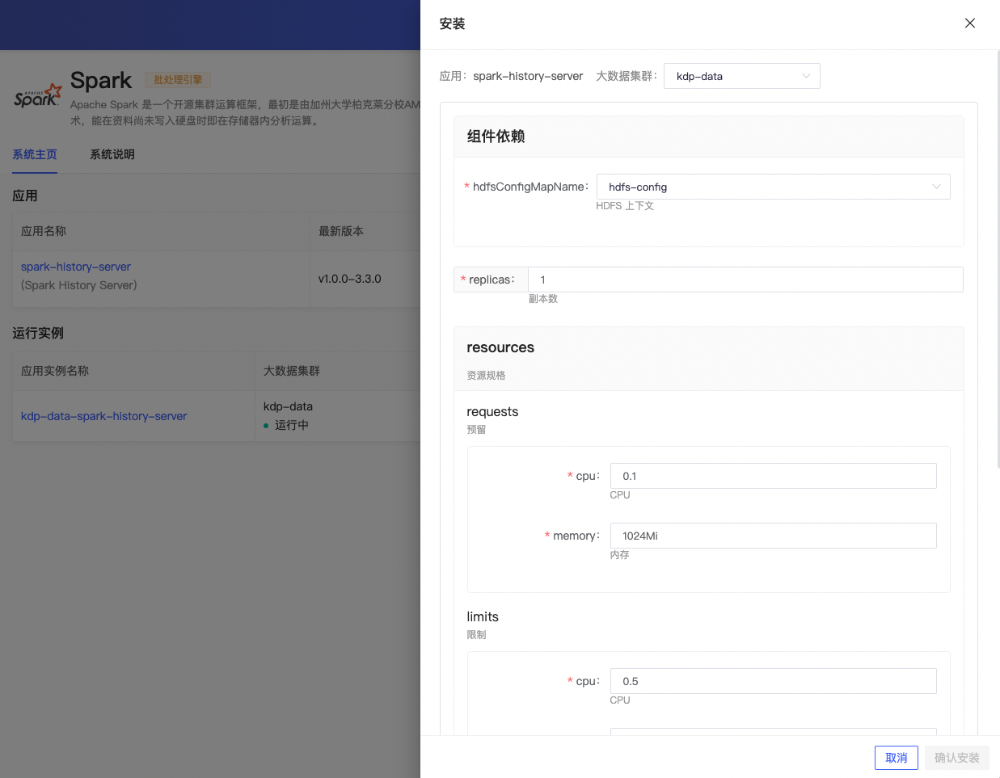
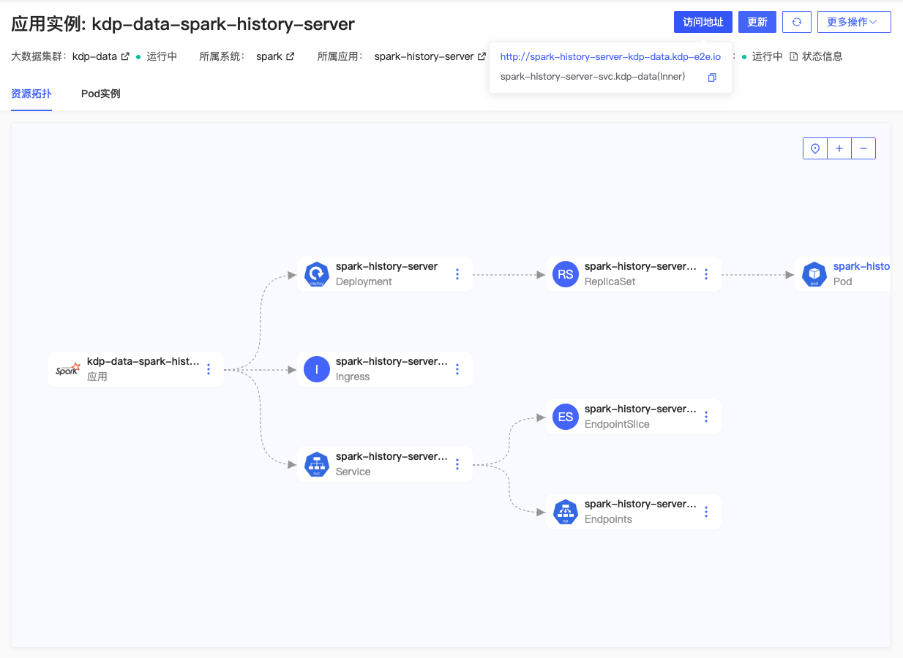

# Spark 概述

Spark 是一个通用的大数据分析引擎，具有高性能、易用性和普遍性等特点。

## 架构

Spark 架构如下图所示，基于 Spark Core 构建了 Spark SQL、Spark Streaming、MLlib 和 Graphx 四个主要编程库，分别用于离线 ETL（Extract-Transform-Load）、在线数据分析、流计算、机器学习和图计算等场景。

## 组件依赖

spark-history-server 组件依赖 hdfs，History Server 定期扫描该目录以发现新的或更新的日志文件，并进行解析。

## 应用安装

安装应用时可使用默认配置。

### Spark History Server 应用配置

- 组件依赖
  - hdfsConfigMapName: HDFS 上下文
- replicas: 副本数
- resources: 资源规格
- logDirectory: Spark 日志路径
- cleaner
  - enabled: 开启自动清理
  - interval: 清理周期
  - maxAge: 最大保留时间
- image: 镜像版本

安装完成，应用实例详情页可查看应用访问地址，进行更新、卸载等运维管理操作。

