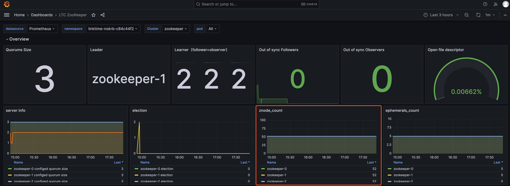

# Zookeeper 常见问题

## ZooKeeper 服务不稳定，发生异常重启等情况

造成服务不稳定的情况可能有很多，最常见的情况是 znode 数量过大或者 snapshot 过大，由于 ZooKeeper 将所有的 znode 维护在内存中，并且需要在节点间进行数据同步，因此过大的 znode 数量或者容量会对服务稳定性造成影响。ZooKeeper 的定位是一个分布式协调服务，不能把 ZooKeeper 当作一个文件系统来使用，通常，znode 数量应尽量保持在 10 万以下，snapshot 大小应在 800 MB 以下。

您可以在 KDP 的 Zookeeper 监控面板中，查看 Zookeeper 的 znode 数量监控。



参考 [基础使用](./02-usage-basic.md#连接方式) 进入 zookeeper 容器，执行以下命令，在 ZooKeeper 数据目录下查看 snapshot 的大小。

```shell
ls -lrt /bitnami/zookeeper/data/version-2/snapshot*
```

如果出现 znode 数量或 snapshot 过大的情况，需要排查 znode 分布情况，避免相关上层应用对 ZooKeeper 的过度使用。
