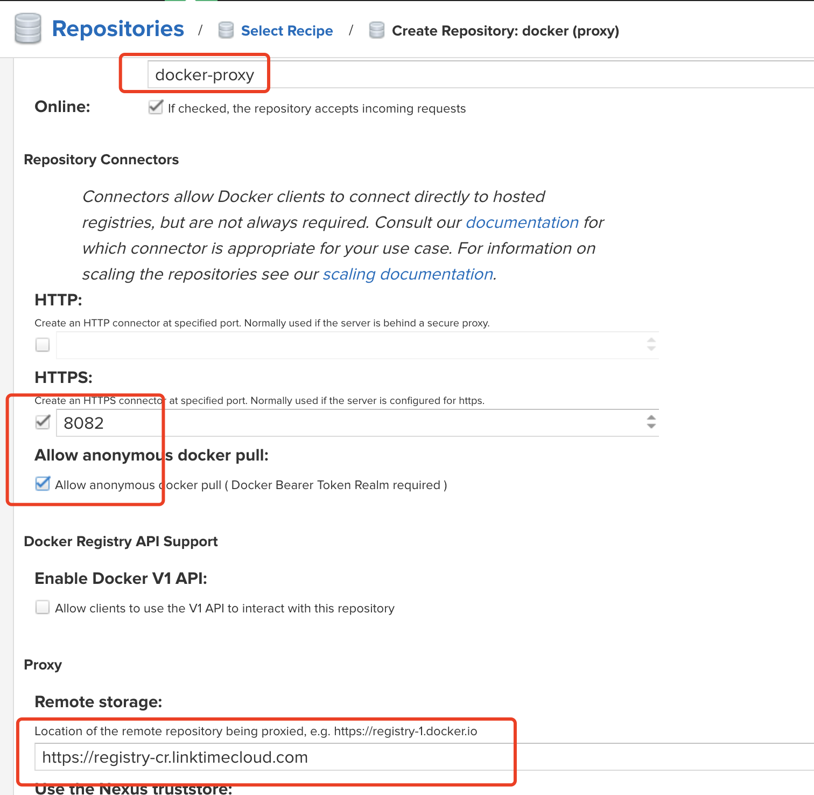
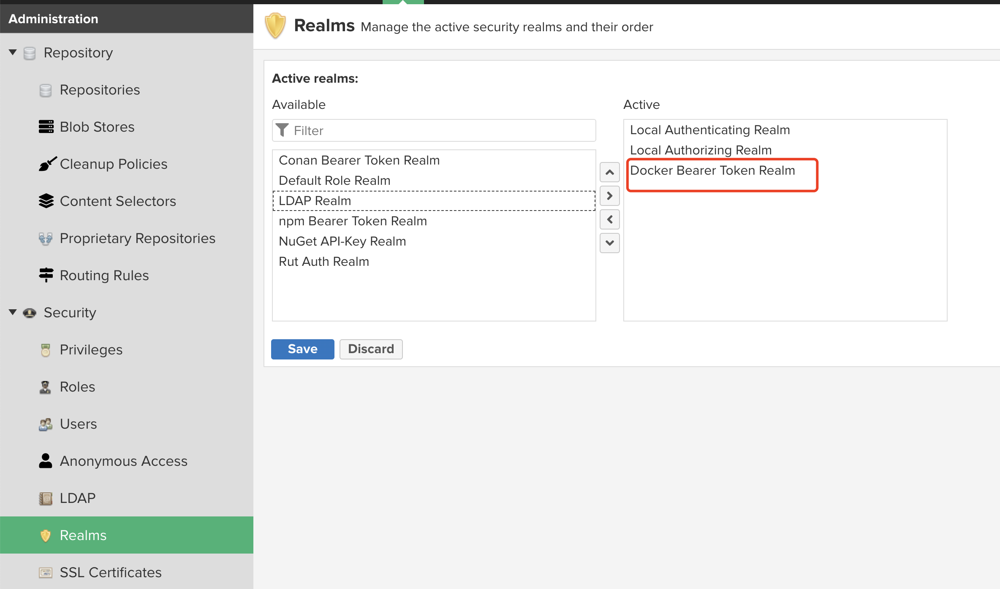
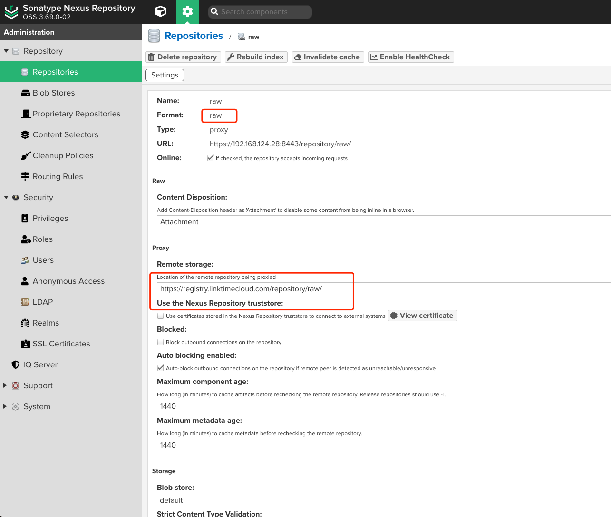
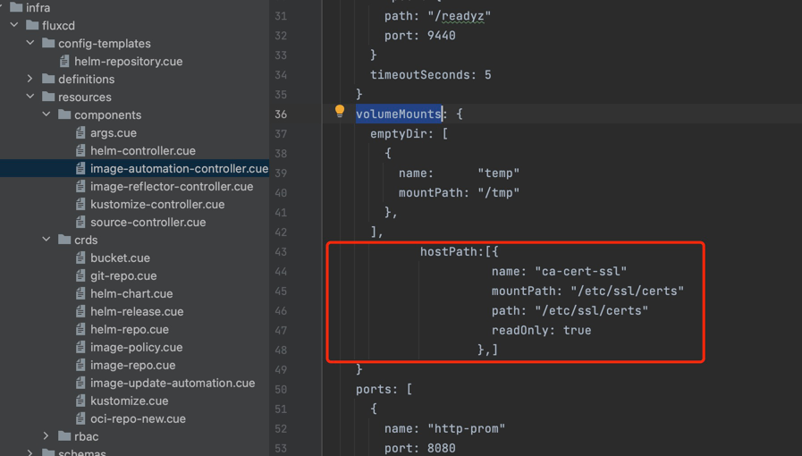

# 离线部署

[English](../../en/getting-started/offline-install.md) | 简体中文

用户通过nexus在互联网环境条件下，缓存docker镜像、helm等资源。安装所有组件后，将nexus缓存文件迁移至离线环境，并将KDP代码上传至离线代码仓库，从而实现KDP离线部署。

## 前提条件

* 互联网单机环境的系统要求：
    - 资源配置：推荐 16C/32G内存/200G磁盘 以上（低配置环境可运行基础设施层和部分大数据组件，无法运行所有大数据组件）
    - 操作系统：Mac OS/主流 Linux 发行版
* 已安装以下软件：
    - [Docker Engine](https://docs.docker.com/engine/install/) stable
    - [Kind](https://kind.sigs.k8s.io/docs/user/quick-start#installation) v0.18.0
    - KDP CLI（以下安装方式二选一）
        - 从 [Release Page](https://github.com/linktimecloud/kubernetes-data-platform/releases) 安装二进制
        - 编译安装 (本地需要安装 [Go](https://go.dev/doc/install) 1.21+): 克隆项目到本地, 在项目根目录执行 `go install`
* 本实践说明以服务器`192.168.0.205`为例，用户可以自定义调整

## 创建https证书
```bash
mkdir -p /opt/nexus/ssl/
cd /opt/nexus/ssl/
openssl genrsa -out 192.168.0.205.key 4096
openssl req -new -x509 -days 36500 -key 192.168.0.205.key -out 192.168.0.205.crt -subj "/C=CN/ST=Wuhan/L=Wuhan/O=linktimecloud/OU=registry/CN=192.168.0.205" -addext "subjectAltName = IP:192.168.0.205"
openssl x509 -in 192.168.0.205.crt -out 192.168.0.205.pem -outform PEM

openssl pkcs12 -export -out 192.168.0.205.pkcs12 -inkey 192.168.0.205.key -in 192.168.0.205.crt
# 输入密码password

keytool -v -importkeystore -srckeystore 192.168.0.205.pkcs12 -srcstoretype PKCS12 -destkeystore 192.168.0.205.jks -deststoretype JKS
# 输入密码password
```

## 部署nexus
### 创建nexus配置文件（/opt/nexus/conf/nexus.properties）
```bash
application-port-ssl=8443
application-port=8081
application-host=0.0.0.0
application-ssl-keystore-path=/opt/sonatype/nexus/etc/ssl/keystore.jks
application-ssl-keystore-type=JKS
application-ssl-keystore-password=m7nz5f1y
application-ssl-truststore-path=/etc/nexus/certs/keystore.jks
application-ssl-truststore-password=m7nz5f1y
application-ssl-truststore-type=JKS
nexus-args=${jetty.etc}/jetty.xml,${jetty.etc}/jetty-http.xml,${jetty.etc}/jetty-https.xml,${jetty.etc}/jetty-requestlog.xml
ssl.etc=${karaf.data}/etc/ssl
```
### docker启动nexus
```bash
chmod -R 777 /opt/nexus
docker run -d --restart=always -p 8443:8443 -p 8081:8081 -p 8082:8082 --name nexus3 -v /opt/nexus/nexus-data:/nexus-data -v /opt/nexus/ssl/192.168.0.205.jks:/opt/sonatype/nexus/etc/ssl/keystore.jks -v /opt/nexus/conf/nexus.properties:/opt/sonatype/nexus/etc/nexus-default.properties sonatype/nexus3
```
### 获取nexus密码
```bash
docker exec -it nexus3 cat /opt/sonatype/sonatype-work/nexus3/admin.password
```
### 浏览器登录nexus
```shell
https://192.168.0.205:8443
```
#### 添加docker代理仓库

#### 配置docker ralm

#### 添加raw代理仓库


## KDP源码调整
### 修改kind创建kubernetes集群配置文件(e2e/kind-cluster.yaml)
```yaml
#####
# kind release page: https://github.com/kubernetes-sigs/kind/releases
######
kind: Cluster
apiVersion: kind.x-k8s.io/v1alpha4
containerdConfigPatches:
- |-
  [plugins."io.containerd.grpc.v1.cri".registry.mirrors]
    [plugins."io.containerd.grpc.v1.cri".registry.mirrors."192.168.0.205:8082"]
      endpoint = ["https://192.168.0.205:8082"]
  [plugins."io.containerd.grpc.v1.cri".registry.configs]
    [plugins."io.containerd.grpc.v1.cri".registry.configs."192.168.0.205:8082".tls]
      insecure_skip_verify = true
name: kdp-e2e
networking:
  # the default CNI will not be installed
  # disableDefaultCNI: true
  kubeProxyMode: "ipvs"
kubeadmConfigPatches:
- |
  apiVersion: kubeproxy.config.k8s.io/v1alpha1
  kind: KubeProxyConfiguration
  metricsBindAddress: 0.0.0.0:10249
nodes:
- role: control-plane
  image: kindest/node:v1.26.3
  kubeadmConfigPatches:
  - |
    kind: ClusterConfiguration
    apiServer:
      certSANs:
        - 127.0.0.1
        - apiserver.kdp-e2e.io
  extraPortMappings:  
    - containerPort: 6443
      hostPort: 6443
      protocol: TCP
  extraMounts:
    - hostPath: test/config.json
      containerPath: /var/lib/kubelet/config.json
      readOnly: true
    - containerPath: /etc/ssl/certs/192.168.0.205.pem
      hostPath: /opt/nexus/ssl/192.168.0.205.pem
- role: worker
  image: kindest/node:v1.26.3
  extraMounts:
    - hostPath: test/config.json
      containerPath: /var/lib/kubelet/config.json
      readOnly: true
    - hostPath: /tmp/udev
      containerPath: /run/udev
    - containerPath: /etc/ssl/certs/192.168.0.205.pem
      hostPath: /opt/nexus/ssl/192.168.0.205.pem
  extraPortMappings:
    - containerPort: 80
      hostPort: 80
      protocol: TCP
    - containerPort: 443
      hostPort: 443
      protocol: TCP
- role: worker
  image: kindest/node:v1.26.3
  extraMounts:
    - hostPath: test/config.json
      containerPath: /var/lib/kubelet/config.json
      readOnly: true
    - hostPath: /tmp/udev
      containerPath: /run/udev
    - containerPath: /etc/ssl/certs/192.168.0.205.pem
      hostPath: /opt/nexus/ssl/192.168.0.205.pem
- role: worker
  image: kindest/node:v1.26.3
  extraMounts:
    - hostPath: test/config.json
      containerPath: /var/lib/kubelet/config.json
      readOnly: true
    - hostPath: /tmp/udev
      containerPath: /run/udev
    - containerPath: /etc/ssl/certs/192.168.0.205.pem
      hostPath: /opt/nexus/ssl/192.168.0.205.pem
- role: worker
  image: kindest/node:v1.26.3
  extraMounts:
    - hostPath: test/config.json
      containerPath: /var/lib/kubelet/config.json
      readOnly: true
    - hostPath: /tmp/udev
      containerPath: /run/udev
    - containerPath: /etc/ssl/certs/192.168.0.205.pem
      hostPath: /opt/nexus/ssl/192.168.0.205.pem
```
### 修改fluxcd相关代码挂载本地https证书
#### 修改fluxcd代码文件列表
```yaml
infra/fluxcd/resources/components/helm-controller.cue
infra/fluxcd/resources/components/image-automation-controller.cue
infra/fluxcd/resources/components/image-reflector-controller.cue
infra/fluxcd/resources/components/kustomize-controller.cue
infra/fluxcd/resources/components/source-controller.cue
```
#### 修改fluxcd代码示例
详情参考[KubeVela webservice](https://kubevela.io/docs/end-user/components/references/)组件类型
```yaml
hostPath:[{
          name: "ca-cert-ssl"
          mountPath: "/etc/ssl/certs"
          path: "/etc/ssl/certs"
          readOnly: true
        },]
```


### 更新代码至私有git仓库

## 安装 KDP 基础设施层
使用 KDP CLI 安装 KDP 基础设施层：
```bash
./kdp install --debug  --local-mode --set dnsService.name=kube-dns --docker-registry 192.168.0.205:8082 --helm-repository oci://192.168.0.205:8082/linktimecloud/ --kdp-repo https://github.com/${username}/kubernetes-data-platform.git --kdp-repo-ref main
```

## 配置本地域名解析
KDP 上运行的所有组件均通过 K8s Ingress 的方式暴露外部访问。在快速启动中我们使用了自定义的根域名`kdp-e2e.io`，因此安装完成后需要配置本地域名解析后方可访问对外暴露的KDP服务:
```bash
# 1. set env `KDP_HOST` to the private IP of the stand-alone host, e.g. `export KDP_HOST=192.168.1.100`
# 2. modify /etc/hosts requires sudo priviledge

kdpHost=${KDP_HOST:-192.168.0.205}
kdpDomain="kdp-e2e.io"
kdpPrefix=("kdp-ux" "grafana" "prometheus" "alertmanager" "cloudtty" "flink-session-cluster-kdp-data" "hdfs-namenode-0-kdp-data" "hdfs-namenode-1-kdp-data" "hue-kdp-data" "kafka-manager-kdp-data" "minio-kdp-data-api" "spark-history-server-kdp-data" "streampark-kdp-data")
etcHosts="/etc/hosts"

for prefix in "${kdpPrefix[@]}"; do
  domain="$prefix.$kdpDomain"
  if ! grep -q "$domain" ${etcHosts}; then
    echo "$kdpHost $domain" | sudo tee -a ${etcHosts}
  fi
done
```

## 访问 KDP UX,并安装所需组件
安装完成后可访问 KDP UX，默认地址为：http://kdp-ux.kdp-e2e.io

## 打包并拷贝nexus缓存资源至离线环境
```bash
tar -czvf nexus-data.tar.gz /opt/nexus/nexus-data
```
## 后续步骤，参考上述互联网部署流程