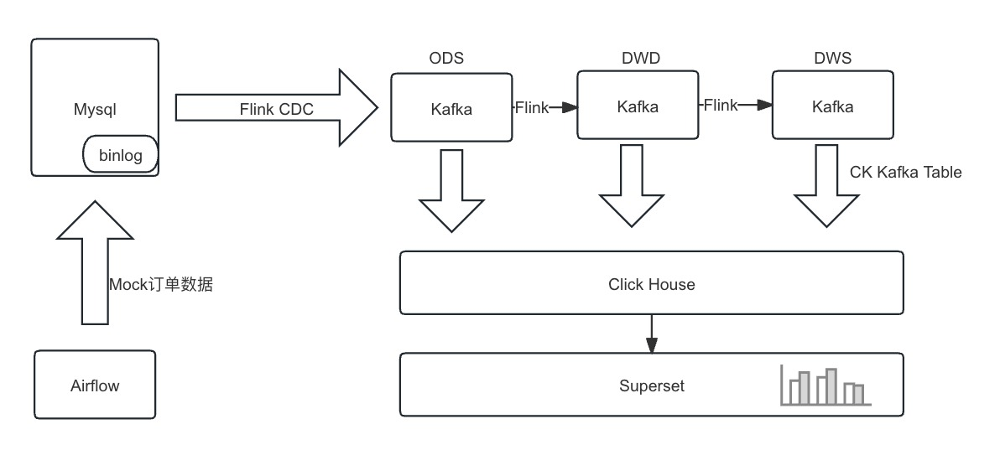
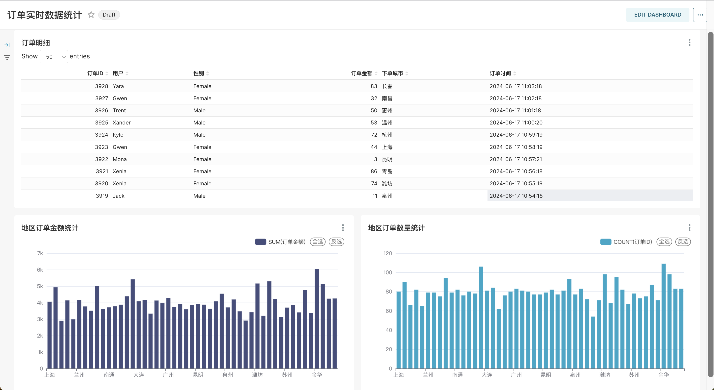

# 实时增量数据分析

简体中文 | [English](../../en/user-tutorials/Real-time-incremental-data-analysis.md)

# 1. 说明

借助 KDP 平台的开源组件 `Airflow`、`Mysql`、`Flink`、`Kafka`、`ClickHouse`、`Superset` 完成数据实时采集处理及可视化分析。



## 1.1 数据流说明

直接使用Flink构建实时数仓，由Flink进行清洗加工转换和聚合汇总，将各层结果集写入Kafka中。

Click house从Kafka分别订阅各层数据，将各层数据持久化到Click house中，用于之后的查询分析。

## 1.2 数据说明

本次分析数据基于mock数据，包含数据实时采集处理及可视化分析：

- 消费者表： customers

| 字段     | 字段说明 |
| -------- |------|
| id  | 用户ID |
| name | 姓名   |
| age   | 年龄   |
| gender   | 性别   |

- 订单表： orders

| 字段       | 字段说明 |
| ---------- |------|
| order_id    | 订单ID |
| order_revenue | 订单金额 |
| order_region | 下单地区 |
| customer_id | 用户ID |
| create_time | 下单时间 |

## 1.3 环境说明

在 KDP 页面安装如下组件并完成组件的 QuickStart:
- MySQL: 实时数据数据源及Superset/Airflow 元数据库，安装时需要开启binlog
- Kafka: 数据采集sink
- Flink: 数据采集及数据处理
- ClickHouse: 数据存储
- Superset: 数据可视化
- Airflow: 作业调度

Mysql 开启binlog配置：

```
[mysqld]
log-bin=mysql_bin
binlog-format=row
binlog-row-image=full
```

# 2. 数据集成

文中使用的账号密码信息请根据实际集群配置进行修改。

## 2.1 创建mysql表

```sql
CREATE DATABASE IF NOT EXISTS kdp_demo default character set utf8mb4;
USE kdp_demo;

CREATE TABLE IF NOT EXISTS kdp_demo.orders (
    order_id INT NOT NULL AUTO_INCREMENT,
    order_revenue FLOAT NOT NULL,
    order_region VARCHAR(40) NOT NULL,
    customer_id INT NOT NULL,
    create_time TIMESTAMP DEFAULT CURRENT_TIMESTAMP,
    PRIMARY KEY ( order_id )
);

CREATE TABLE IF NOT EXISTS kdp_demo.customers (
    id INT AUTO_INCREMENT PRIMARY KEY,
    name VARCHAR(100),
    age INT,
    gender ENUM('Male', 'Female')
);

INSERT INTO kdp_demo.customers (id, name, age, gender) VALUES (1, 'Alice', 28, 'Female'), (2, 'Bob', 34, 'Male'), (3, 'Charlie', 22, 'Male'), (4, 'David', 30, 'Male'), (5, 'Eve', 25, 'Female'), (6, 'Faythe', 29, 'Female'), (7, 'Grace', 31, 'Female'), (8, 'Heidi', 27, 'Female'), (9, 'Ivan', 26, 'Male'), (10, 'Judy', 24, 'Female'), (11, 'Karl', 32, 'Male'), (12, 'Leo', 33, 'Male'), (13, 'Mallory', 21, 'Female'), (14, 'Nina', 29, 'Female'), (15, 'Oscar', 35, 'Male'), (16, 'Peggy', 28, 'Female'), (17, 'Quentin', 34, 'Male'), (18, 'Rupert', 22, 'Male'), (19, 'Sybil', 30, 'Female'), (20, 'Trent', 25, 'Male'), (21, 'Uma', 29, 'Female'), (22, 'Victor', 31, 'Male'), (23, 'Walter', 27, 'Male'), (24, 'Xander', 26, 'Male'), (25, 'Yvonne', 24, 'Female'), (26, 'Zach', 32, 'Male'), (27, 'Amy', 33, 'Female'), (28, 'Brian', 21, 'Male'), (29, 'Cathy', 29, 'Female'), (30, 'Dylan', 35, 'Male'), (31, 'Elaine', 28, 'Female'), (32, 'Frank', 34, 'Male'), (33, 'Gina', 22, 'Female'), (34, 'Hank', 30, 'Male'), (35, 'Isla', 25, 'Female'), (36, 'Jack', 29, 'Male'), (37, 'Karen', 31, 'Female'), (38, 'Liam', 27, 'Male'), (39, 'Mona', 26, 'Female'), (40, 'Nate', 24, 'Male'), (41, 'Olivia', 32, 'Female'), (42, 'Pete', 33, 'Male'), (43, 'Quincy', 21, 'Male'), (44, 'Rita', 29, 'Female'), (45, 'Sam', 35, 'Male'), (46, 'Tina', 28, 'Female'), (47, 'Ulysses', 34, 'Male'), (48, 'Vera', 22, 'Female'), (49, 'Walt', 30, 'Male'), (50, 'Xenia', 25, 'Female'), (51, 'Yale', 29, 'Male'), (52, 'Zoe', 31, 'Female'), (53, 'Aidan', 27, 'Male'), (54, 'Bella', 26, 'Female'), (55, 'Caden', 24, 'Male'), (56, 'Daria', 32, 'Female'), (57, 'Eli', 33, 'Male'), (58, 'Fiona', 21, 'Female'), (59, 'Gabe', 29, 'Male'), (60, 'Holly', 35, 'Female'), (61, 'Ian', 28, 'Male'), (62, 'Jenna', 34, 'Female'), (63, 'Kyle', 22, 'Male'), (64, 'Lena', 30, 'Female'), (65, 'Mason', 25, 'Male'), (66, 'Nora', 29, 'Female'), (67, 'Owen', 31, 'Male'), (68, 'Paula', 27, 'Female'), (69, 'Quinn', 26, 'Male'), (70, 'Ralph', 24, 'Male'), (71, 'Sara', 32, 'Female'), (72, 'Tom', 33, 'Male'), (73, 'Una', 21, 'Female'), (74, 'Vince', 29, 'Male'), (75, 'Wendy', 35, 'Female'), (76, 'Xavier', 28, 'Male'), (77, 'Yara', 34, 'Female'), (78, 'Zane', 22, 'Male'), (79, 'Ann', 30, 'Female'), (80, 'Ben', 25, 'Male'), (81, 'Cindy', 29, 'Female'), (82, 'Derek', 31, 'Male'), (83, 'Elisa', 27, 'Female'), (84, 'Fred', 26, 'Male'), (85, 'Gwen', 24, 'Female'), (86, 'Harry', 32, 'Male'), (87, 'Isabel', 33, 'Female'), (88, 'Jonah', 21, 'Male'), (89, 'Kara', 29, 'Female'), (90, 'Luke', 35, 'Male'), (91, 'Maya', 28, 'Female'), (92, 'Nick', 34, 'Male'), (93, 'Olga', 22, 'Female'), (94, 'Paul', 30, 'Male'), (95, 'Quilla', 25, 'Female'), (96, 'Reed', 29, 'Male'), (97, 'Sophie', 31, 'Female'), (98, 'Theo', 27, 'Male'), (99, 'Ursula', 26, 'Female'), (100, 'Vlad', 24, 'Male');
```

## 2.2 创建 Kafka Topic

进入Kafka broker pod，执行命令创建 Topic，也可以通过Kafka manager 页面创建，以下为进入pod并通过命令行创建的示例：

```shell
export BOOTSTRAP="kafka-3-cluster-kafka-0.kafka-3-cluster-kafka-brokers.kdp-data.svc.cluster.local:9092"
bin/kafka-topics.sh --create --topic ods-order --replication-factor 3 --partitions 10 --bootstrap-server $BOOTSTRAP
bin/kafka-topics.sh --create --topic ods-customers --replication-factor 3 --partitions 10 --bootstrap-server $BOOTSTRAP

bin/kafka-topics.sh --create --topic dwd-order-customer-valid --replication-factor 3 --partitions 10 --bootstrap-server $BOOTSTRAP
bin/kafka-topics.sh --create --topic dws-agg-by-region --replication-factor 3 --partitions 10 --bootstrap-server $BOOTSTRAP
```

## 2.3 创建 ClickHouse 表

进入click-house pod，使用`clickhouse-client`执行命令创建表，以下为建表语句：

```sql
CREATE DATABASE IF NOT EXISTS kdp_demo;
USE kdp_demo;

-- kafka_dwd_order_customer_valid
CREATE TABLE IF NOT EXISTS kdp_demo.dwd_order_customer_valid (
  order_id Int32,
  order_revenue Float32,
  order_region String,
  create_time DateTime,
  customer_id Int32,
  customer_age Float32,
  customer_name String,
  customer_gender String
) ENGINE = MergeTree()
ORDER BY order_id;

CREATE TABLE kdp_demo.kafka_dwd_order_customer_valid (
  order_id Int32,
  order_revenue Float32,
  order_region String,
  create_time DateTime,
  customer_id Int32,
  customer_age Float32,
  customer_name String,
  customer_gender String
) ENGINE = Kafka
SETTINGS
  kafka_broker_list = 'kafka-3-cluster-kafka-0.kafka-3-cluster-kafka-brokers.kdp-data.svc.cluster.local:9092',
  kafka_topic_list = 'dwd-order-customer-valid',
  kafka_group_name = 'clickhouse_group',
  kafka_format = 'JSONEachRow',
  kafka_row_delimiter = '\n';


CREATE MATERIALIZED VIEW kdp_demo.mv_dwd_order_customer_valid TO kdp_demo.dwd_order_customer_valid AS
SELECT
  order_id,
  order_revenue,
  order_region,
  create_time,
  customer_id,
  customer_age,
  customer_name,
  customer_gender
FROM kdp_demo.kafka_dwd_order_customer_valid;


-- kafka_dws_agg_by_region
CREATE TABLE IF NOT EXISTS kdp_demo.dws_agg_by_region (
  order_region String,
  order_cnt Int64,
  order_total_revenue Float32
) ENGINE = ReplacingMergeTree()
ORDER BY order_region;

CREATE TABLE kdp_demo.kafka_dws_agg_by_region (
  order_region String,
  order_cnt Int64,
  order_total_revenue Float32
) ENGINE = Kafka
SETTINGS
  kafka_broker_list = 'kafka-3-cluster-kafka-0.kafka-3-cluster-kafka-brokers.kdp-data.svc.cluster.local:9092',
  kafka_topic_list = 'dws-agg-by-region',
  kafka_group_name = 'clickhouse_group',
  kafka_format = 'JSONEachRow',
  kafka_row_delimiter = '\n';

CREATE MATERIALIZED VIEW kdp_demo.mv_dws_agg_by_region TO kdp_demo.dws_agg_by_region AS
SELECT
  order_region,
  order_cnt,
  order_total_revenue
FROM kdp_demo.kafka_dws_agg_by_region;
```

## 2.4 创建 Flink SQL 作业

### 2.4.1 SQL部分

```sql
CREATE DATABASE IF NOT EXISTS `default_catalog`.`kdp_demo`;
       
-- create source tables
CREATE TABLE IF NOT EXISTS `default_catalog`.`kdp_demo`.`orders_src`(
    `order_id` INT NOT NULL,
    `order_revenue` FLOAT NOT NULL,
    `order_region` STRING NOT NULL,
    `customer_id` INT NOT NULL,
    `create_time` TIMESTAMP,
    PRIMARY KEY(`order_id`) NOT ENFORCED
) with (
    'connector' = 'mysql-cdc',
    'hostname' = 'kdp-data-mysql',
    'port' = '3306',
    'username' = 'bdos_dba',
    'password' = 'KdpDba!mysql123',
    'database-name' = 'kdp_demo',
    'table-name' = 'orders'
);

CREATE TABLE IF NOT EXISTS `default_catalog`.`kdp_demo`.`customers_src` (
    `id` INT NOT NULL,
    `age` FLOAT NOT NULL,
    `name` STRING NOT NULL,
    `gender` STRING NOT NULL,
    PRIMARY KEY(`id`) NOT ENFORCED
) with (
    'connector' = 'mysql-cdc',
    'hostname' = 'kdp-data-mysql',
    'port' = '3306',
    'username' = 'bdos_dba',
    'password' = 'KdpDba!mysql123',
    'database-name' = 'kdp_demo',
    'table-name' = 'customers'
);

-- create ods dwd and dws tables
CREATE TABLE IF NOT EXISTS `default_catalog`.`kdp_demo`.`ods_order_table` (
    `order_id` INT,
    `order_revenue` FLOAT,
    `order_region` VARCHAR(40),
    `customer_id` INT,
    `create_time` TIMESTAMP,
    PRIMARY KEY (order_id) NOT ENFORCED
) WITH (
    'connector' = 'upsert-kafka',
    'topic' = 'ods-order',
    'properties.bootstrap.servers' = 'kafka-3-cluster-kafka-0.kafka-3-cluster-kafka-brokers.kdp-data.svc.cluster.local:9092',
    'key.format' = 'json',
    'value.format' = 'json'
);

CREATE TABLE IF NOT EXISTS `default_catalog`.`kdp_demo`.`ods_customers_table` (
    `customer_id` INT,
    `customer_age` FLOAT,
    `customer_name` STRING,
    `gender` STRING,
    PRIMARY KEY (customer_id) NOT ENFORCED
) WITH (
    'connector' = 'upsert-kafka',
    'topic' = 'ods-customers',
    'properties.bootstrap.servers' = 'kafka-3-cluster-kafka-0.kafka-3-cluster-kafka-brokers.kdp-data.svc.cluster.local:9092',
    'key.format' = 'json',
    'value.format' = 'json'
);

CREATE TABLE IF NOT EXISTS `default_catalog`.`kdp_demo`.`dwd_order_customer_valid` (
    `order_id` INT,
    `order_revenue` FLOAT,
    `order_region` STRING,
    `create_time` TIMESTAMP,
    `customer_id` INT,
    `customer_age` FLOAT,
    `customer_name` STRING,
    `customer_gender` STRING,
    PRIMARY KEY (order_id) NOT ENFORCED
) WITH (
    'connector' = 'upsert-kafka',
    'topic' = 'dwd-order-customer-valid',
    'properties.bootstrap.servers' = 'kafka-3-cluster-kafka-0.kafka-3-cluster-kafka-brokers.kdp-data.svc.cluster.local:9092',
    'key.format' = 'json',
    'value.format' = 'json'
);

CREATE TABLE IF NOT EXISTS `default_catalog`.`kdp_demo`.`dws_agg_by_region` (
    `order_region` VARCHAR(40),
    `order_cnt` BIGINT,
    `order_total_revenue` FLOAT,
    PRIMARY KEY (order_region) NOT ENFORCED
) WITH (
    'connector' = 'upsert-kafka',
    'topic' = 'dws-agg-by-region',
    'properties.bootstrap.servers' = 'kafka-3-cluster-kafka-0.kafka-3-cluster-kafka-brokers.kdp-data.svc.cluster.local:9092',
    'key.format' = 'json',
    'value.format' = 'json'
);

USE kdp_demo;
-- EXECUTE STATEMENT SET
-- BEGIN

INSERT INTO ods_order_table SELECT * FROM orders_src;

INSERT INTO ods_customers_table SELECT * FROM customers_src;

INSERT INTO
    dwd_order_customer_valid
SELECT
    o.order_id,
    o.order_revenue,
    o.order_region,
    o.create_time,
    c.id as customer_id,
    c.age as customer_age,
    c.name as customer_name,
    c.gender as customer_gender
FROM
    customers_src c
        JOIN orders_src o ON c.id = o.customer_id
WHERE
    c.id <> -1;

INSERT INTO
    dws_agg_by_region
SELECT
    order_region,
    count(*) as order_cnt,
    sum(order_revenue) as order_total_revenue
FROM
    dwd_order_customer_valid
GROUP BY
    order_region;
-- END;
```

### 2.4.2 依赖部分

maven 依赖：
```xml
<dependency>
    <groupId>com.ververica</groupId>
    <artifactId>flink-sql-connector-mysql-cdc</artifactId>
    <version>3.0.1</version>
</dependency>
```

### 2.4.3 配置部分

具体使用参考[Stream Park 文档](https://streampark.apache.org/docs/get-started/how-to-use)

## 2.5 创建 Airflow DAG

### 2.5.1 DAG 文件部分

```python
import random
from datetime import timedelta

from airflow import DAG
from airflow.operators.bash import BashOperator
from airflow.utils.dates import days_ago

default_args = {
    'owner': 'admin',
    'depends_on_past': False,
    'email_on_failure': False,
    'email_on_retry': False,
    'retries': 1,
}

dag = DAG(
    'kdp_demo_order_data_insert',
    description='Insert into orders by using random data',
    schedule_interval=timedelta(minutes=1),
    start_date=days_ago(1),
    catchup=False,
    tags=['kdp-example'],
)

# MySQL connection info
mysql_host = 'kdp-data-mysql'
mysql_db = 'kdp_demo'
mysql_user = 'bdos_dba'
mysql_password = 'KdpDba!mysql123'
mysql_port = '3306'

cities = ["北京", "上海", "广州", "深圳", "成都", "杭州", "重庆", "武汉", "西安", "苏州", "天津", "南京", "郑州",
          "长沙", "东莞", "青岛", "宁波", "沈阳", "昆明", "合肥", "大连", "厦门", "哈尔滨", "福州", "济南", "温州",
          "佛山", "南昌", "长春", "贵阳", "南宁", "金华", "石家庄", "常州", "泉州", "南通", "太原", "徐州", "嘉兴",
          "乌鲁木齐", "惠州", "珠海", "扬州", "兰州", "烟台", "汕头", "潍坊", "保定", "海口"]
city = random.choice(cities)
consumer_id = random.randint(1, 100)
order_revenue = random.randint(1, 100)

# 插入数据的 BashOperator
insert_data_orders = BashOperator(
    task_id='insert_data_orders',
    bash_command=f'''
    mysql -h {mysql_host} -P {mysql_port} -u {mysql_user} -p{mysql_password} {mysql_db} -e "
    INSERT INTO orders(order_revenue,order_region,customer_id) VALUES({order_revenue},'{city}',{consumer_id});"
    ''',
    dag=dag,
)

insert_data_orders
```

### 2.5.2 DAG 说明及执行

当前Airflow安装时，需要指定可访问的git 仓库地址，因此需要将 Airflow DAG 提交到 Git 仓库中。每分钟向orders表插入一条数据。

### 2.6 数据验证

使用Click House验证数据：

进入Click House客户端：

```shell
clickhouse-client
# default pass: ckdba.123
```

```sql
SELECT * FROM kdp_demo.dwd_order_customer_valid;
SELECT count(*) FROM kdp_demo.dwd_order_customer_valid;
```

对比验证Mysql中数据是否一致。

```sql
select count(*) from kdp_demo.orders;
```

# 3 数据可视化

在2.6中数据验证通过后，可以通过Superset进行数据可视化展示。

使用账号 `admin` 密码 `admin` 登录 Superset `http://superset-kdp-data.kdp-e2e.io` (注意添加本地 Host 解析) 页面。

## 3.1 创建图表

### 导入我们制作好的图表

1. [下载面板](https://raw.githubusercontent.com/linktimecloud/example-datasets/feature%23superset/superset/Real-time-incremental-data-analysis-superset-export.zip)

2. 导入面板

   选择下载的文件导入

   

   输入 ClickHouse 的用户 `default` 的默认密码 `ckdba.123`

   

3. 效果


