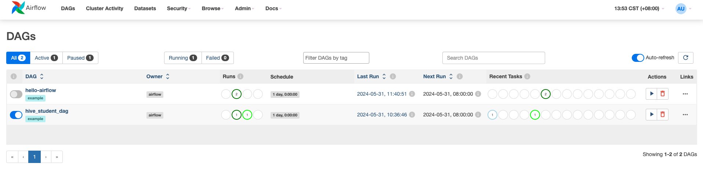

# 使用Apache Airflow进行Hive SQL批作业调度

# 1. 介绍
Apache Airflow是一个开源的流式作业调度平台，可以轻松地创建、调度、监控和管理工作流。Airflow支持Hive SQL，可以轻松地执行Hive SQL任务。
Apache Airflow使用DAG（有向无环图）来表示工作流，DAG由任务节点和依赖关系组成。任务节点可以是Python操作、Shell操作、SQL操作等。Airflow支持多种调度器，包括本地调度器、Celery调度器、Kubernetes调度器等。

本文介绍使用`pyhive`编写Hive SQL任务，并使用Apache Airflow Kubernetes 调度器来执行任务。

# 2. 编写 Hive SQL DAG

具体的代码实现可以访问 [Github](https://github.com/linktimecloud/example-datasets/blob/airflow/dags/hive-sql-example.py
) 或者 [Gitee](https://gitee.com/linktime-cloud/example-datasets/blob/airflow/dags/hive-sql-example.py) 查看。

这段代码是一个使用Apache Airflow框架编写的DAG（Directed Acyclic Graph，有向无环图），用于自动化数据处理任务。它主要执行以下两个任务：创建一个Hive表并插入数据，然后找出每个科目的最高分学生。

# 3. 运行DAG
## 3.1 组件依赖
需要在KDP安装如下组件：
- mysql
- airflow
- zookeeper
- hdfs
- hive (hive metastore, hive server)
- hue, httpfs-gateway (可选)

## 3.2 调度作业
使用默认参数在KDP安装Airflow后, 使用账号`admin`和密码`admin` 登录Airflow Web。

启动名称为`hive-sql-example`的DAG。

运行成功后，可以通过Hue Web界面查看结果。也可以参考 `hive-server2` Qucick Start 使用beeline 连接 Hive Server2 查看结果。

