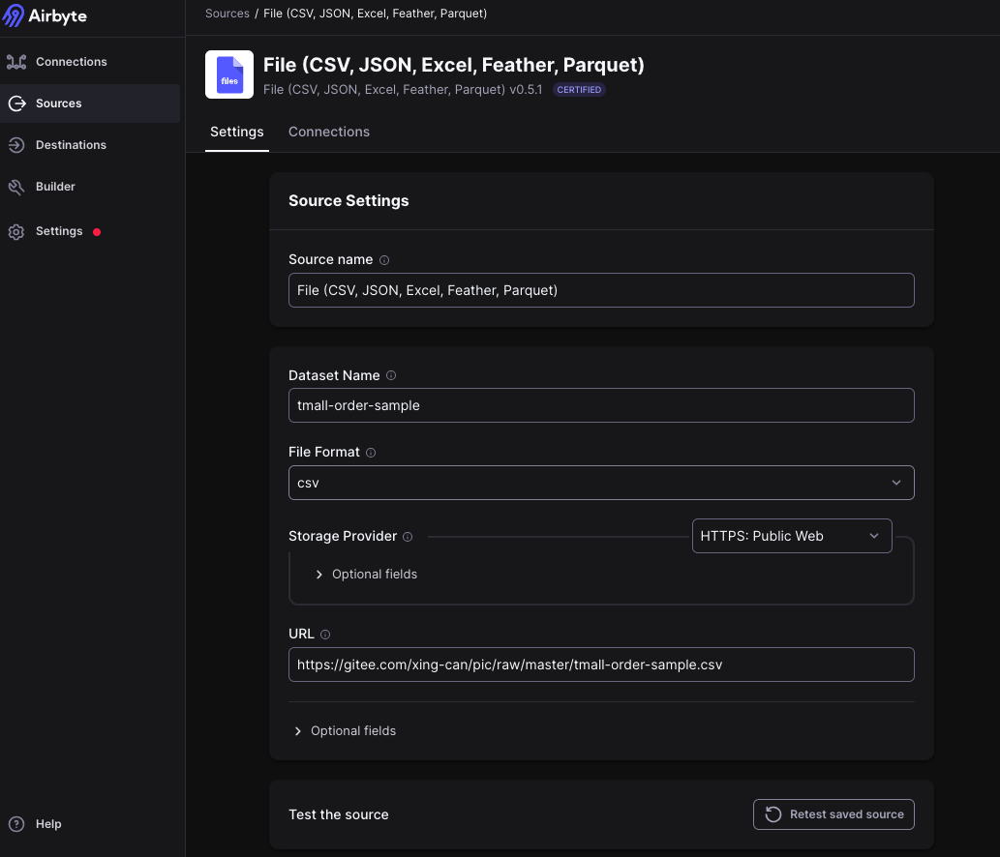
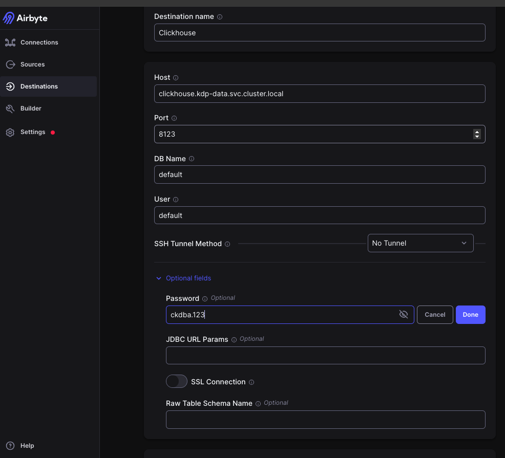
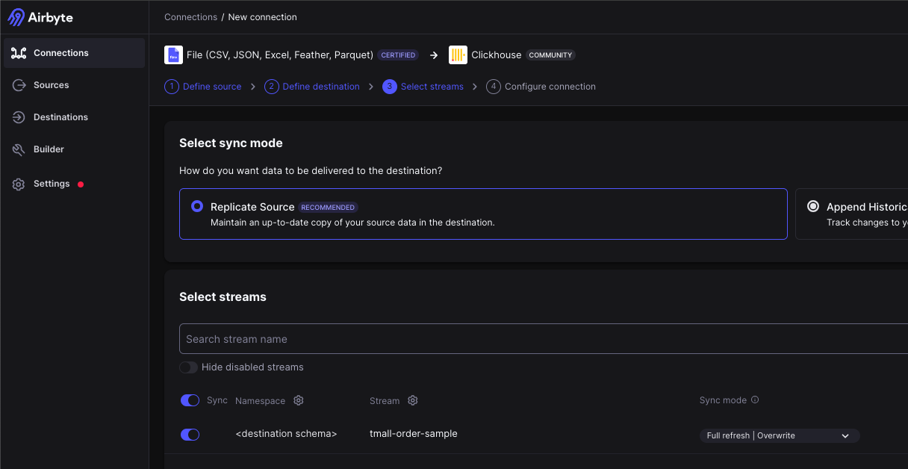
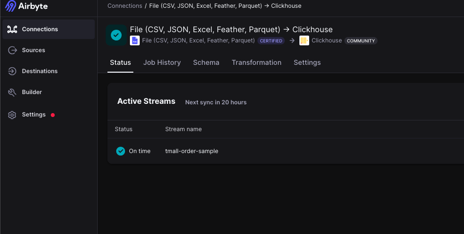
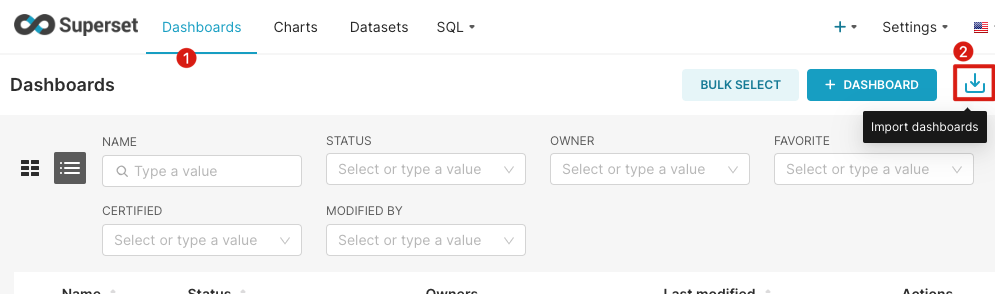
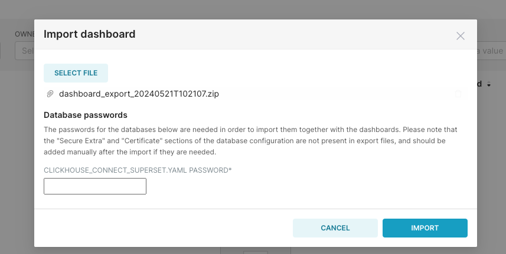
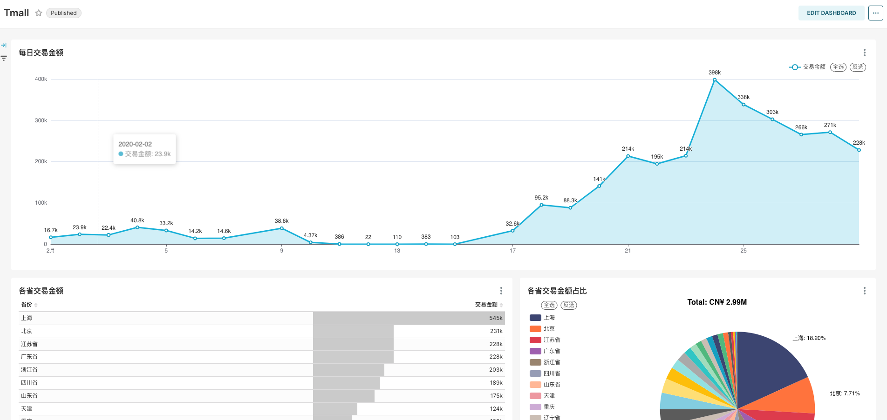

# 使用 airbyte, clickhouse, superset 探索数据
简体中文 | [English](../../en/user-tutorials/exploring-data-using-airbyte-clickhouse-superset.md) 

# 1. 介绍
本文将展示如何使用KDP平台来完成数据集成/加工/BI展示，涉及的应用有`airbyte`, `clickhouse`, `superset`， 需要提前安装这些应用。
建议先熟悉个组件的quick start，然后按照本文的步骤来操作。

# 2. 数据集成
将数据从 csv file 导入 clickhouse
1. 在 airbyte 中添加一个 file 类型 source。

   - Dataset Name: `tmall-order-sample` (请勿修改)
   - URL: `https://gitee.com/linktime-cloud/example-datasets/raw/main/airbyte/tmall-order-sample.csv`
      
1. 在 airbyte 中添加一个 clickhouse 类型 destination。 

    - Host: `clickhouse.kdp-data.svc.cluster.local`
    - Port: `8123`
    - DB Name: `default`
    - User: `default`
    - Password: `ckdba.123`

1. 在 airbyte 中添加一个 connection, source 选择 file, destination 选择 clickhouse, 使用默认配置然后保存。

   
1. 查看 airbyte 的 job 状态，如果成功，则说明数据已经成功导入到clickhouse中。

   
完成上述操作后即完成了ELT(Extract Load Transform)中的EL, 接下使用clickhouse完成Transform。

# 3. 数据加工

```bash
# 进入clickhouse container
kubectl exec -it clickhouse-shard0-0 -n kdp-data -c clickhouse -- bash
# 连接clickhouse
clickhouse-client --user default  --password ckdba.123
# 查看数据库
show databases;
use airbyte_internal;
show tables;
# 确认数据写入成功
select count(*) from airbyte_internal.default_raw__stream_tmall_order_sample;
```

继续依次执行下面的三条SQL语句，完成数据加工。

```sql
DROP TABLE IF EXISTS airbyte_internal.ods_tmall_order;

-- Define the structure of the new table ods_tmall_order 
CREATE TABLE airbyte_internal.ods_tmall_order
(
    total_amount          Int32,
    order_number          Int32,
    shipping_address      String,
    payment_time          DateTime64(3, 'GMT'),
    order_creation_time   DateTime64(3, 'GMT'),
    refund_amount         Int32,
    actual_payment_amount Int32
)
    ENGINE = MergeTree
ORDER BY order_number;
-- Assuming order_number is a unique identifier for each order

-- Insert data into the new table from the JSON in _airbyte_data
INSERT INTO airbyte_internal.ods_tmall_order
SELECT JSONExtractInt(_airbyte_data, '总金额')                                                      AS total_amount,
       JSONExtractInt(_airbyte_data, '订单编号')                                                    AS order_number,
       JSONExtractString(_airbyte_data, '收货地址 ')                                                AS shipping_address,
       parseDateTimeBestEffortOrNull(nullIf(JSONExtractString(_airbyte_data, '订单付款时间 '), '')) AS payment_time,
       parseDateTimeBestEffortOrNull(nullIf(JSONExtractString(_airbyte_data, '订单创建时间'), ''))  AS order_creation_time,

       JSONExtractInt(_airbyte_data, '退款金额')                                                    AS refund_amount,
       JSONExtractInt(_airbyte_data, '买家实际支付金额')                                            AS actual_payment_amount
FROM default_raw__stream_tmall_order_sample;

```

确认数据处理完成
```sql
select * from airbyte_internal.ods_tmall_order limit 10;
```
# 4. 数据展示
在 Superset 中添加 clickhouse 数据源, 并制作面板。关于如何添加数据源，如何制作面板请参考 Superset quick start。下面我们通过面板的导入功能完成数据源，面板的导入。
1. [下载面板](https://gitee.com/linktime-cloud/example-datasets/blob/main/superset/dashboard_export_20240521T102107.zip)
2. 导入面板
选择下载的文件导入

输入clickhouse的用户`default`的默认密码`ckdba.123`

导入后的效果如下

   
