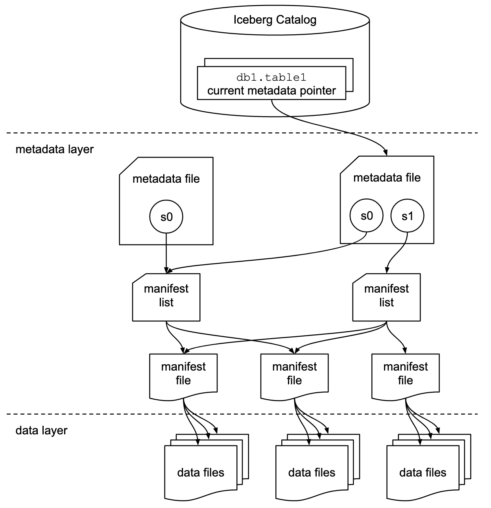

# Iceberg 快速开始

Hive 是当今数据仓库事实上的标准，围绕 Hive 生态的工具非常成熟。但 Hive 也有其缺点，例如

- Hive 在分区级别实现事务的原子性，但在文件跟踪级别不能提供事务支持。
- Hive 的事务性只能保证单个分区操作的原子性，因此不能以一致的方式同时更改多个分区中的数据。
- 多个进程同时更改数据时会导致数据丢失，因为都以最后一次写入为准，中间的操作都被最后一次操作覆盖。因此需要自行定义和组织协调修改顺序。
- 跨分区查询性能低下。
- Hive 表的统计信息都是通过异步、定期读取作业中的方式收集的，因此统计信息通常已过时。

Hive 表格式的大多数问题都源于它的一个原始设计问题，这个问题起初看起来相当小，但最终会产生重大后果——表中的数据在文件夹级别进行跟踪。

Netflix 发现解决 Hive 表格式引起的主要问题的关键是要在文件级别跟踪表中的数据。他们不是一个指向一个目录或一组目录的表，而是将一个表定义为一个规范的文件列表。事实上，他们意识到文件级跟踪不仅可以解决他们使用 Hive 表格式遇到的问题，还可以为实现更广泛的分析目标奠定基础。



Iceberg 新定义的表结构有元数据层和数据层。数据层就是数据文件。元数据层是它很重要的设计点，可以复用 Hive 的 MetaStore，指向最新的快照。元数据里面分多层，记录了具体的文件列表。每次有新的 Commit，就会创建出新的快照，读请求可以访问旧的快照，写请求写新的。在写的过程中，新创建的数据文件读是不可见的，只有在提交后把最新的版本指过去，新写入的文件才可见。做到了读写分离。同时修改操作是原子的，能够支持细粒度的分区内部的修改。

Iceberg 数仓相比 Hive 数仓在事务性和实时性上都有巨大优势。Iceberg 还可以作为数据湖使用，例如用 Flink CDC 将 Kafka 中的半格式化数据写入 Iceberg，数据分析师可以直接连接 Iceberg 进行查询分析。越来越多的公司利用 Iceberg 实现湖仓一体（Data Lakehouse）。Iceberg 已经逐渐成为湖仓一体事实上的标准。

下面我们分别以 Spark 和 Flink 作为计算引擎，Hive Metastore 作为统一的元数据中心，MinIO 作为存储，介绍如何在 KDP 上使用 Iceberg 表。

## 安装配置 Hive Metastore 和 MinIO

请在 KDP 中依次安装以下组件：

- minio
- mysql
- hdfs
- hive-metastore

其中 hive-metastore 需要在 `hiveConf` 中添加如下配置：

```yaml
fs.s3a.access.key: admin
fs.s3a.endpoint: http://minio:9000
fs.s3a.path.style.access: 'true'
fs.s3a.secret.key: admin.password
iceberg.engine.hive.enabled: 'true'
```

`admin` 和 `admin.password` 是安装 MinIO 时的默认账密。如果做过修改，需要设为实际值。

这样就在 `hive-site.xml` 中指定了 MinIO 的地址和账密，让 Hive Metastore 能访问到 MinIO。

## Spark 快速开始

### 准备 Spark SQL 环境

KDP 中并没有直接提供 spark-sql，我们可以发一个 Pod 到集群上作为 spark-sql 的执行环境。

在本地创建名为 `spark-sql.yaml` 的文件，填入以下内容：

```yaml
apiVersion: v1
kind: Pod
metadata:
  name: spark-sql
  namespace: kdp-data
spec:
  volumes:
    - name: hdfs-conf
      configMap:
        name: hdfs-config
    - name: hive-conf
      configMap:
        name: hive-metastore-context
  containers:
    - name: spark
      image: od-registry.linktimecloud.com/ltc-spark:v1.1.0-3.3.0
      command: ["tail", "-f", "/dev/null"]
      resources:
        limits:
          cpu: '2'
          memory: 2048Mi
        requests:
          cpu: '0.5'
          memory: 2048Mi
      volumeMounts:
        - name: hdfs-conf
          mountPath: /opt/spark/conf/core-site.xml
          subPath: core-site.xml
        - name: hdfs-conf
          mountPath: /opt/spark/conf/hdfs-site.xml
          subPath: hdfs-site.xml
        - name: hive-conf
          mountPath: /opt/spark/conf/hive-site.xml
          subPath: hive-site.xml
```

这个 Pod 使用 spark 镜像，并且挂载了 hdfs 和 hive 的配置文件。注意 `spec.containers[0].image` 可能需要修改为集群上的镜像仓库地址。 执行以下命令发布 Pod 到集群上：

```shell
kubectl apply -f spark-sql.yaml
```

### 在 Spark SQL 中使用 Iceberg

执行以下命令进入 Spark SQL：

```shell
# 进入 spark-sql 容器
kubectl exec -it spark-sql -n kdp-data -- bash
# 启动 Spark SQL
# AWS_REGION 可以是任意值，但不能为空
export AWS_REGION=us-east-1
# admin 和 admin.password 是安装 MinIO 时的默认账密。如果做过修改，需要设为实际值。
export AWS_ACCESS_KEY_ID=admin
export AWS_SECRET_ACCESS_KEY=admin.password
/opt/spark/bin/spark-sql \
    --conf spark.sql.extensions=org.apache.iceberg.spark.extensions.IcebergSparkSessionExtensions \
    --conf spark.sql.catalog.spark_iceberg=org.apache.iceberg.spark.SparkCatalog \
    --conf spark.sql.catalog.spark_iceberg.type=hive \
    --conf spark.sql.catalog.spark_iceberg.io-impl=org.apache.iceberg.aws.s3.S3FileIO \
    --conf spark.sql.catalog.spark_iceberg.s3.endpoint=http://minio:9000 \
    --conf spark.sql.catalog.spark_iceberg.s3.path-style-access=true \
    --conf iceberg.engine.hive.enabled=true
```

注意上面的 --conf 参数，我们创建了一个名为 `spark_iceberg` 的 catalog，它的元数据保存在 hive-metastore，数据存储在 MinIO。

执行以下 SQL 命令进行数据写入和查询操作：

```sql
-- 创建数据库
CREATE DATABASE IF NOT EXISTS spark_iceberg.iceberg_db;

-- 创建表
CREATE TABLE IF NOT EXISTS spark_iceberg.iceberg_db.orders (
    order_id STRING,
    name STRING,
    order_value DOUBLE,
    priority INT,
    state STRING,
    order_date STRING,
    customer_id STRING,
    ts STRING
) USING iceberg LOCATION 's3a://default/warehouse/orders';

-- 插入数据
INSERT INTO spark_iceberg.iceberg_db.orders
VALUES
    ('order001', 'Product A', 100.00, 1, 'California', '2024-04-03', 'cust001', '1234567890'),
    ('order002', 'Product B', 150.00, 2, 'New York', '2024-04-03', 'cust002', '1234567890'),
    ('order003', 'Product C', 200.00, 1, 'Texas', '2024-04-03', 'cust003', '1234567890');

-- 查询数据
SELECT * FROM spark_iceberg.iceberg_db.orders;

-- 可以多次执行 insert 操作，然后观察 snapshot 的变化
SELECT * FROM spark_iceberg.iceberg_db.orders.snapshots;
```

更多内容请参考[官方文档](https://iceberg.apache.org/docs/nightly/spark-getting-started/)

## Flink 快速开始

### 组件依赖

请在 KDP 中依次安装以下组件：

- flink-kubernetes-operator
- flink-session-cluster

其中 flink-session-cluster 需要将 Flink on Hive 设为 `enable`。

### 在 Flink SQL 中使用 Iceberg

执行以下命令进入 Flink SQL：

```shell
# 获得 flink-session-cluster pod 名称
kubectl get pods -n kdp-data -l app=flink-session-cluster -l component=jobmanager -o name
# 进入 flink-session-cluster 容器
# flink-session-cluster-xxxxx 替换成 pod 真实名称
kubectl exec -it flink-session-cluster-xxxxx -n kdp-data -- bash
# 启动 Flink SQL
./bin/sql-client.sh
```

执行以下 SQL 命令进行数据写入和查询操作：

```sql
-- 创建一个 iceberg 类型的 catalog，元数据保存在 hive-metastore 中，数据存储在 minio 的 default bucket 中。
-- 如果需要更换 bucket，注意要先在 minio 中创建。
CREATE CATALOG flink_iceberg WITH (
    'type' = 'iceberg',
    'catalog-type'='hive',
    'warehouse' = 's3a://default/warehouse',
    'hive-conf-dir' = '/opt/hive-conf');

-- 创建数据库
CREATE DATABASE IF NOT EXISTS flink_iceberg.iceberg_db;

-- 创建表
CREATE TABLE IF NOT EXISTS flink_iceberg.iceberg_db.orders (
    order_id STRING,
    name STRING,
    order_value DOUBLE,
    priority INT,
    state STRING,
    order_date STRING,
    customer_id STRING,
    ts STRING
);

-- 以 batch 模式执行 SQL，以 tableau 模式返回结果
SET 'execution.runtime-mode'='batch';
SET 'sql-client.execution.result-mode' = 'tableau';

-- 插入数据
INSERT INTO flink_iceberg.iceberg_db.orders
VALUES
    ('order001', 'Product A', 100.00, 1, 'California', '2024-04-03', 'cust001', '1234567890'),
    ('order002', 'Product B', 150.00, 2, 'New York', '2024-04-03', 'cust002', '1234567890'),
    ('order003', 'Product C', 200.00, 1, 'Texas', '2024-04-03', 'cust003', '1234567890');

-- 查询数据
SELECT * FROM flink_iceberg.iceberg_db.orders;
```

更多内容请参考[官方文档](https://iceberg.apache.org/docs/nightly/flink/)

## 利用 JuiceFS 加速 MinIO 访问性能

对象存储相比 HDFS 虽然降低了存储成本，但在处理大量小文件时性能较差。JuiceFS通过在对象存储上提供一个POSIX兼容的文件系统层，优化了元数据管理和文件操作性能。它利用本地缓存和分布式元数据管理，显著提高了处理小文件的效率。KDP 中也提供了 JuiceFS，通过 JuiceFS S3 Gateway，所有对接 MinIO 的组件都可以无缝迁移到 JuiceFS。

### 安装 JuiceFS

请在 KDP 应用目录中找到并安装 JuiceFS。安装完毕后，需要访问 JuiceFS 管理页面，创建一个 bucket，比如 `lakehouse`。

### 切换到 JuiceFS

对上文用例做以下修改：

1. 将 http://minio:9000 替换为 http://juicefs-s3-gateway:9000
2. 将 bucket 名称（比如 s3a://default）替换为 JuiceFS 中的 bucket（比如 s3a://lakehouse）

其他内容不用做任何修改，即可获得 JuiceFS 提供的性能提升。
