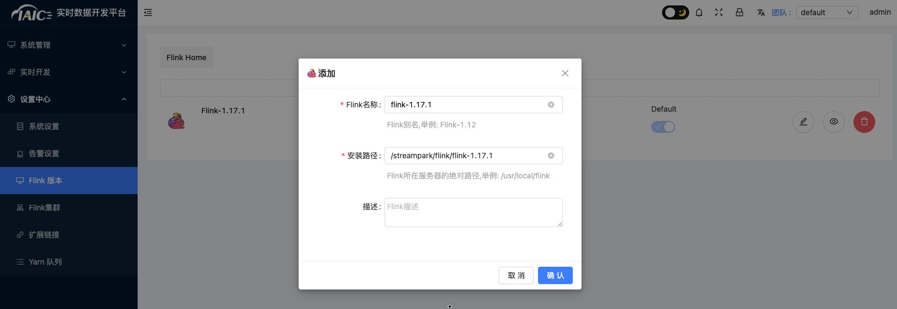
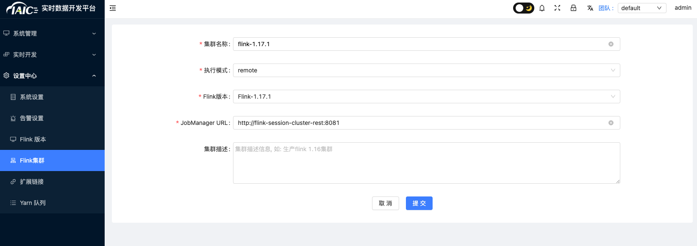
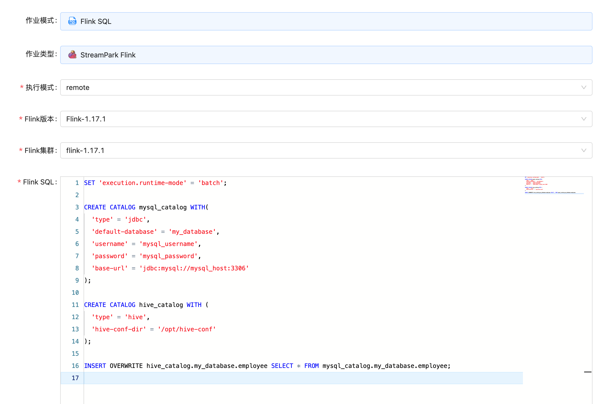

# 从关系型数据库将数据导入 Hive

企业的大数据平台搭建好后，通常要先从散落在各个部门的数据库导入数据，消除数据孤岛。传统的主机模式大数据平台通常会用 sqoop 等 ETL 工具导入数据。在云原生大数据平台上，有更好的方法。

本文介绍如何用 Flink SQL 将 MySQL 数据导入 Hive。Flink 的 Table & SQL API 可以处理 SQL 语言编写的查询语句，但是这些查询需要嵌入用 Java 或 Scala 编写的表程序中。此外，这些程序在提交到集群前需要用构建工具打包。我们可以用 Flink SQL Client 或 StreamPark 来编写、调试和提交表程序到 Flink 集群上，而无需写一行 Java 或 Scala 代码。这个步骤在 KDP 上可以非常容易的实现。

# 组件依赖

本案例需要在 KDP 上安装以下组件：

- hdfs
- hive-metastore
- hive-server2
- flink-kubernetes-operator
- flink-session-cluster
- streampark（可选。注意需要启用 Flink on Hive。）
- hue（可选）

请依次安装上述组件。

## StreamPark 配置（可选）

如果安装了 streampark，需要先进行 flink 集群配置。

1. 找到应用目录 Flink 下 Streampark 应用，点击应用实例名称进入应用实例页，点击“访问地址”按钮，进入 Streampark 管理页面，输入 **固定** 用户名(admin)密码(streampark)登录。
   在 `设置中心` 添加 `Flink版本` 配置: 当前仅支持 flink 1.17.1 版本，在 streampark 默认路径为 `/streampark/flink/flink-1.17.1`。
   

2. 在 `设置中心` 添加 `Flink集群` 配置: 当前仅支持 flink 1.17.1 版本。KDP flink 默认访问地址为：`http://flink-session-cluster-rest:8081`
   

## Hue 配置（可选）

Hue 安装完成之后会自动连上 hive server2，无需进行额外配置。在 Hue 登录页面使用账号 `root` 登录（请勿用其他用户，否则会出现权限问题），无需密码。

# CLI 工具

如果不想安装 streampark 和 hue，可以分别使用 Flink SQL 和 Beeline 进行替代。

## Flink SQL 使用方法

执行以下命令进入 Flink SQL：

```shell
# 获得 flink-session-cluster pod 名称
kubectl get pods -n kdp-data -l app=flink-session-cluster -l component=jobmanager -o name
# 进入 flink-session-cluster 容器
# flink-session-cluster-xxxxx 替换成 pod 真实名称
kbuectl exec -it flink-session-cluster-xxxxx -n kdp-data -- bash
# 启动 Flink SQL
./bin/sql-client.sh
```

## Beeline 使用方法

执行以下命令进入 Beeline：

```shell
# 进入 hive-server2 容器
kubectl exec -it hive-server2-0 -n kdp-data -- bash
# 启动 Beeline
beeline -u 'jdbc:hive2://hive-server2-0.hive-server2:10000/;auth=noSasl' -n root
```

# 数据准备

## 源表

如果 mysql 中已有数据，可以跳过这一步。如果没有数据，可以参考下面步骤创建测试数据。

登录 mysql，执行以下 sql 脚本创建数据库和表，插入测试数据：

```sql
CREATE DATABASE my_database;

CREATE TABLE IF NOT EXISTS my_database.employee (
  id int NOT NULL PRIMARY KEY,
  name varchar(255),
  age int,
  gender varchar(255)
);

INSERT INTO my_database.employee
VALUES
  (1, 'scott', 23, 'M'),
  (2, 'scott', 23, 'M'),
  (3, 'scott', 23, 'M'),
  (4, 'scott', 23, 'M'),
  (5, 'scott', 23, 'M');
```

## 目标表

在 beeline 或 Hue 中执行以下脚本，创建与源表对应的目标表。

```sql
CREATE DATABASE my_database;

CREATE TABLE IF NOT EXISTS my_database.employee (
 id int,
 name string,
 age int,
 gender string )
 COMMENT 'Employee Table'
 ROW FORMAT DELIMITED
 FIELDS TERMINATED BY ',';
```

# 数据导入

在 StreamPark 或 Flink SQL 中执行以下 Flink SQL。注意要将 MySQL 地址、端口和账密替换为真实信息。

```sql
SET 'execution.runtime-mode' = 'batch';

CREATE CATALOG mysql_catalog WITH(
  'type' = 'jdbc',
  'default-database' = 'my_database',
  'username' = '<mysql_username>',
  'password' = '<mysql_password>',
  'base-url' = 'jdbc:mysql://<mysql_host>:<mysql_port>'
);

CREATE CATALOG hive_catalog WITH (
  'type' = 'hive',
  'hive-conf-dir' = '/opt/hive-conf'
);

INSERT OVERWRITE hive_catalog.my_database.employee SELECT * FROM mysql_catalog.my_database.employee;
```

> MySQL Catalog 参考 [JDBC Catalog 文档](https://nightlies.apache.org/flink/flink-docs-release-1.17/zh/docs/connectors/table/jdbc/#jdbc-catalog-的使用)

> Hive Catalog 参考 [Hive Catalog 文档](https://nightlies.apache.org/flink/flink-docs-release-1.17/zh/docs/connectors/table/hive/overview/#连接到hive)

在 StreamPark 中创建作业可以参考下图：



# 在 Hive 中浏览数据

数据导入完成后，就可以在 Beeline 或 Hue 中浏览数据：

```sql
select * from my_database.employee;
```

后续可以在 hive 中对数据进行分析和加工。
