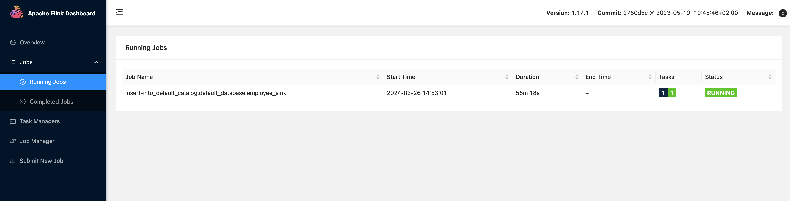

# MySQL 数据同步到 Kafka

在复杂的计算场景中，MySQL 中的一张表可能被多个作业使用（比如保存用户信息的表），当多个任务使用同一张 MySQL 表做处理时，MySQL 数据库会启动多个连接，对 MySQL 服务器和网络造成很大的压力。

为了缓解对上游 MySQL 数据库的压力，可以考虑利用 Flink cdc 将 MySQL 表同步到 Kafka，MySQL 表以 Upsert Kafka 的方式写入对应 topic。然后直接使用 Kafka JSON Catalog 中的表代替 MySQL 表，从而降低多个任务对 MySQL 数据库造成的压力。

本文介绍如何在 Flink SQL 中实现数据同步，无需写一行代码。

# 组件依赖

本案例需要在 KDP 上安装以下组件：

- flink-kubernetes-operator
- flink-session-cluster
- kafka-3-operator
- kafka-3-cluster
- kafka-manager（可选）

请依次安装上述组件。

Flink SQL 的使用方法请参考 [Flink SQL](./import-from-mysql-to-hive.md#flink-sql-使用方法)

kafka-3-cluster 安装完成后，请在 KDP 页面依次点击「大数据集群管理」-「集群信息」-「应用使用配置」-「kafka-3-cluster-kafka-context」，查看 `bootstrap_plain` 的值（通常为 `kafka-3-cluster-kafka-0.kafka-3-cluster-kafka-brokers.kdp-data.svc.cluster.local:9092,kafka-3-cluster-kafka-1.kafka-3-cluster-kafka-brokers.kdp-data.svc.cluster.local:9092,kafka-3-cluster-kafka-2.kafka-3-cluster-kafka-brokers.kdp-data.svc.cluster.local:9092`）。这个值是 kafka bootstrap servers 地址，下面会用到。

# 数据源准备

> 注意：Flink cdc 需要读取 MySQL 的 binlog，请确保 MySQL 配置中的 `binlog_row_image=FULL`。源表必须要有主键。

如果已有合适的数据源，可以跳过这一步。

登录 mysql，执行以下 sql 脚本创建数据库和表：

```sql
CREATE DATABASE my_database;

CREATE TABLE IF NOT EXISTS my_database.employee (
  id int NOT NULL PRIMARY KEY,
  name varchar(255),
  age int,
  gender varchar(255)
);
```

# 创建同步作业

进入 Flink SQL，执行以下脚本。注意要将 MySQL 地址、端口和账密替换为真实信息。Kafka bootstrap servers 替换成上文中获得的地址。

```sql
CREATE TABLE employee_source (
  `id` INT NOT NULL,
  name STRING,
  age INT,
  gender STRING,
  PRIMARY KEY (`id`) NOT ENFORCED
) WITH (
  'connector' = 'mysql-cdc',
  'hostname' = '<mysql_host>',
  'port' = '<mysql_port>',
  'username' = '<mysql_user>',
  'password' = '<mysql_password>',
  'database-name' = 'my_database',
  'table-name' = 'employee',
  'server-time-zone' = 'Asia/Shanghai',
  'jdbc.properties.useSSL' = 'false'
);

CREATE TABLE employee_sink(
  `id` INT NOT NULL,
  name STRING,
  age INT,
  gender STRING,
  PRIMARY KEY (`id`) NOT ENFORCED
) WITH (
  'connector' = 'upsert-kafka',
  'topic' = 'mysql-table-employee',
  'properties.bootstrap.servers' = '<bootstrap_servers>',
  'key.format' = 'json',
  'value.format' = 'json'
);

INSERT INTO employee_sink SELECT * FROM employee_source;
```

这时就创建了一个实时同步的作业，可以在 Flink Dashboard 中看到这个运行中的作业。



如果安装了 Kafka Manager，可以打开 Live Tail 页面观测新进入 topic 的数据。

如果没有安装 Kafka Manager，可以进入 kafka-3-cluster-kafka-0 容器，执行以下命令观测新进入 topic 的数据。

```shell
./bin/kafka-console-consumer.sh --bootstrap-server localhost:9092 --topic mysql-table-employee
```

登录 mysql，执行以下 sql 插入数据：

```sql
INSERT INTO my_database.employee VALUES (1234, 'scott', 23, 'M');
```

观测到新进入 topic 的数据：


