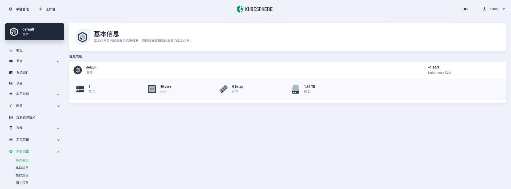
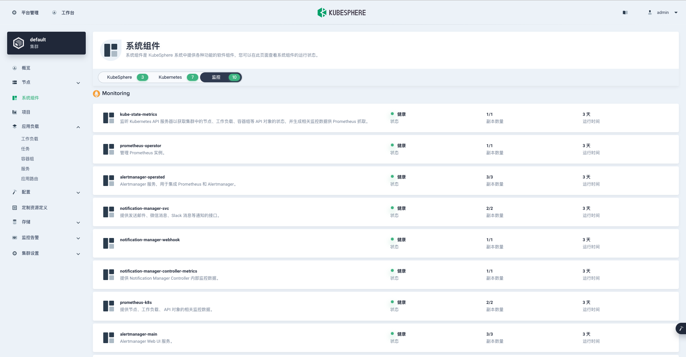
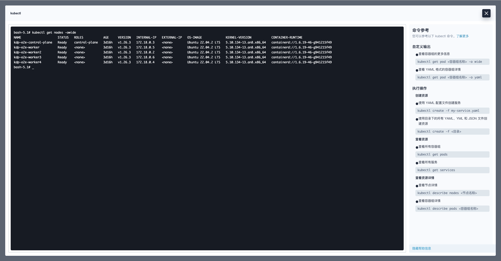
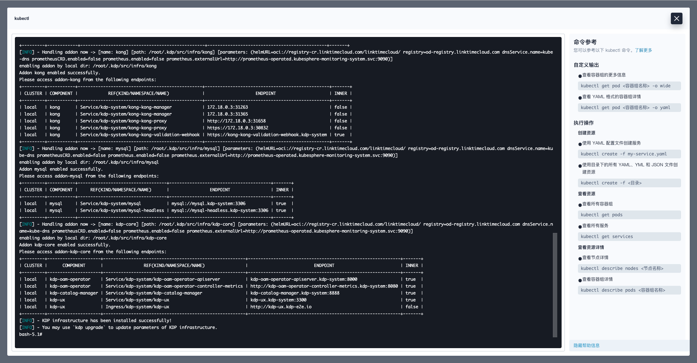
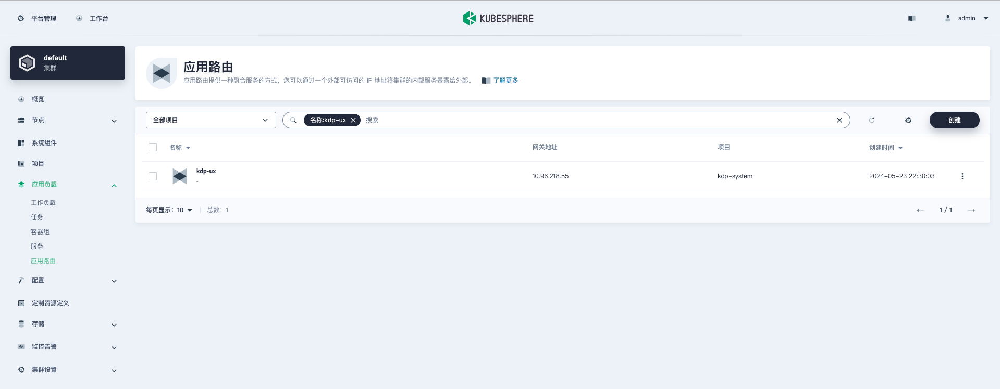
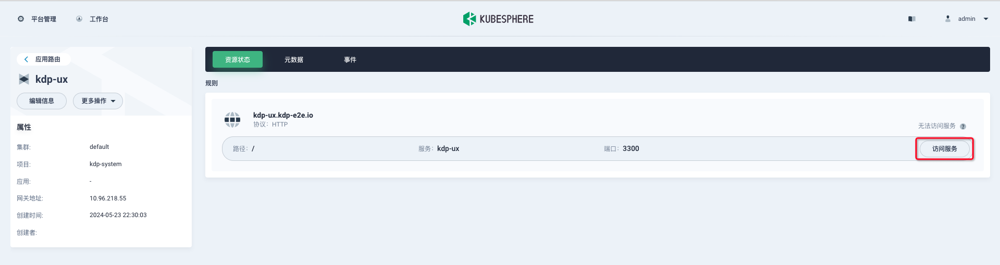

# 在 KubeSphere 容器平台安装 KDP

## KubeSphere 容器平台

[Kubekey](https://github.com/kubesphere/kubekey) 是一个开源的 Kubernetes 安装程序和生命周期管理工具。它支持安装 Kubernetes 集群、KubeSphere 以及其他相关组件。

[KubeSphere](https://kubesphere.io/zh/) 是一个用于云原生应用程序管理的分布式操作系统，使用 Kubernetes 作为其内核。它提供了即插即用架构，允许第三方应用程序无缝集成到其生态系统中。

它们共同提供了一个完整的云原生应用程序平台解决方案，包括容器管理、DevOps、服务网格和可观测性。

## 先决条件

- 在 Kubernetes v1.26.x 上安装 KubeSphere（参考 [在 Kubernetes 上最小化安装 KubeSphere](https://kubesphere.io/zh/docs/v3.4/quick-start/minimal-kubesphere-on-k8s/) 快速开始）：

- KubeSphere 安装完成后，登录 KubeSphere Web 控制台并确保监控组件已启用（这将安装 Prometheus Operator、一个 Prometheus 集群和一个 Alertmanager 集群）：


## 在 KubeSphere 上安装 KDP

1. 使用管理员账户登录 KubeSphere Web 控制台。

2. 使用 [Web Kubectl](https://kubesphere.io/zh/docs/v3.4/toolbox/web-kubectl/) 功能打开一个 Web 终端：


3. 在 Web 终端中，运行以下命令以安装 KDP：
```bash
# 下载 KDP CLI
export VERSION=v1.1.0
wget https://github.com/linktimecloud/kubernetes-data-platform/releases/download/${VERSION}/kdp-${VERSION}-linux-amd64.tar.gz 
tar xzf kdp-${VERSION}-linux-amd64.tar.gz
mkdir -p ~/.local/bin
install -v linux-amd64/kdp ~/.local/bin
export PATH=$PATH:$HOME/.local/bin
kdp version

# 安装 KDP
# 注意：注意以下参数：
# - `openebs.enabled=false`：跳过 KDP 内置 OpenEBS hostpath provisioner 组件的安装
# - `storageConfig.storageClassMapping.localDisk=local`：使用 KubeSphere 上的内置 StorageClass，你也可以将 `local` 更改为其他现有的 SC
# - `prometheusCRD.enabled=false`：跳过 KDP 内置 Prometheus CRD 的安装
# - `prometheus.enabled=false`：跳过 KDP 内置 Prometheus Operator 的安装
# - `prometheus.externalUrl=http://prometheus-operated.kubesphere-monitoring-system.svc:9090`：使用 KubeSphere 上的内置 Prometheus 服务
kdp install \
--force-reinstall \
--set openebs.enabled=false \
--set storageConfig.storageClassMapping.localDisk=local \
--set prometheusCRD.enabled=false \
--set prometheus.enabled=false \
--set prometheus.externalUrl=http://prometheus-operated.kubesphere-monitoring-system.svc:9090 
```

4. 等待安装完成：


## 访问 KDP Web 控制台

1. KDP 安装完成后，转到 KubeSphere Web 控制台，并在菜单 “应用负载” -> “应用路由” 中找到名为 'kdp-ux' 的应用路由对象：


1. 点击并进入'kdp-ux'应用路由的详细页面，然后点击路径'/'的'访问服务'按钮，在新的标签页中打开 KDP Web 控制台


1. 你现在可以使用 KDP Web 控制台来建设你的数据平台。有关使用数据组件的更多教程，请参考 [教程](./tutorials.md)。
