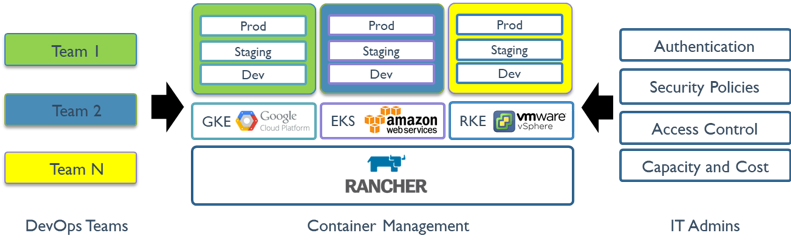
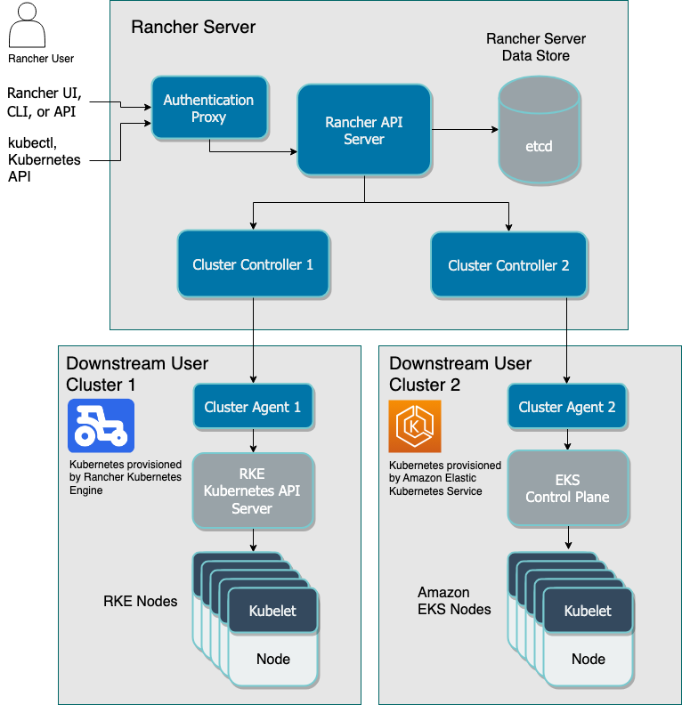
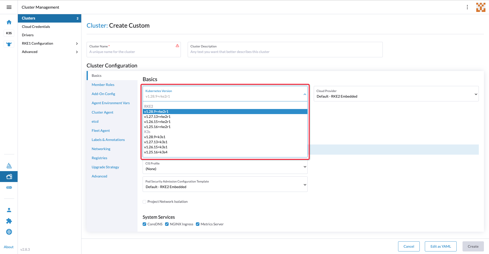
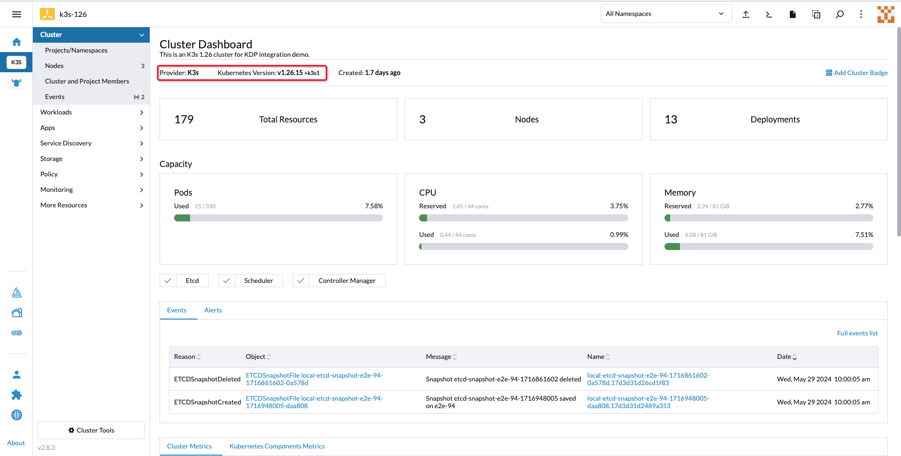
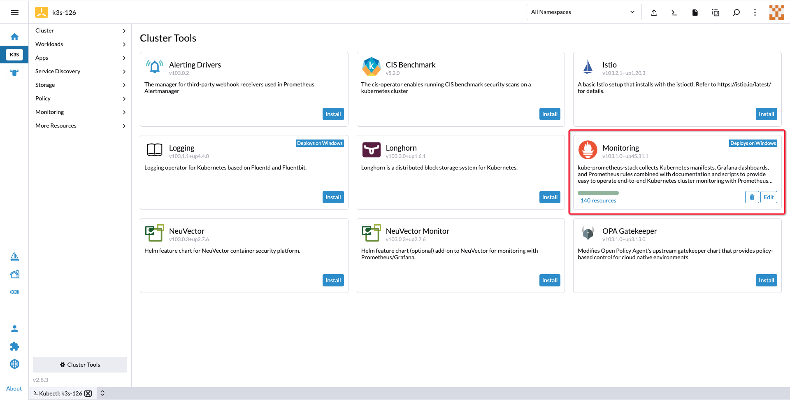
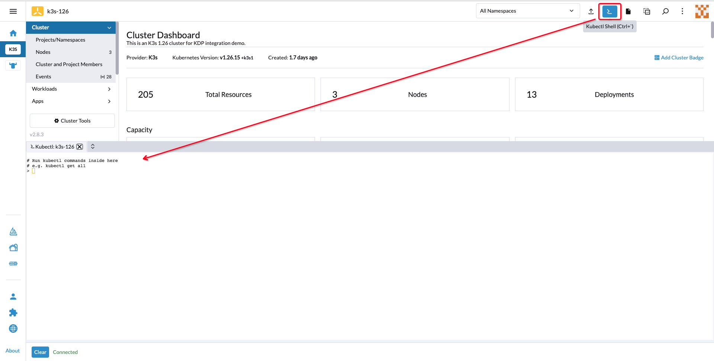
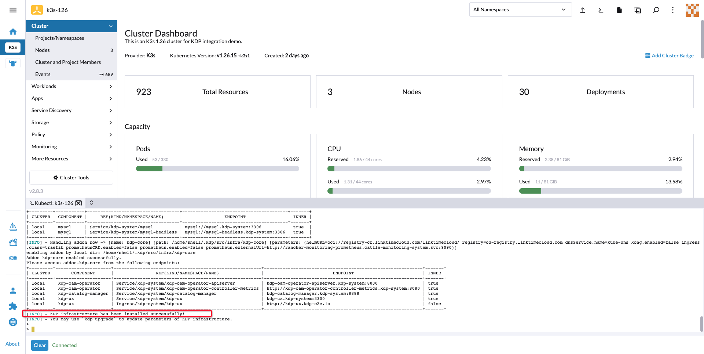
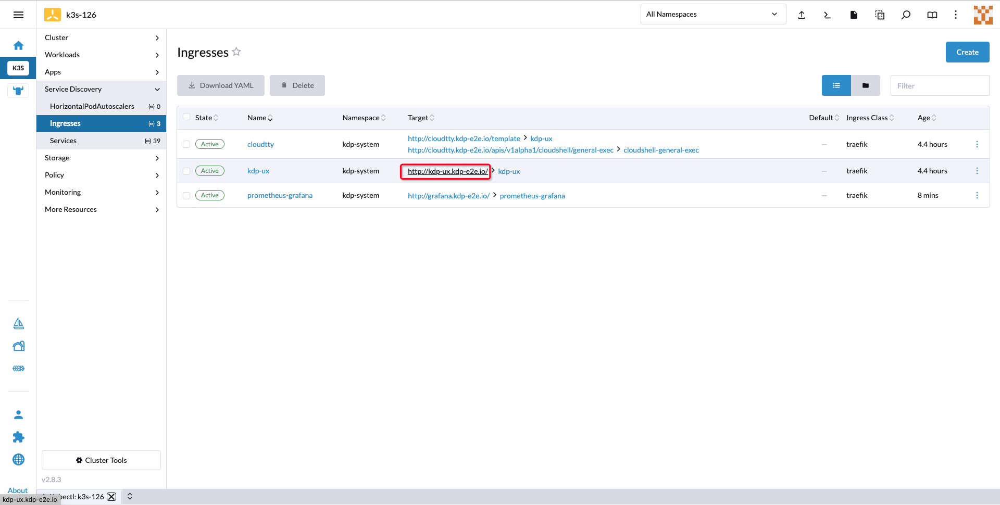
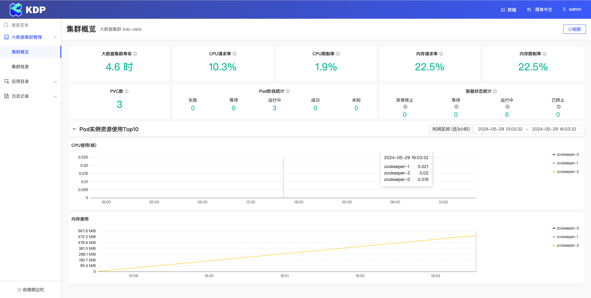

# 在Rancher上安装KDP
## Rancher 简介
### 什么是 Rancher

[Rancher](https://ranchermanager.docs.rancher.com/zh/) 是一个 Kubernetes 管理工具，让您能在任何地方和任何提供商上部署和运行集群。

Rancher 可以创建来自 Kubernetes 托管服务提供商的集群，创建节点并安装 Kubernetes，或者导入在任何地方运行的现有 Kubernetes 集群。

Rancher 是一个全栈式的 Kubernetes 容器管理平台，为您提供在任何地方都能成功运行 Kubernetes 的工具。



### Rancher 架构

Rancher 的架构包括 Rancher 管理服务器和 Rancher 管理的下游集群：


### 集成的 Kubernetes 发行版

Rancher 集成了这些 [Kubernetes 发行版](https://ranchermanager.docs.rancher.com/zh/integrations-in-rancher/kubernetes-distributions)：
- [K3s](https://docs.k3s.io/zh/): K3s 是轻量级的 Kubernetes。K3s 易于安装，仅需要 Kubernetes 内存的一半，所有组件都在一个小于 100 MB 的二进制文件中。
- [RKE2](https://docs.rke2.io/zh/): RKE2，也称为 RKE Government，是 Rancher 的下一代 Kubernetes 发行版。

在 Rancher 上创建自定义下游集群时，您会看到这两个发行版作为选项：


## 先决条件

- [x] 已在 [Kubernetes 集群](https://ranchermanager.docs.rancher.com/zh/getting-started/installation-and-upgrade/install-upgrade-on-a-kubernetes-cluster)上安装 Rancher 管理服务器，或通过[其他方法](https://ranchermanager.docs.rancher.com/zh/getting-started/installation-and-upgrade/other-installation-methods)安装。

- [x] 已在 Rancher 管理服务器上[创建了下游集群](https://ranchermanager.docs.rancher.com/zh/how-to-guides/new-user-guides/launch-kubernetes-with-rancher)，例如 K3s 集群、RKE2 集群或来自[其他提供商](https://ranchermanager.docs.rancher.com/how-to-guides/new-user-guides/kubernetes-clusters-in-rancher-setup)的K8s集群。

## 在 Rancher 管理的集群上安装KDP

> 假设您已经在 Rancher 上安装了一个下游的 K3s 或 RKE2 集群(K8s v1.26.x)，并已在下游集群上安装了监控套件：



### 安装KDP CLI

* 可选使用本地终端工具或 KubeSphere 网页终端进行操作：
  - 通过本地Shell：打开您计算机上的Bash或Zsh终端。
  * 通过'Kubectl Shell'：如下所示在 Rancher 控制台中打开'Kubectl Shell(Ctrl+`)'，您将连接到一个网页终端：


* 在网页或本地终端中，请执行以下命令以安装 KDP 命令行工具（注：若使用网页终端，因其无状态特性，每次新建立会话都需要重新安装 KDP 命令行工具）：
```bash
# 下载 KDP CLI（设置环境变量'VERSION'为所需版本号）
export VERSION=v1.1.0
wget https://github.com/linktimecloud/kubernetes-data-platform/releases/download/${VERSION}/kdp-${VERSION}-linux-amd64.tar.gz
tar xzf kdp-${VERSION}-linux-amd64.tar.gz
mkdir -p ~/.local/bin
install -v ./linux-amd64/kdp ~/.local/bin
export PATH=$PATH:$HOME/.local/bin

kdp version
```

### 安装 KDP 基础平台
#### 对于K3s集群

执行以下命令以在启用了监控套件的 K3s 集群上安装 KDP ：
```bash
# 注：请关注以下参数：
# - `dnsService.name=kube-dns`：指定 K3s 集群的默认 DNS 服务名称。
# - `kong.enabled=false` && `ingress.class=traefik`：跳过 KDP 内置的 Kong Ingress Controller 组件安装，改用 K3s 内置的 Traefik 。
# - `prometheus*`：跳过 KDP 内置的监控套件安装，改用 K3s 内置的监控套件。

kdp install \
--force-reinstall \
--set dnsService.name=kube-dns \
--set kong.enabled=false \
--set ingress.class=traefik \
--set prometheusCRD.enabled=false \
--set prometheus.enabled=false \
--set prometheus.externalUrl=http://rancher-monitoring-prometheus.cattle-monitoring-system.svc:9090 
```

#### 对于RKE2集群

执行以下命令以在启用了监控套件的 RKE2 集群上安装 KDP ：
```bash
# 注：请关注以下参数：
# - `dnsService.name=rke2-coredns-rke2-coredns`：指定 RKE2 集群的默认 DNS 服务名称。
# - `kong.enabled=false` && `ingress.class=nginx`：跳过 KDP 内置的 Kong Ingress Controller 组件安装，改用 RKE2 内置的 Nginx 。
# - `prometheus*`：跳过 KDP 内置的监控套件安装，改用 RKE2 内置的监控套件。

kdp install \
--force-reinstall \
--set dnsService.name=rke2-coredns-rke2-coredns \
--set kong.enabled=false \
--set ingress.class=nginx \
--set prometheusCRD.enabled=false \
--set prometheus.enabled=false \
--set prometheus.externalUrl=http://rancher-monitoring-prometheus.cattle-monitoring-system.svc:9090 
```

### 访问KDP UX

* 等待安装完成：


* 转到 Rancher 控制台菜单'Service Discovery' - 'Ingresses'，找到 Ingress 对象'kdp-ux'，然后点击'Target'列中的链接，KDP UX 将在新标签页中打开：


* 您现在可以使用 KDP Web 控制台来建设自己的数据平台。有关使用数据组件的更多教程，请参考[**教程目录**](./tutorials.md)：

