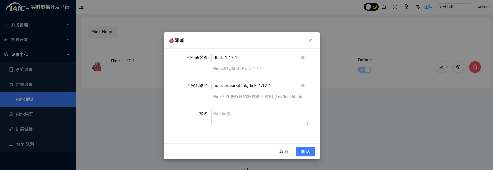

# Kafka 与内外部组件集成

KDP 提供的云原生 Kafka 是一个分布式的消息队列系统，具有高吞吐量、高可用性、高容错性等特点，适用于大规模数据处理场景。

为支持用户快速搭建 Kafka 集群，KDP 提供了 Kafka 集群应用，用户可以通过 KDP-ux 一键安装 Kafka 集群，支持消息的生产和消费需求。
为支持用户进行云下数据转移到云上，KDP 为 Kafka 提供了 K8s 集群外部访问的能力，通过 K8s nodeport 方式暴露 Kafka 服务，用户可以将云下服务通过 Kafka 客户端连接到 KDP Kafka 集群。

## Kafka 与外部组件集成

KDP 对 Kafka 进行了封装，用户服务在云上与运行访问 Kafka 集群的方式与云下基本一致，用户云下访问时只需将 Kafka 集群域名解析到 KDP Kafka 集群 K8s node IP 上，即可通过 Kafka 客户端连接到 KDP Kafka 集群。

### Kafka部署

通过 KDP-ux 安装 Kafka 集群应用，**listeners.type选择nodeport**。

### 网络打通

安装 Kafka 集群应用后，需要确保 KDP Kafka 集群 K8s node 网络与用户服务所在网络打通，以便用户服务通过 Kafka 客户端连接到 KDP Kafka 集群。
请用户自行配置DNS服务器或者本地hosts文件，将Kafka集群域名解析到KDP Kafka集群K8s node IP上。

### 配置Kafka域名解析

KDP Kafka 集群应用会自动创建一个 Kafka 集群域名，用户需要将 Kafka 集群域名解析到 KDP Kafka 集群 K8s node IP 上。
kafka 集群域名格式为：`<kafka-broker>.<namespace>.svc.<cluster-domain>`，例如：`kafka-3-cluster-kafka-plain-0.kdp-data.svc.cluster.local`。

注：KDP Kafka 地址与端口信息可以通过 KDP-ux 集群信息-应用使用配置页查看。默认情况下 Kafka 三节点broker会占用 NodePort 31091-31094 端口。

### Kafka客户端连接

用户服务通过 Kafka 客户端连接到 KDP Kafka 集群，需要配置 Kafka 客户端连接信息，包括 Kafka 集群域名、Kafka 集群端口等信息。

若用户已有使用 Kafka 的云下应用，只需要替换Kafka地址端口即可替换到 KDP Kafka。

以下是一份KDP kafka 生产者与消费者示例代码：

1. Java依赖配置
   在pom.xml中添加以下依赖。

```xml
   <dependency>
       <groupId>org.apache.kafka</groupId>
       <artifactId>kafka-clients</artifactId>
       <version>3.4.1</version>
   </dependency>
```

2. 创建Kafka配置文件kafka-cfg.properties

```properties
   bootstrap.servers=<broker地址+端口>
   topic=<设置topic名称>
   group.id=<设置group id>
```

3. 工具类准备

```java
   import java.util.Properties;
   
   public class KafkaCfg {
       private static Properties properties;
       public static final String BOOTSTRAP_SERVERS = "bootstrap.servers";
       public static final String TOPIC = "topic";
       public static final String GROUP_ID = "group.id";
     
     
       public synchronized static Properties getKafkaProperties() {
           if (null != properties) {
               return properties;
           }
           Properties kafkaProperties = new Properties();
           try {
               kafkaProperties.load(KafkaCfg.class.getClassLoader().getResourceAsStream("kafka-cfg.properties"));
           } catch (Exception e) {
               e.printStackTrace();
           }
           properties = kafkaProperties;
           return kafkaProperties;
       }
   }
```

4. 生产消息实践

```java
   import org.apache.kafka.clients.producer.KafkaProducer;
   import org.apache.kafka.clients.producer.ProducerConfig;
   import org.apache.kafka.clients.producer.ProducerRecord;
   
   import java.util.Properties;
   
   public class KdpKafkaProducer {
   
       public static void main(String args[]) {
           //加载kafka-cfg.properties。
           Properties kafkaCfgProperties =  KafkaCfg.getKafkaProperties();
   
           Properties props = new Properties();
           //设置接入点，请通过控制台获取对应Topic的接入点。
           props.put(ProducerConfig.BOOTSTRAP_SERVERS_CONFIG, kafkaCfgProperties.getProperty(KafkaCfg.BOOTSTRAP_SERVERS));
   
           //kafka ack消息确认机制，1代表leader确认后返回，-1代表需要所有replicas确认才返回
           props.put("acks", "1");
           //Kafka消息的序列化方式。
           props.put(ProducerConfig.KEY_SERIALIZER_CLASS_CONFIG, "org.apache.kafka.common.serialization.StringSerializer");
           props.put(ProducerConfig.VALUE_SERIALIZER_CLASS_CONFIG, "org.apache.kafka.common.serialization.StringSerializer");
           //请求的最长等待时间。
           props.put(ProducerConfig.MAX_BLOCK_MS_CONFIG, 30 * 1000);
           //设置客户端内部重试次数。
           props.put(ProducerConfig.RETRIES_CONFIG, 5);
           //设置客户端内部重试间隔。
           props.put(ProducerConfig.RECONNECT_BACKOFF_MS_CONFIG, 3000);
           //构造Producer对象，该对象是线程安全的。
           KafkaProducer<String, String> producer = new KafkaProducer<>(props);
   
           //消息所属的Topic
           String topic = kafkaCfgProperties.getProperty(KafkaCfg.TOPIC);
           //消息key
           String key = "message key";
           //消息的内容，这里只是个测试string，实际生产场景多将消息对象转换成json或是avro格式字符串。
           String value = "this is the message's value";
   
           for (int i = 0; i< 100 ; i++) {
               ProducerRecord<String, String> record = new ProducerRecord<>(topic,
                       key + i,
                      value + i);
               producer.send(record);
           }
           producer.flush();
       }
   }
```

5. 消息消费实践

```java
   import org.apache.kafka.clients.consumer.ConsumerConfig;
   import org.apache.kafka.clients.consumer.ConsumerRecord;
   import org.apache.kafka.clients.consumer.ConsumerRecords;
   import org.apache.kafka.clients.consumer.KafkaConsumer;
   import org.apache.kafka.clients.producer.ProducerConfig;
   
   import java.util.ArrayList;
   import java.util.List;
   import java.util.Properties;
   
   public class KdpKafkaConsumer {
   
       public static void main(String args[]) {
           //加载kafka-cfg.properties。
           Properties kafkaProperties =  KafkaCfg.getKafkaProperties();
   
           Properties props = new Properties();
           //设置接入点，请通过控制台获取对应Topic的接入点。
           props.put(ProducerConfig.BOOTSTRAP_SERVERS_CONFIG, kafkaProperties.getProperty(KafkaCfg.BOOTSTRAP_SERVERS));
           //两次Poll之间的最大允许间隔。
           //消费者超过该值没有返回心跳，服务端判断消费者处于非存活状态，服务端将消费者从Consumer Group移除并触发Rebalance，默认30s。
           props.put(ConsumerConfig.SESSION_TIMEOUT_MS_CONFIG, 30000);
           //每次Poll的最大数量。
           //注意该值不要改得太大，如果Poll太多数据，而不能在下次Poll之前消费完，则会触发一次负载均衡，产生卡顿。
           props.put(ConsumerConfig.MAX_POLL_RECORDS_CONFIG, 30);
           //消息的反序列化方式。
           props.put(ConsumerConfig.KEY_DESERIALIZER_CLASS_CONFIG, "org.apache.kafka.common.serialization.StringDeserializer");
           props.put(ConsumerConfig.VALUE_DESERIALIZER_CLASS_CONFIG, "org.apache.kafka.common.serialization.StringDeserializer");
           //当前消费实例所属的消费组，请在控制台申请之后填写。
           //属于同一个组的消费实例，会负载消费消息。
           props.put(ConsumerConfig.GROUP_ID_CONFIG, kafkaProperties.getProperty(KafkaCfg.GROUP_ID));
   
           //生成一个消费实例。
           KafkaConsumer<String, String> consumer = new KafkaConsumer<>(props);
           //设置消费组订阅的Topic，可以订阅多个。
           //如果GROUP_ID_CONFIG是一样，则订阅的Topic也建议设置成一样。
           List<String> subscribedTopics =  new ArrayList<String>();
           //如果需要订阅多个Topic，则在这里添加进去即可。
           //每个Topic需要先在控制台进行创建。
           String topicStr = kafkaProperties.getProperty(KafkaCfg.TOPIC);
           String[] topics = topicStr.split(",");
           for (String topic: topics) {
               subscribedTopics.add(topic.trim());
           }
           consumer.subscribe(subscribedTopics);
   
           //循环消费消息。
           while (true){
               try {
                   //必须在下次Poll之前消费完这些数据, 且总耗时不得超过SESSION_TIMEOUT_MS_CONFIG。
                   ConsumerRecords<String, String> records = consumer.poll(1000);
   
                   //建议开一个单独的线程池来消费消息，然后异步返回结果。
                   for (ConsumerRecord<String, String> record : records) {
                       System.out.println(String.format("Consume partition:%d offset:%d", record.partition(), record.offset()));
                       System.out.println(String.format("record key:%s, value:%s", record.key(), record.value()));
                   }
               } catch (Exception e) {
                   e.printStackTrace();
               }
           }
       }
   }
```

## Kafka 与内部组件集成

在KDP下提供一个通过Flink读Kafka数据写入Kafka的示例供用户参考。

### 组件部署

在KDP-ux上分别安装Kafka cluster、kafka-manager、flink cluster、streampark应用。

### topic创建与数据准备

找到应用目录kafka下kafka-manager应用，点击名称进入应用详情页，点击“访问地址”按钮，进入kafka-manager管理页面，创建一个名为`pageviews`、一个名为`pageviews_per_region`的topic。kafka manager topic管理与创建页面如下：


点击`pageviews` topic右侧放大镜进入topic详情页，点击`Produce to topic`按钮，将一下数据**逐条**发送到topic中。


```json
{"user_id": 1, "page_id": 1, "user_region": "China"}
{"user_id": 2, "page_id": 1, "user_region": "US"}
{"user_id": 3, "page_id": 1, "user_region": "China"}
{"user_id": 4, "page_id": 1, "user_region": "US"}
{"user_id": 5, "page_id": 2, "user_region": "China"}
{"user_id": 6, "page_id": 2, "user_region": "US"}
{"user_id": 7, "page_id": 3, "user_region": "China"}
{"user_id": 8, "page_id": 4, "user_region": "US"}
{"user_id": 9, "page_id": 3, "user_region": "UK"}
{"user_id": 10, "page_id": 4, "user_region": "UK"}
```

### Flink 读写 Kafka

#### Streampark 配置

若已完成配置可跳过

1. 找到应用目录Flink下Streampark应用，进入点击名称应用详情页，点击“访问地址”按钮，进入Streampark管理页面，输入**固定**用户名(admin)密码(streampark)登录。
   在`设计中心`添加`Flink版本`配置:当前仅支持flink 1.17.1版本，在streampark默认路径为`/streampark/flink/flink-1.17.1`。
   

2. 在`设计中心`添加`Flink集群`配置:当前仅支持flink 1.17.1版本。KDP flink默认访问地址为：<http://flink-session-cluster-rest:8081>
   

#### Flink任务编写

1. 选择`实时任务`->`作业管理`点击`添加`，
2. 执行模式选择`remote`，选择`Flink版本`与`Flink集群`选择3.3.1中配置的内容
   
3. flink sql填入如下内容：

```sql
CREATE TABLE pageviews_per_region (
   user_region STRING,
   pv BIGINT,
   uv BIGINT,
   PRIMARY KEY (user_region) NOT ENFORCED
) WITH (
   'connector' = 'upsert-kafka',
   'topic' = 'pageviews_per_region',
   'properties.bootstrap.servers' = 'kafka-3-cluster-kafka-0.kafka-3-cluster-kafka-brokers.kdp-data.svc.cluster.local:9092,kafka-3-cluster-kafka-1.kafka-3-cluster-kafka-brokers.kdp-data.svc.cluster.local:9092,kafka-3-cluster-kafka-2.kafka-3-cluster-kafka-brokers.kdp-data.svc.cluster.local:9092',
   'key.format' = 'csv',
   'value.format' = 'csv'
);

CREATE TABLE pageviews (
   user_id BIGINT,
   page_id BIGINT,
   user_region STRING
) WITH (
   'connector' = 'kafka',
   'topic' = 'pageviews',
   'properties.bootstrap.servers' = 'kafka-3-cluster-kafka-0.kafka-3-cluster-kafka-brokers.kdp-data.svc.cluster.local:9092,kafka-3-cluster-kafka-1.kafka-3-cluster-kafka-brokers.kdp-data.svc.cluster.local:9092,kafka-3-cluster-kafka-2.kafka-3-cluster-kafka-brokers.kdp-data.svc.cluster.local:9092',
   'properties.group.id' = 'kdp-test-group',
   'scan.startup.mode' = 'earliest-offset',
   'format' = 'json'
);

-- calculate the pv, uv and insert into pageviews_per_region
INSERT INTO pageviews_per_region
SELECT
   user_region,
   COUNT(*),
   COUNT(DISTINCT user_id)
FROM pageviews
GROUP BY user_region;
```

4. 输入作业名称`kafka-to-kafka`，点击`确定`。
5. 在`作业管理`页面找到刚才添加的`kafka-to-kafka`作业点击操作中的`提交`与`启动`，等待任务启动成功。

### 结果验证

回到kafka manager页面查看`pageviews_per_region` topic数据，可以看到数据已经写入到`pageviews_per_region` topic中。
可点击`pageviews_per_region` topic右侧放大镜进入topic详情页，查看写入数据内容。


