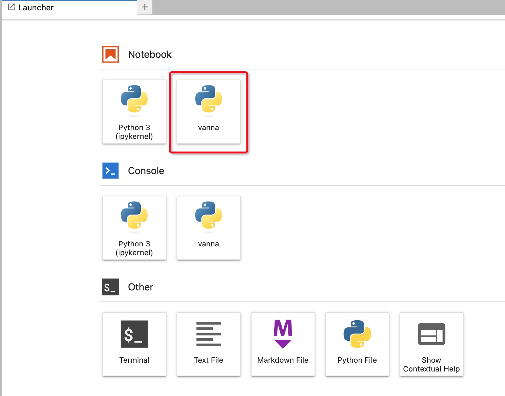

# 大语言模型（LLM）检索增强生成（RAG）开发向导

## 大语言模型（LLM）和检索增强生成（RAG）

大语言模型（LLM，Large Language Model），也称大型语言模型，是一种旨在理解和生成人类语言的人工智能模型。

LLM 通常指包含数百亿（或更多）参数的语言模型，它们在海量的文本数据上进行训练，从而获得对语言深层次的理解。目前，国外的知名 LLM 有 GPT-3.5、GPT-4、PaLM、Claude 和 LLaMA 等，国内的有文心一言、讯飞星火、通义千问、ChatGLM、百川等。

为了探索性能的极限，许多研究人员开始训练越来越庞大的语言模型，例如拥有 1750 亿参数的 GPT-3 和 5400 亿参数的 PaLM 。尽管这些大型语言模型与小型语言模型（例如 3.3 亿参数的 BERT 和 15 亿参数的 GPT-2）使用相似的架构和预训练任务，但它们展现出截然不同的能力，尤其在解决复杂任务时表现出了惊人的潜力，这被称为“涌现能力”。以 GPT-3 和 GPT-2 为例，GPT-3 可以通过学习上下文来解决少样本任务，而 GPT-2 在这方面表现较差。因此，科研界给这些庞大的语言模型起了个名字，称之为“大语言模型（LLM）”。LLM 的一个杰出应用就是 ChatGPT ，它是 GPT 系列 LLM 用于与人类对话式应用的大胆尝试，展现出了非常流畅和自然的表现。

大型语言模型（LLM）相较于传统的语言模型具有更强大的能力，然而在某些情况下，它们仍可能无法提供准确的答案。为了解决大型语言模型在生成文本时面临的一系列挑战，提高模型的性能和输出质量，研究人员提出了一种新的模型架构：检索增强生成（RAG, Retrieval-Augmented Generation）。该架构巧妙地整合了从庞大知识库中检索到的相关信息，并以此为基础，指导大型语言模型生成更为精准的答案，从而显著提升了回答的准确性与深度。RAG 已经在多个领域取得了成功，包括问答系统、对话系统、文档摘要、文档生成等。

## 在 KDP 中构建 RAG 应用

在 KDP 中可以方便的利用本地大模型或在线大模型，结合用户自身的数据，构建 RAG 应用。下面我们以 Text to SQL 场景为例，说明如何构建 RAG 应用。

SQL 语言被广泛应用与数据分析领域。尽管 SQL 比较接近自然语言，但对业务人员来说还是有一定的使用门槛：

- 必须学习 SQL 语法
- 必须了解表结构，清楚的知道哪些业务数据在哪些表中

有了大模型后，能否利用大模型的能力，结合私有的表结构信息，帮助我们进行数据分析呢？比如直接提问「上个月谁卖出了最多的 iPhone？」

答案是肯定的。

为了简化开发细节，我们直接使用 [Vanna](https://github.com/vanna-ai/vanna) 来实现 Text to SQL。如果需要更灵活的构建，可以考虑使用 [LangChain](https://github.com/langchain-ai/langchain) 等其他工具。

### 组件依赖

请在 KDP 中安装以下组件：

- ollama
- milvus
- jupyterlab

ollama 用于在本地运行大模型，milvus 用于保存向量化之后的数据，而 jupyterlab 则是开发环境。

### 在本地运行大模型

我们以 [phi3](https://ollama.com/library/phi3) 为例运行大模型。进入 ollama 的容器，执行

```shell
ollama run phi3:3.8b
```

启动成功后就可以通过 `http://ollama:11434` 来访问 phi3 大模型。

### 准备开发环境

在 jupyterlab 的 Terminal 中执行以下命令：

```bash
# 进入当前用户目录，该目录应该是挂载到 PV 中的，以免重启 pod 后环境丢失
cd ~
# 创建一个名为 vanna 的 Python 虚拟环境
python -m venv vanna
# 激活这个虚拟环境
source vanna/bin/activate
# 安装必要的 pip 包
pip install -i https://mirrors.aliyun.com/pypi/simple/ 'vanna[milvus,ollama]' pyhive thrift ipykernel ipywidgets
# 将当前虚拟环境添加到 Jupyterlab 的 kernel 列表中
python -m ipykernel install --user --name=vanna
```

执行完毕后稍过一会儿，在 Jupyterlab Launcher 中应该能看到名为 `vanna` 的 kernel。



### 利用 Vanna 构建 Text to SQL

#### 扩展 BaseEmbeddingFunction

由于 Vanna 中默认没有内置针对 milvus 的 embedding function，我们需要对 `BaseEmbeddingFunction` 进行扩展。新建一个 `vanna` kernel 的 Notebook，写入以下代码：

```python
from vanna.ollama import Ollama
from vanna.milvus import Milvus_VectorStore
from milvus_model.base import BaseEmbeddingFunction
from pymilvus import MilvusClient
from ollama import Client
from typing import List, Optional
import numpy as np

class OllamaEmbeddingFunction(BaseEmbeddingFunction):
    def __init__(
        self,
        model_name: str,
        host: Optional[str] = None
    ):
        self.model_name = model_name
        self.client = Client(host=host)
     
    def encode_queries(self, queries: List[str]) -> List[np.array]:
        return self._encode(queries)
     
    def __call__(self, texts: List[str]) -> List[np.array]:
        return self._encode(texts)
     
    def encode_documents(self, documents: List[str]) -> List[np.array]:
        return self._encode(documents)
     
    def _encode(self, texts: List[str]):
        return [np.array(self.client.embeddings(model=self.model_name, prompt=text)['embedding']) for text in texts]

class MyVanna(Milvus_VectorStore, Ollama):
    def __init__(self, config=None):
        fn = OllamaEmbeddingFunction(model_name=config['embedding_model'], host=config['ollama_host'])
        milvus = MilvusClient(uri=config['milvus_host'])
        config['embedding_function'] = fn
        config['milvus_client'] = milvus
        Milvus_VectorStore.__init__(self, config=config)
        Ollama.__init__(self, config=config)

vn = MyVanna(config={'ollama_host': 'http://ollama:11434', 'model': 'phi3:3.8b', 'embedding_model': 'phi3:3.8b', 'milvus_host': 'http://milvus:19530'})
```

#### 单张表的场景

假定 Hive 中已有一张表，建表语句为 

```sql
CREATE TABLE IF NOT EXISTS test_table (id bigint, data string);
```

在 Notebook 中，我们继续写入以下代码：

```python
vn.connect_to_hive(host = 'hive-server2-0.hive-server2.kdp-data.svc.cluster.local',
      dbname = 'default',
      port = 10000,
      auth = 'NOSASL',
      user = 'root')

vn.train(ddl='CREATE TABLE IF NOT EXISTS test_table (id bigint, data string)')
 
# 提问
# 你会看到输出类似这样的SQL：
# SELECT id
# FROM minio_test_2
# ORDER BY data DESC
# LIMIT 3
# 以及图表展示
vn.ask("What are the top 3 ids of test_table?")
```

#### 多张表的场景

Vanna 官方提供了一个 sqlite 数据库示例 [Chinook.sqlite](https://vanna.ai/Chinook.sqlite)。我们将其下载后，在 jupyterlab 中上传到 notebook 同级目录。写入以下代码：

```python
vn.connect_to_sqlite('Chinook.sqlite')

# 遍历所有DDL语句来对表结构进行训练
df_ddl = vn.run_sql("SELECT type, sql FROM sqlite_master WHERE sql is not null")
for ddl in df_ddl['sql'].to_list():
    vn.train(ddl=ddl)

# 提问
vn.ask(question="What are the top 10 billing countries by total billing?", allow_llm_to_see_data=True)
```

如果你选择使用其他数据库，可以对代码进行调整，针对具体的建表语句进行训练。

更多用例请参考[官方文档](https://vanna.ai/docs/)。
