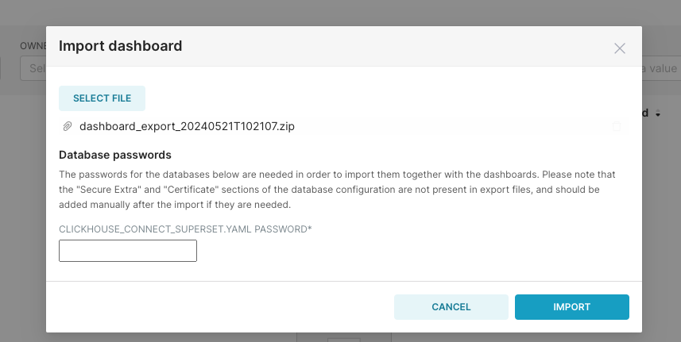

# 淘宝母婴购物数据可视化分析
简体中文 | [English](../../en/user-tutorials/visualization-analysis-of-taobao's-maternal-and-infant-shopping-data.md)

# 1. 背景
母婴用品是淘宝的热门购物类目。随着国家二胎、三胎政策的推进，母婴类商品的销量将进一步增加。与此同时，年轻一代父母的育儿观念也发生了显著变化，推动了中国母婴电商市场的多样化发展。各大母婴品牌因此展开了更加激烈的竞争，越来越多的品牌看到了行业中的潜在商机，纷纷加入母婴电商领域，使得行业竞争愈发激烈。基于此，本项目将对“淘宝母婴购物”数据集进行可视化分析，以更好地挖掘数据洞察。

## 1.1 数据说明
本次分析数据来源于[淘宝母婴购物行为数据集](https://tianchi.aliyun.com/dataset/45)，并在原始数据的基础上进行了字段调整，包括如下两张表：

- 用户基本信息表： tianchi_mum_baby

| 字段     | 字段说明     | 说明                                                          |
| -------- | ------------ | ------------------------------------------------------------- |
| user_id  | 用户标识     | 抽样 & 字段脱敏                                               |
| birthday | 婴儿出生日期 | 由 user_id 填写，有可能不真实，格式：YYYYMMDD                 |
| gender   | 婴儿性别     | （0 男孩，1 女孩，2 性别不明），由 user_id 填写，有可能不真实 |

- 商品交易信息表： tianchi_mum_baby_trade_history

| 字段       | 字段说明        | 说明 |
| ---------- | --------------- | ---- |
| user_id    | 用户标识        |      |
| auction_id | 交易 ID         |      |
| category_1 | 商品一级类目 ID |      |
| category_2 | 商品二级类目 ID |      |
| buy_amount | 购买数量        |      |
| auction_id | 订单 ID         |      |

## 1.2 目标
借助 KDP 平台的开源组件 `Airbyte`、`ClickHouse`、`Superset` 完成如下简单的商业分析任务，通过数据分析和可视化展示，充分挖掘数据的价值，让数据更好地为业务服务。
- 流量分析：年/季度/月/日的商品销量如何？有什么规律？
- 类别分析：商品销量按照类目分类有什么规律？
- 性别分析：不同性别的婴幼儿购买行为相似吗？是否符合我们的常识？
- .....

## 1.3 环境说明
在 KDP 页面安装如下组件并完成组件的 QuickStart:
- Airbyte: 数据采集
- ClickHouse: 数据 ETL 处理
- Superset: 数据可视化
- Airflow: 作业调度
- MySQL: Superset/Airflow 元数据库

通常在真实的项目中我们需要对作业进行调度，这里我们使用 Airflow 来实现作业调度。

# 2. 数据集成
我们通过平台的 Airbyte 组件，将数据从原始数据源（CSV 文件）同步到 ClickHouse 中。
1. 在 Airbyte 中添加一个 file 类型 source，读取 `tianchi_mum_baby`
   
   - Source Name: `tianchi_mum_baby`
   - Dataset Name: `tianchi_mum_baby` (请勿修改)
   - URL: `https://gitee.com/linktime-cloud/example-datasets/raw/main/airbyte/tianchi_mum_baby.csv`

2. 在 Airbyte 中添加一个 file 类型 source，读取 `tianchi_mum_baby_trade_history`。
    - Source Name: `tianchi_mum_baby_trade_history`
    - Dataset Name: `tianchi_mum_baby_trade_history` (请勿修改)
    - URL: `https://gitee.com/linktime-cloud/example-datasets/raw/main/airbyte/tianchi_mum_baby_trade_history.csv`
   
3. 在 Airbyte 中添加一个 ClickHouse 类型 destination。

    - Host: `clickhouse`
    - Port: `8123`
    - DB Name: `default`
    - User: `default`
    - Password: `ckdba.123`

4. 在 Airbyte 中添加一个 connection。source 选择 `tianchi_mum_baby`，destination 选择 ClickHouse，使用默认配置下一步，Schedule type 配置为 `Manual`，然后保存。


5. 在 Airbyte 中添加一个 connection。source 选择 `tianchi_mum_baby_trade_history`，destination 选择 ClickHouse，使用默认配置下一步，Schedule type 配置为 `Manual`，然后保存。手动点击同步按钮，同步数据。
   
6. 查看 Airbyte 的 job 状态，如果成功，则说明数据已经成功导入到 ClickHouse 中。

   
完成上述操作后数据已经成功导入到 ClickHouse 中。接下来我们利用 ClickHouse 进行数据 ETL 处理。

# 3 数据开发
将数据从 CSV 文件导入到 ClickHouse 后，对数据进行 ETL 处理，供 Superset 进行可视化分析。
Airflow 中相关的代码如下，具体代码参考 [Github](https://github.com/linktimecloud/example-datasets/blob/airflow/dags/taobao-mom-baby.py) 或者 [Gitee](https://gitee.com/linktime-cloud/example-datasets/blob/airflow/dags/taobao-mom-baby.py)。

```python
@task
 def clickhouse_upsert_userinfo():
     ...

 @task
 def clickhouse_upsert_user_purchases():
     ...

 @task
 def clickhouse_upsert_dws_user_purchases():
     ...
```

注意：通常在数仓建模中有一定的命名规范和数据分层，这里简单处理。

# 4. 作业调度
通常在真实的项目中数据是随时间变化的，因此需要通过作业调度来更新数据。关于 Airflow 的基本使用可以参考应用的 QuickStart。

在数据开发章节中编写了 Airflow DAG，里面主要涉及两种作业的调度：
- Airbyte 作业
- ClickHouse 作业

Airbyte 本身是可以配置调度的，但是为了统一管理作业和处理作业之间的依赖关系，这里统一使用 Airflow 来调度。下面主要介绍如何通过 Airflow 来调度 Airbyte 作业。

1. 在 Airflow 中添加一个 HTTP 类型 connection。
   
   
   - Connection Id: `airbyte`（后续 DAG 中会用到该连接）
   - Connection Type: `HTTP`
   - Host: `airbyte-airbyte-server-svc`
   - Port: `8001`

2. Airbyte 作业 Task
代码如下：
```python

user_info_to_clickhouse = AirbyteTriggerSyncOperator(
    task_id='user_info_to_clickhouse',
    airbyte_conn_id='airbyte',
    connection_id='dd5ebac2-2827-460a-bc5b-d96b68eb5e8a', # 请使用您的 Airbyte connection id
    asynchronous=False,
    timeout=3600,
    wait_seconds=3
)

user_purchases_to_clickhouse = AirbyteTriggerSyncOperator(
    task_id='user_purchases_to_clickhouse',
    airbyte_conn_id='airbyte',
    connection_id='1f37ca26-b381-4fb9-8b68-fa1e633cc505',  # 请使用您的 Airbyte connection id
    asynchronous=False,
    timeout=3600,
    wait_seconds=3
)
```

- `airbyte_conn_id` 即添加的 HTTP 类型 connection 的 ID
- `connection_id` 即 Airbyte 中的 connection 的 ID，可以通过 URL 获取，如某个 connection 的 URL 为 `http://airbyte-kdp-data.kdp-e2e.io/workspaces/xyz/connections/abc`，则 connection_id 为 `abc`

> 请 Fork 代码后，在 KDP 上更新 Airgflow 的 `dags` 的 gitSync 的配置，使用您自己的 git 仓库。


关于 Airbyte 作业的调度可以参考：[Using the Airbyte Operator to orchestrate Airbyte OSS](https://docs.airbyte.com/operator-guides/using-the-airflow-airbyte-operator#2-create-a-dag-in-apache-airflow-to-trigger-your-airbyte-job)

3. 在 Airflow 中启用名称为 `taobao_user_purchases_example` 的 DAG，作业是每天调度，第一次启用会补跑昨天的调度。也可以手动触发。点击 DAG 名称可以查看作业运行状态。
   
    > DAG 列表
    
  
    > DAG 运行状态
    


# 5. 数据可视化
Superset 支持 ClickHouse 数据源，我们可以通过 Superset 来可视化分析数据。建议用户先完成 KDP Superset App 的 QuickStart。

使用账号 `admin` 密码 `admin` 登录 Superset `http://superset-kdp-data.kdp-e2e.io` (注意添加本地 Host 解析) 页面。

## 5.1 创建图表

### 方式一：导入我们制作好的图表（建议）
1. [下载面板](https://gitee.com/linktime-cloud/example-datasets/raw/main/superset/dashboard_export_20240607T100739.zip)
2. 导入面板
选择下载的文件导入

输入 ClickHouse 的用户 `default` 的默认密码 `ckdba.123`


### 方式二：手动创建

- **添加数据链接**
依次点页面右 `Settings` - `Databases Connections` - `+ Database` 添加 ClickHouse 数据源。

填写如下参数：
- HOST: `clickhouse`
- PORT: `8123`
- DATABASE NAME: `default`
- USERNAME: `default`
- PASSWORD: `ckdba.123`

- **添加 DATASET**
依次点击页面上方的导航 `DATASETS` - 右上方 `+ Dataset` 添加数据集。


然后参考 Superset 官方文档，制作图表

#### 流量分析
   
   - 平台的销量按季度递增，第四季度的销量达到最大值。
   - 年中/年底月份销量较大，可能和促销相关；1 月份/2 月份销量最低。
  
#### 性别分析

- 男宝和女宝数量差异不大
- 男宝的购买量较女宝的购买量高出约一倍
- 男宝在各品类的购买量都大于女宝，除了 `50022520`; 男宝在品类 `50014815` 的购买量远超女宝，且购买量超过女宝的 2 倍。
  
#### 类别分析

- 对于一级品类主要集中在三大品类
- 二级品类中比较特殊的是一级品类 `50014815` 中的二级品类 `50018831` 的销量占整个此品类 64%

> 机器学习
另外我们也可以通过机器学习来预测用户的购买行为，对用户进行推荐，对于没有按照预期购买的用户，我们可以推送优惠券来吸引用户购买。To Be Continue...
